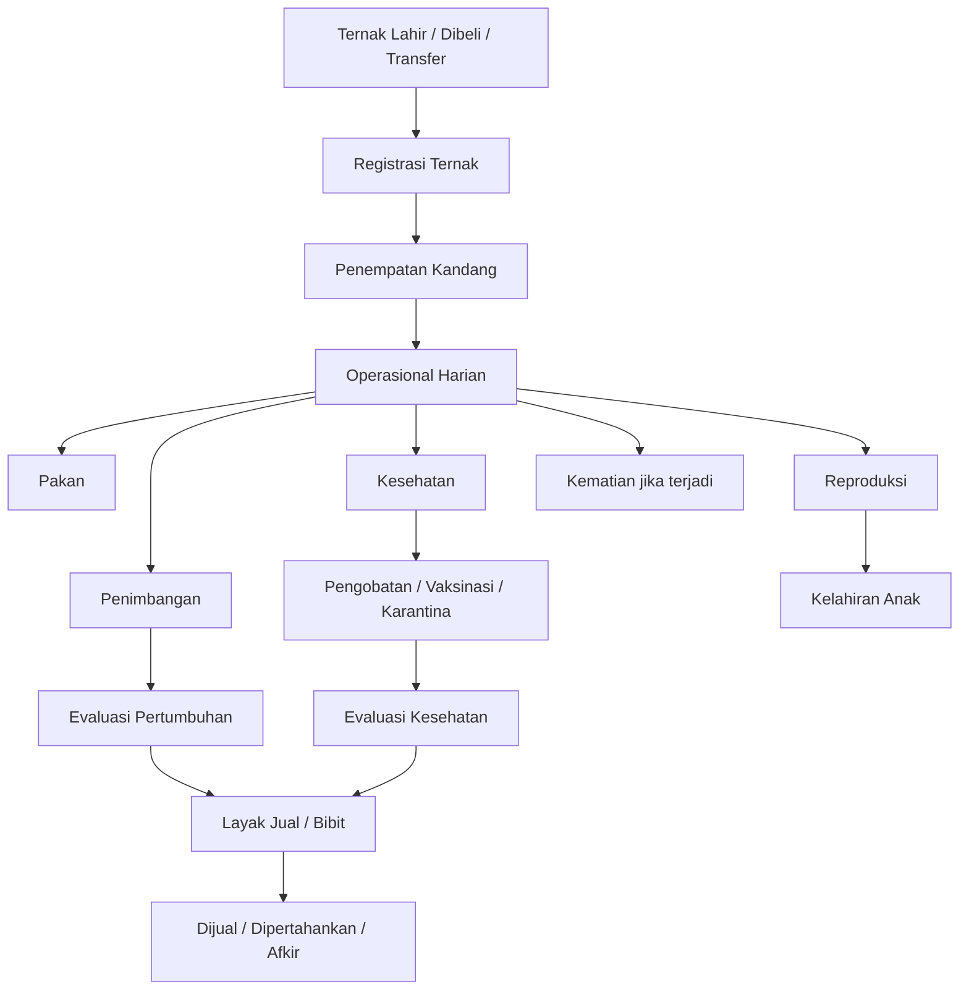
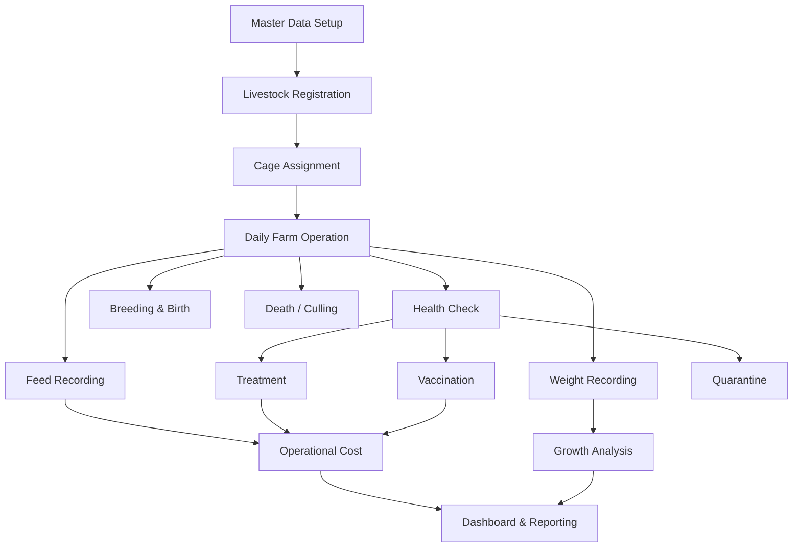
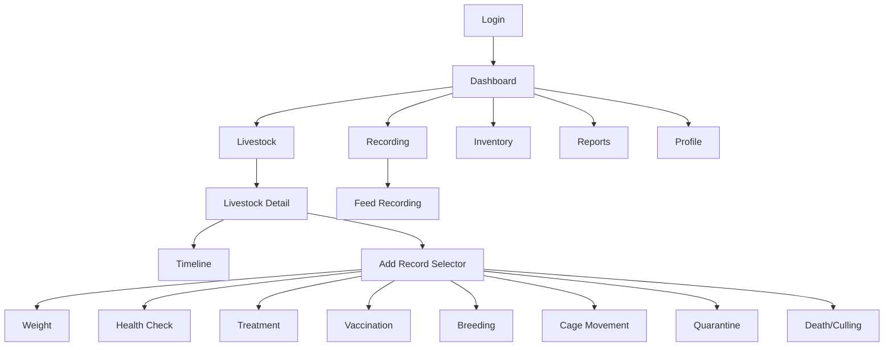
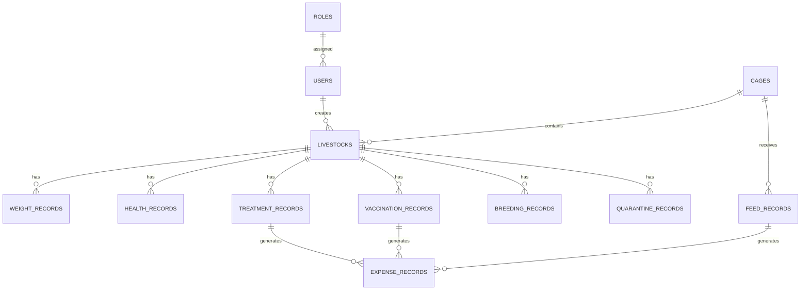
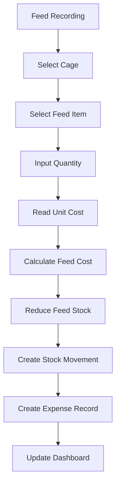
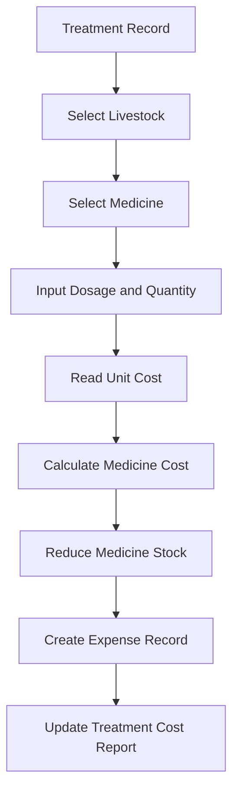
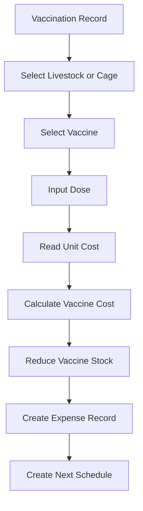

<!-- FILE: README.md -->

# Product Requirement Document (PRD) — Mobile Livestock Recording

Dokumentasi ini merupakan paket PRD untuk aplikasi mobile **Livestock Recording** berbasis **Expo React Native**, **Express.js**, dan **MongoDB**. Fokus dokumen ini adalah analisis sistem dan proses bisnis peternakan kambing, bukan detail teknis seperti folder structure atau API endpoint.

## Daftar File

| File                                  | Isi Utama                                                                                          |
| ------------------------------------- | -------------------------------------------------------------------------------------------------- |
| `00-PRD-Overview.md`                  | Gambaran umum produk, objective, scope, aktor, dan konsep event-based recording                    |
| `01-Business-Process.md`              | Alur proses bisnis lengkap dari ternak lahir/masuk sampai jual, bibit, karantina, mati, atau afkir |
| `02-Business-Rules.md`                | Aturan bisnis status, validasi, stok, biaya, dashboard, dan reporting                              |
| `03-Mobile-User-Flow.md`              | Flow layar aplikasi mobile dari dashboard sampai recording detail                                  |
| `04-Functional-Requirements.md`       | Functional requirements per modul                                                                  |
| `05-Database-Design.md`               | Desain collection MongoDB, field, relasi, validasi, dan alasan desain                              |
| `06-Dashboard-and-Reporting.md`       | Dashboard, laporan, indikator operasional, dan analisis biaya                                      |
| `07-Acceptance-Criteria.md`           | Acceptance criteria per fitur                                                                      |
| `08-Operational-Cost-Analysis.md`     | Analisis biaya pakan, obat, vaksin, dan estimasi efisiensi bisnis                                  |
| `09-Glossary.md`                      | Istilah penting agar semua pihak memiliki pemahaman yang sama                                      |
| `PRD-Livestock-Recording-Complete.md` | Gabungan seluruh dokumen dalam satu file                                                           |

## Prinsip Utama

Aplikasi menggunakan pendekatan **event-based livestock recording**, yaitu setiap aktivitas penting pada ternak dicatat sebagai event dan membentuk timeline ternak. Dengan pendekatan ini, setiap kambing memiliki riwayat lengkap mulai dari registrasi, kandang, pakan, berat, kesehatan, obat, vaksinasi, reproduksi, karantina, kematian, hingga evaluasi layak jual atau bibit.

<!-- FILE: 00-PRD-Overview.md -->

# 00 — PRD Overview

## Mobile Livestock Recording Application

## 1. Product Summary

Mobile Livestock Recording adalah aplikasi mobile untuk membantu peternakan kambing mencatat dan memantau data operasional ternak secara terstruktur. Sistem ini mendukung aktivitas nyata di peternakan seperti pencatatan ternak baru, penempatan kandang, pemberian pakan, penimbangan, pemeriksaan kesehatan, pengobatan, vaksinasi, reproduksi, karantina, kematian, serta monitoring ternak yang layak dijual atau dijadikan bibit.

Aplikasi dirancang menggunakan:

- **Expo React Native** untuk aplikasi mobile.
- **Express.js** untuk backend service.
- **MongoDB** untuk database berbasis document.

Dokumen ini tidak membahas struktur folder, endpoint API, atau kode program. Fokus dokumen adalah kebutuhan sistem, alur bisnis, aturan operasional, desain data, dashboard, reporting, dan acceptance criteria.

## 2. Product Objective

Tujuan aplikasi adalah:

1. Memudahkan petugas mencatat aktivitas peternakan dari perangkat mobile.
2. Menyimpan riwayat lengkap setiap ternak dari lahir/masuk sampai status akhir.
3. Membantu farm manager memantau populasi, kesehatan, reproduksi, stok, dan biaya.
4. Mengubah data pakan, obat, dan vaksin menjadi analisis biaya operasional.
5. Membantu pengambilan keputusan jual, bibit, karantina, afkir, atau treatment lanjutan.

## 3. Business Problem

Peternakan kambing membutuhkan pencatatan yang konsisten atas identitas ternak, kandang, pakan, berat, kesehatan, pengobatan, vaksinasi, reproduksi, dan status akhir. Jika data masih manual, tersebar, atau tidak terhubung dengan biaya, farm akan kesulitan menjawab pertanyaan penting seperti:

- Ternak mana yang sering sakit?
- Kandang mana yang paling banyak menghabiskan pakan?
- Berapa biaya pakan bulan ini?
- Berapa biaya pengobatan per ternak?
- Ternak mana yang sudah layak jual?
- Ternak mana yang cocok dijadikan bibit?
- Apakah biaya pemeliharaan sebanding dengan pertumbuhan berat?

## 4. Scope

### In Scope

- User and role management.
- Livestock registration and profile.
- Cage management and movement.
- Feed stock and feed recording.
- Weight recording and growth monitoring.
- Health check.
- Treatment and medicine stock.
- Vaccination and vaccine stock.
- Breeding, pregnancy, and birth.
- Quarantine.
- Death and culling.
- Sale and breeding candidate monitoring.
- Operational cost analysis.
- Dashboard and reporting.
- Timeline and activity log.

### Out of Scope

- Marketplace ternak.
- Payment gateway.
- IoT sensor integration.
- Machine learning prediction.
- Accounting system penuh.
- API endpoint detail.
- Folder structure frontend/backend.

## 5. Main Actors

| Actor          | Tanggung Jawab                                                                     |
| -------------- | ---------------------------------------------------------------------------------- |
| Owner          | Melihat ringkasan bisnis dan performa farm                                         |
| Farm Manager   | Memantau dashboard, laporan, biaya, kandidat jual/bibit, dan keputusan operasional |
| Farm Staff     | Mencatat aktivitas harian seperti pakan, timbang, kandang, dan kelahiran           |
| Health Officer | Mencatat kesehatan, treatment, vaksinasi, dan karantina                            |
| Admin          | Mengelola user, role, master data, stok, dan kandang                               |

## 6. Core Concept: Event-Based Recording

Setiap aktivitas penting dicatat sebagai event. Event tersebut membentuk timeline ternak dan menjadi dasar dashboard serta report.

Contoh event:

- Livestock registered.
- Cage assigned.
- Feed given.
- Weight recorded.
- Health checked.
- Treatment recorded.
- Vaccination recorded.
- Breeding recorded.
- Birth recorded.
- Quarantine started/released.
- Death recorded.
- Marked as sale/breeding candidate.

## 7. High-Level Lifecycle



## 8. Success Metrics

Sistem dianggap berhasil jika:

1. Semua ternak memiliki identitas, status, dan current cage yang jelas.
2. Aktivitas utama farm tercatat sebagai timeline.
3. Pakan, obat, dan vaksin memengaruhi stok dan biaya.
4. Dashboard menampilkan populasi, kesehatan, stok, biaya, dan kandidat jual/bibit.
5. Report dapat digunakan farm manager untuk evaluasi operasional dan bisnis.

<!-- FILE: 01-Business-Process.md -->

# 01 — Business Process

## Operational Flow for Goat Livestock Recording

## 1. Business Process Overview

Business process aplikasi mengikuti siklus kerja peternakan kambing dari setup data awal, registrasi ternak, perawatan harian, monitoring kesehatan dan pertumbuhan, reproduksi, karantina, sampai keputusan akhir seperti jual, bibit, mati, atau afkir.



## LV — Livestock Registration & Profile

### Tujuan Fitur

Mencatat ternak baru dari kelahiran, pembelian, atau transfer serta menyimpan identitas dan status terbaru ternak.

### Aktor yang Terlibat

Farm Staff, Admin, Farm Manager

### Alur Proses Bisnis

1. Petugas membuka menu Livestock.
2. Memilih Add Livestock.
3. Memilih sumber ternak: Birth, Purchase, atau Transfer.
4. Mengisi identitas ternak, jenis kelamin, tanggal lahir/masuk, breed, induk, pejantan, berat awal, dan kandang awal.
5. Sistem memvalidasi ear tag, tanggal, dan kapasitas kandang.
6. Sistem membuat livestock ID dan menyimpan data ternak.
7. Sistem membuat timeline awal dan memperbarui dashboard populasi.

### Kondisi Normal

- Data lengkap, ear tag unik, kandang tersedia, dan ternak berhasil dibuat sebagai Active/Newborn.

### Kondisi Khusus

- Jika ternak berasal dari luar farm dan berisiko sakit, status awal dapat menjadi Quarantine.
- Jika anak lahir dari induk yang tercatat, sistem menghubungkan data anak dengan induk dan breeding record.
- Jika kandang penuh atau ear tag duplikat, sistem menolak penyimpanan.

### Business Rules

- Setiap ternak wajib memiliki livestock ID unik.
- Ear tag tidak boleh duplikat pada ternak aktif.
- Ternak aktif wajib memiliki current cage.
- Tanggal lahir/masuk tidak boleh melebihi tanggal hari ini.
- Terminal status seperti Sold, Dead, dan Culled tidak boleh menerima recording baru.

### Dampak terhadap Data Lain

- Populasi farm bertambah.
- Occupancy kandang bertambah.
- Timeline awal terbentuk.
- Dashboard populasi, gender, umur, dan kandang diperbarui.

### Perubahan Status

- Newborn/Active/Quarantine sebagai status awal sesuai kondisi ternak.

### Perubahan Stok

- Tidak ada perubahan stok langsung.

### Timeline yang Tercatat

- Livestock Registered
- Initial Cage Assigned
- Birth Recorded jika berasal dari kelahiran

### Data yang Ditampilkan pada Dashboard

- Total livestock
- Total male/female
- Total newborn
- Livestock per cage
- Recent livestock registered

### Acceptance Criteria

- User dapat menambahkan ternak baru.
- Sistem menolak ear tag duplikat.
- Sistem menolak kandang penuh.
- Sistem memperbarui populasi dan timeline.

## CG — Cage Management & Movement

### Tujuan Fitur

Mengelola lokasi ternak dan mencatat perpindahan kandang sesuai kebutuhan operasional.

### Aktor yang Terlibat

Farm Staff, Farm Manager, Admin

### Alur Proses Bisnis

1. Petugas membuka detail ternak.
2. Memilih Move Cage.
3. Memilih kandang tujuan.
4. Mengisi alasan perpindahan.
5. Sistem mengecek kapasitas dan tipe kandang.
6. Sistem memperbarui current cage dan occupancy.
7. Timeline mutasi kandang dibuat.

### Kondisi Normal

- Ternak aktif dipindahkan ke kandang yang masih tersedia.

### Kondisi Khusus

- Jika kandang tujuan bertipe quarantine, status ternak berubah menjadi Quarantine.
- Jika kandang penuh, sistem menolak mutasi.
- Ternak Dead, Sold, atau Culled tidak dapat dipindahkan.

### Business Rules

- Satu ternak hanya boleh memiliki satu current cage.
- Kandang tidak boleh melebihi kapasitas.
- Mutasi kandang wajib memiliki alasan.
- Kandang karantina hanya untuk ternak karantina atau observasi.

### Dampak terhadap Data Lain

- Current cage berubah.
- Occupancy kandang asal berkurang dan kandang tujuan bertambah.
- Dashboard kandang diperbarui.

### Perubahan Status

- Active tetap Active jika pindah kandang biasa.
- Active/Sick dapat menjadi Quarantine jika dipindahkan ke kandang karantina.

### Perubahan Stok

- Tidak ada perubahan stok langsung.

### Timeline yang Tercatat

- Moved from Cage A to Cage B
- Quarantine cage assigned jika masuk karantina

### Data yang Ditampilkan pada Dashboard

- Cage occupancy
- Livestock per cage
- Quarantine cage count
- Recent cage movement

### Acceptance Criteria

- User dapat memindahkan ternak.
- Sistem memperbarui current cage.
- Sistem menolak kandang penuh.
- Sistem mencatat alasan mutasi.

## FD — Feed Recording & Feed Cost

### Tujuan Fitur

Mencatat pemberian pakan per kandang, mengurangi stok pakan, dan menghitung biaya pakan sebagai pengeluaran operasional farm.

### Aktor yang Terlibat

Farm Staff, Farm Manager

### Alur Proses Bisnis

1. Petugas membuka Feed Recording.
2. Memilih kandang.
3. Memilih jenis pakan.
4. Mengisi jumlah pakan dan waktu pemberian.
5. Sistem membaca stok dan harga satuan.
6. Sistem menghitung total biaya pakan.
7. Sistem mengurangi stok pakan.
8. Sistem membuat stock movement dan expense record.
9. Dashboard stok dan biaya diperbarui.

### Kondisi Normal

- Stok pakan cukup, harga satuan tersedia, dan feed record berhasil disimpan.

### Kondisi Khusus

- Jika stok tidak cukup, sistem menolak atau memberi warning.
- Jika harga satuan belum tersedia, sistem memberi warning karena biaya tidak dapat dihitung.
- Jika kandang kosong, feed record tidak dapat dibuat untuk kandang tersebut.

### Business Rules

- Feed record dilakukan per kandang.
- Jumlah pakan harus lebih besar dari nol.
- Penggunaan pakan tidak boleh melebihi stok.
- Biaya pakan = quantity used x unit cost.
- Feed cost dapat dibagi rata sebagai estimasi biaya pakan per ternak.

### Dampak terhadap Data Lain

- Feed stock berkurang.
- Stock movement OUT dibuat.
- Expense record bertipe feed dibuat.
- Feed usage report dan cost dashboard diperbarui.

### Perubahan Status

- Tidak mengubah status ternak secara langsung.

### Perubahan Stok

- Feed stock berkurang sesuai quantity used.

### Timeline yang Tercatat

- Feed given to cage
- Feed stock used
- Feed expense recorded

### Data yang Ditampilkan pada Dashboard

- Feed stock remaining
- Total feed cost today/month
- Feed cost per cage
- Estimated feed cost per livestock
- Low feed stock alert

### Acceptance Criteria

- User dapat mencatat pakan per kandang.
- Sistem mengurangi stok pakan.
- Sistem menghitung biaya pakan.
- Sistem membuat expense record.
- Dashboard stok dan biaya diperbarui.

## WG — Weight Recording & Growth Monitoring

### Tujuan Fitur

Mencatat berat badan ternak secara berkala untuk memantau pertumbuhan dan mendukung keputusan jual atau bibit.

### Aktor yang Terlibat

Farm Staff, Farm Manager

### Alur Proses Bisnis

1. Petugas membuka detail ternak.
2. Memilih Add Weight Record.
3. Mengisi berat dan tanggal timbang.
4. Sistem membandingkan dengan berat sebelumnya.
5. Sistem menyimpan weight record.
6. Sistem memperbarui current weight.
7. Sistem mengevaluasi growth dan candidate status.

### Kondisi Normal

- Berat valid dan menjadi current weight terbaru.

### Kondisi Khusus

- Jika berat turun signifikan, sistem memberi alert.
- Jika berat dan umur memenuhi kriteria, sistem dapat menandai sale candidate atau breeding candidate.
- Ternak sakit tidak boleh langsung masuk kandidat jual.

### Business Rules

- Berat harus lebih besar dari nol.
- Tanggal timbang tidak boleh sebelum tanggal lahir/masuk.
- Weight record terbaru menjadi current weight.
- Ternak terminal status tidak boleh menerima weight record.

### Dampak terhadap Data Lain

- Current weight berubah.
- Weight history bertambah.
- Growth dashboard diperbarui.
- Candidate list dapat berubah.

### Perubahan Status

- Active dapat menjadi Sale Candidate atau Breeding Candidate jika memenuhi kriteria.

### Perubahan Stok

- Tidak ada perubahan stok.

### Timeline yang Tercatat

- Weight recorded
- Weight gain/loss calculated

### Data yang Ditampilkan pada Dashboard

- Average weight
- Growth trend
- Weight drop alert
- Sale candidate
- Breeding candidate
- Cost per kg gain jika data cukup

### Acceptance Criteria

- User dapat mencatat berat.
- Sistem memperbarui current weight.
- Sistem menampilkan riwayat berat.
- Sistem memberi alert jika berat turun signifikan.

## HL — Health Check

### Tujuan Fitur

Mencatat kondisi kesehatan ternak, mendeteksi penyakit, dan menentukan tindakan lanjutan seperti treatment atau karantina.

### Aktor yang Terlibat

Farm Staff, Health Officer, Farm Manager

### Alur Proses Bisnis

1. Petugas membuka detail ternak.
2. Memilih Health Check.
3. Mengisi kondisi, gejala, diagnosis, dan rekomendasi tindakan.
4. Sistem menentukan health status.
5. Jika sakit, sistem merekomendasikan treatment atau quarantine.
6. Sistem menyimpan health record dan memperbarui dashboard.

### Kondisi Normal

- Ternak sehat dan status tetap Active/Healthy.

### Kondisi Khusus

- Jika sakit, status menjadi Sick.
- Jika berisiko menular, sistem merekomendasikan Quarantine.
- Jika perlu obat, proses lanjut ke Treatment.

### Business Rules

- Health check wajib memiliki kondisi.
- Jika kondisi Sick, gejala atau diagnosis wajib diisi.
- Ternak sakit tidak boleh menjadi sale candidate atau breeding candidate.
- Health status terakhir menjadi status kesehatan aktif.

### Dampak terhadap Data Lain

- Health history bertambah.
- Health status berubah.
- Candidate status dapat dicabut.
- Dashboard health alert diperbarui.

### Perubahan Status

- Active → Sick/Need Observation/Quarantine.
- Sick → Healthy jika sembuh.

### Perubahan Stok

- Tidak ada perubahan stok langsung kecuali lanjut treatment atau vaccination.

### Timeline yang Tercatat

- Health check recorded
- Sick status assigned
- Quarantine recommendation jika berisiko menular

### Data yang Ditampilkan pada Dashboard

- Total sick livestock
- Under observation
- Health alert
- Recent health check
- Treatment required

### Acceptance Criteria

- User dapat mencatat health check.
- Sistem memperbarui health status.
- Sistem mencabut kandidat jual/bibit jika sakit.
- Sistem memberi rekomendasi tindakan.

## TR — Treatment & Medicine Cost

### Tujuan Fitur

Mencatat pengobatan ternak sakit, mengurangi stok obat, dan menghitung biaya pengobatan per ternak.

### Aktor yang Terlibat

Health Officer, Farm Staff, Farm Manager

### Alur Proses Bisnis

1. Petugas memilih ternak sakit.
2. Memilih Add Treatment.
3. Memilih obat.
4. Mengisi dosis, quantity, frekuensi, durasi, dan tanggal.
5. Sistem membaca stok dan harga satuan obat.
6. Sistem menghitung biaya obat.
7. Sistem mengurangi stok obat.
8. Sistem membuat stock movement dan expense record.
9. Status ternak diperbarui sesuai hasil treatment.

### Kondisi Normal

- Stok obat cukup, treatment tersimpan, status menjadi Under Treatment atau Healthy jika sembuh.

### Kondisi Khusus

- Jika stok obat tidak cukup, sistem menolak.
- Jika harga obat belum tersedia, sistem memberi warning.
- Jika treatment result recovered, status kembali Healthy/Active.

### Business Rules

- Treatment harus terhubung dengan livestock.
- Obat harus memiliki stok dan harga satuan.
- Quantity obat harus lebih besar dari nol dan tidak melebihi stok.
- Biaya obat = quantity used x unit cost.
- Ternak under treatment tidak boleh dijual.

### Dampak terhadap Data Lain

- Medicine stock berkurang.
- Treatment history bertambah.
- Expense record bertipe medicine dibuat.
- Health dashboard dan cost report diperbarui.

### Perubahan Status

- Sick → Under Treatment.
- Under Treatment → Healthy jika sembuh.
- Under Treatment → Quarantine jika memburuk/menular.

### Perubahan Stok

- Medicine stock berkurang sesuai quantity used.

### Timeline yang Tercatat

- Treatment recorded
- Medicine stock used
- Medicine expense recorded
- Treatment result updated

### Data yang Ditampilkan pada Dashboard

- Active treatment
- Medicine stock remaining
- Medicine expense this month
- Livestock with highest treatment cost
- Medicine low stock alert

### Acceptance Criteria

- User dapat mencatat treatment.
- Sistem mengurangi stok obat.
- Sistem menghitung biaya obat.
- Sistem memperbarui health status.
- Sistem menampilkan biaya pengobatan pada report.

## VC — Vaccination & Vaccine Cost

### Tujuan Fitur

Mencatat vaksinasi, mengurangi stok vaksin, menghitung biaya vaksin, dan membuat jadwal vaksin berikutnya.

### Aktor yang Terlibat

Health Officer, Farm Staff, Farm Manager

### Alur Proses Bisnis

1. Petugas membuka Vaccination.
2. Memilih ternak atau kelompok/kandang.
3. Memilih vaksin.
4. Mengisi dosis, tanggal vaksin, dan next vaccination date.
5. Sistem mengecek stok dan harga satuan.
6. Sistem menghitung biaya vaksin.
7. Sistem mengurangi stok vaksin.
8. Sistem membuat reminder vaksin berikutnya.

### Kondisi Normal

- Vaksin tersedia dan jadwal berikutnya berhasil dibuat.

### Kondisi Khusus

- Jika ternak sakit, sistem memberi warning.
- Jika next vaccination date sudah lewat, status menjadi overdue.
- Jika stok tidak cukup, sistem menolak.

### Business Rules

- Vaksin harus memiliki stok dan harga satuan.
- Penggunaan vaksin mengurangi stok.
- Vaksinasi berkala harus memiliki next vaccination date.
- Vaccine cost = quantity used x unit cost.

### Dampak terhadap Data Lain

- Vaccine stock berkurang.
- Vaccination history bertambah.
- Expense record bertipe vaccine dibuat.
- Reminder dan dashboard vaccination due diperbarui.

### Perubahan Status

- Vaccination status: Completed/Due/Overdue.
- Main status tidak selalu berubah.

### Perubahan Stok

- Vaccine stock berkurang sesuai quantity used.

### Timeline yang Tercatat

- Vaccination recorded
- Vaccine stock used
- Next vaccination scheduled

### Data yang Ditampilkan pada Dashboard

- Vaccination due
- Vaccination overdue
- Vaccine stock remaining
- Vaccine expense this month
- Recent vaccination

### Acceptance Criteria

- User dapat mencatat vaksinasi.
- Sistem mengurangi stok vaksin.
- Sistem menghitung biaya vaksin.
- Sistem membuat reminder vaksin berikutnya.

## BR — Breeding, Pregnancy, and Birth

### Tujuan Fitur

Mencatat proses reproduksi mulai dari perkawinan, pemeriksaan kebuntingan, kelahiran, sampai pembuatan data anak ternak.

### Aktor yang Terlibat

Farm Staff, Health Officer, Farm Manager

### Alur Proses Bisnis

1. Petugas memilih ternak betina.
2. Sistem mengecek eligibility.
3. Petugas memilih pejantan dan tanggal kawin.
4. Sistem membuat breeding record dan status Mated.
5. Petugas melakukan pregnancy check.
6. Jika Pregnant, sistem menyimpan estimated birth date.
7. Saat lahir, petugas mencatat birth record.
8. Sistem membuat data anak ternak dan menghubungkan dengan induk.

### Kondisi Normal

- Betina sehat, cukup umur, tidak punya breeding aktif, dan berhasil masuk proses breeding.

### Kondisi Khusus

- Jika betina sakit, belum cukup umur, atau sudah memiliki breeding aktif, sistem menolak.
- Jika anak mati saat lahir, tetap dicatat pada birth outcome.
- Jika pejantan tidak diketahui, sire dapat dikosongkan dengan catatan.

### Business Rules

- Hanya betina sehat dan eligible yang dapat breeding.
- Satu betina tidak boleh memiliki dua breeding aktif.
- Pregnancy check wajib memiliki hasil.
- Anak hidup harus dibuat sebagai livestock baru.
- Anak terhubung dengan dam dan sire jika tersedia.

### Dampak terhadap Data Lain

- Reproductive status berubah.
- Breeding history bertambah.
- Birth record bertambah.
- Populasi bertambah jika anak hidup.
- Dashboard pregnancy dan newborn diperbarui.

### Perubahan Status

- Available → Mated.
- Mated → Pregnant/Available.
- Pregnant → Lactating setelah melahirkan.

### Perubahan Stok

- Tidak ada perubahan stok langsung.

### Timeline yang Tercatat

- Breeding recorded
- Pregnancy checked
- Birth recorded
- Child livestock created

### Data yang Ditampilkan pada Dashboard

- Mated count
- Pregnant count
- Estimated birth schedule
- Birth this month
- Newborn count

### Acceptance Criteria

- User dapat mencatat breeding.
- Sistem memvalidasi eligibility.
- User dapat mencatat pregnancy check.
- User dapat mencatat kelahiran.
- Sistem membuat data anak ternak.

## QR — Quarantine

### Tujuan Fitur

Mengelola ternak yang perlu diisolasi karena sakit, baru datang dari luar farm, atau berisiko menular.

### Aktor yang Terlibat

Farm Staff, Health Officer, Farm Manager

### Alur Proses Bisnis

1. Petugas memilih ternak.
2. Memilih Set Quarantine.
3. Memilih kandang karantina.
4. Mengisi alasan dan tanggal mulai.
5. Sistem mengubah status menjadi Quarantine.
6. Ternak dipantau melalui health check.
7. Jika sehat, petugas melakukan release quarantine dan memilih kandang tujuan.

### Kondisi Normal

- Ternak masuk kandang karantina dan keluar setelah health check menyatakan sehat.

### Kondisi Khusus

- Jika kandang karantina penuh, sistem menolak.
- Jika belum ada health check sehat, release tidak boleh dilakukan.
- Jika kondisi memburuk, dapat lanjut treatment atau death record.

### Business Rules

- Ternak karantina harus berada pada kandang bertipe quarantine.
- Alasan karantina wajib diisi.
- Ternak karantina tidak boleh dijual atau breeding.
- Release karantina harus berdasarkan health check sehat.

### Dampak terhadap Data Lain

- Status menjadi Quarantine.
- Current cage berubah.
- Quarantine history bertambah.
- Dashboard quarantine diperbarui.

### Perubahan Status

- Active/Sick → Quarantine.
- Quarantine → Active jika sehat.

### Perubahan Stok

- Tidak ada perubahan stok langsung kecuali ada treatment atau feed record.

### Timeline yang Tercatat

- Quarantine started
- Health check during quarantine
- Quarantine released

### Data yang Ditampilkan pada Dashboard

- Total quarantine livestock
- Quarantine duration
- Quarantine cage occupancy
- Overdue quarantine alert

### Acceptance Criteria

- User dapat memasukkan ternak ke karantina.
- Sistem memvalidasi kandang karantina.
- Sistem menolak sale/breeding untuk ternak karantina.
- User dapat release setelah health check sehat.

## DC — Death and Culling

### Tujuan Fitur

Mencatat kematian atau afkir sebagai status akhir ternak agar tidak lagi dihitung dalam populasi aktif.

### Aktor yang Terlibat

Farm Staff, Health Officer, Farm Manager

### Alur Proses Bisnis

1. Petugas membuka detail ternak.
2. Memilih Record Death atau Mark as Culled.
3. Mengisi tanggal, penyebab/alasan, dan catatan.
4. Sistem meminta konfirmasi.
5. Sistem mengubah status menjadi Dead atau Culled.
6. Sistem mengeluarkan ternak dari populasi aktif.
7. Mortality/culling report diperbarui.

### Kondisi Normal

- Kematian atau afkir berhasil dicatat dengan alasan jelas.

### Kondisi Khusus

- Jika kematian karena penyakit menular, sistem membuat health alert.
- Jika ternak sedang under treatment, treatment ditutup dengan outcome death.
- Status final tidak boleh menerima recording baru.

### Business Rules

- Death record wajib memiliki penyebab kematian.
- Culling record wajib memiliki alasan.
- Dead, Sold, dan Culled adalah terminal status.
- Terminal status tidak boleh menerima feed, weight, health, treatment, vaccination, breeding, atau movement baru.

### Dampak terhadap Data Lain

- Populasi aktif berkurang.
- Candidate status dihapus.
- Mortality/culling report diperbarui.
- Timeline final tercatat.

### Perubahan Status

- Active/Sick/Quarantine → Dead.
- Active/Sick → Culled.

### Perubahan Stok

- Tidak ada perubahan stok langsung.

### Timeline yang Tercatat

- Death recorded
- Culling recorded
- Final status assigned

### Data yang Ditampilkan pada Dashboard

- Death this month
- Mortality rate
- Death cause summary
- Culled livestock count

### Acceptance Criteria

- User dapat mencatat kematian.
- Sistem mewajibkan penyebab kematian.
- Sistem mengeluarkan ternak dari populasi aktif.
- Sistem menolak recording baru untuk terminal status.

## CM — Sale and Breeding Candidate Monitoring

### Tujuan Fitur

Membantu farm manager menentukan ternak yang layak dijual atau dijadikan bibit berdasarkan umur, berat, kesehatan, reproduksi, dan biaya pemeliharaan.

### Aktor yang Terlibat

Farm Manager, Owner, Farm Staff

### Alur Proses Bisnis

1. Sistem membaca data ternak aktif.
2. Sistem mengecek umur dan berat.
3. Sistem mengecek health status dan quarantine status.
4. Sistem mengecek reproductive status.
5. Sistem mengecek biaya pakan/obat/vaksin jika tersedia.
6. Sistem menampilkan sale candidate atau breeding candidate beserta alasan.
7. Farm manager melakukan review atau override dengan alasan.

### Kondisi Normal

- Ternak sehat, aktif, berat/umur sesuai kriteria, dan masuk kandidat.

### Kondisi Khusus

- Ternak sakit, under treatment, karantina, mati, dijual, atau afkir tidak boleh masuk kandidat.
- Ternak dengan biaya treatment tinggi diberi tanda perhatian bisnis.
- Farm manager dapat override dengan catatan.

### Business Rules

- Sale candidate harus sehat, aktif, tidak under treatment, dan tidak karantina.
- Breeding candidate harus sehat, cukup umur, pertumbuhan baik, dan tidak memiliki status risiko.
- Candidate status dievaluasi ulang setelah weight record atau health check.
- Alasan kandidat harus dapat ditampilkan.

### Dampak terhadap Data Lain

- Candidate list berubah.
- Dashboard decision support diperbarui.
- Report kandidat jual/bibit tersedia.

### Perubahan Status

- Active → Sale Candidate.
- Active → Breeding Candidate.
- Candidate status dapat dicabut jika kondisi berubah.

### Perubahan Stok

- Tidak ada perubahan stok langsung.

### Timeline yang Tercatat

- Marked as Sale Candidate
- Marked as Breeding Candidate
- Candidate status removed/overridden

### Data yang Ditampilkan pada Dashboard

- Sale candidate count
- Breeding candidate count
- Candidate by weight/age
- Candidate with high cost
- Manager review list

### Acceptance Criteria

- Sistem menampilkan kandidat jual.
- Sistem menampilkan kandidat bibit.
- Sistem mengecualikan ternak sakit/karantina.
- Sistem menampilkan alasan kandidat.

<!-- FILE: 02-Business-Rules.md -->

# 02 — Business Rules

## Operational Rules, Validation, Status, Stock, and Cost

Dokumen ini berisi aturan bisnis yang mengontrol validasi, perubahan status, perubahan stok, perhitungan biaya, timeline, dashboard, dan reporting.

## General Data Rules

- Setiap data utama wajib memiliki ID unik.
- Data yang sudah digunakan dalam transaksi tidak boleh dihapus permanen; gunakan inactive/archived.
- Setiap recording wajib menyimpan tanggal, user pencatat, createdAt, dan updatedAt.
- Nilai angka seperti berat, stok, dosis, quantity, dan biaya tidak boleh negatif.
- Setiap perubahan penting harus menghasilkan activity log.

## Livestock Status Rules

- Active, Sick, Under Treatment, Quarantine, Sold, Dead, dan Culled adalah main status.
- Available, Mated, Pregnant, Lactating, dan Not Applicable adalah reproductive status.
- Sale Candidate dan Breeding Candidate adalah decision status.
- Sold, Dead, dan Culled adalah terminal status.
- Terminal status tidak boleh menerima recording baru.

## Stock and Cost Rules

- Pakan, obat, dan vaksin wajib memiliki unit cost agar biaya dapat dihitung.
- Penggunaan pakan, obat, dan vaksin harus mengurangi stok.
- Setiap penggunaan stok harus membuat stock movement.
- Setiap penggunaan pakan, obat, dan vaksin harus membuat expense record.
- Expense amount dihitung dari quantity used x unit cost.

## Dashboard Rules

- Populasi aktif tidak menghitung Sold, Dead, dan Culled.
- Low stock alert muncul jika stok di bawah minimum stock.
- Health alert muncul untuk Sick, Under Treatment, Quarantine, dan Need Observation.
- Vaccination overdue muncul jika next vaccination date sudah lewat.
- Dashboard biaya harus dapat difilter berdasarkan periode.

## LV — Livestock Registration & Profile

- Setiap ternak wajib memiliki livestock ID unik.
- Ear tag tidak boleh duplikat pada ternak aktif.
- Ternak aktif wajib memiliki current cage.
- Tanggal lahir/masuk tidak boleh melebihi tanggal hari ini.
- Terminal status seperti Sold, Dead, dan Culled tidak boleh menerima recording baru.

## CG — Cage Management & Movement

- Satu ternak hanya boleh memiliki satu current cage.
- Kandang tidak boleh melebihi kapasitas.
- Mutasi kandang wajib memiliki alasan.
- Kandang karantina hanya untuk ternak karantina atau observasi.

## FD — Feed Recording & Feed Cost

- Feed record dilakukan per kandang.
- Jumlah pakan harus lebih besar dari nol.
- Penggunaan pakan tidak boleh melebihi stok.
- Biaya pakan = quantity used x unit cost.
- Feed cost dapat dibagi rata sebagai estimasi biaya pakan per ternak.

## WG — Weight Recording & Growth Monitoring

- Berat harus lebih besar dari nol.
- Tanggal timbang tidak boleh sebelum tanggal lahir/masuk.
- Weight record terbaru menjadi current weight.
- Ternak terminal status tidak boleh menerima weight record.

## HL — Health Check

- Health check wajib memiliki kondisi.
- Jika kondisi Sick, gejala atau diagnosis wajib diisi.
- Ternak sakit tidak boleh menjadi sale candidate atau breeding candidate.
- Health status terakhir menjadi status kesehatan aktif.

## TR — Treatment & Medicine Cost

- Treatment harus terhubung dengan livestock.
- Obat harus memiliki stok dan harga satuan.
- Quantity obat harus lebih besar dari nol dan tidak melebihi stok.
- Biaya obat = quantity used x unit cost.
- Ternak under treatment tidak boleh dijual.

## VC — Vaccination & Vaccine Cost

- Vaksin harus memiliki stok dan harga satuan.
- Penggunaan vaksin mengurangi stok.
- Vaksinasi berkala harus memiliki next vaccination date.
- Vaccine cost = quantity used x unit cost.

## BR — Breeding, Pregnancy, and Birth

- Hanya betina sehat dan eligible yang dapat breeding.
- Satu betina tidak boleh memiliki dua breeding aktif.
- Pregnancy check wajib memiliki hasil.
- Anak hidup harus dibuat sebagai livestock baru.
- Anak terhubung dengan dam dan sire jika tersedia.

## QR — Quarantine

- Ternak karantina harus berada pada kandang bertipe quarantine.
- Alasan karantina wajib diisi.
- Ternak karantina tidak boleh dijual atau breeding.
- Release karantina harus berdasarkan health check sehat.

## DC — Death and Culling

- Death record wajib memiliki penyebab kematian.
- Culling record wajib memiliki alasan.
- Dead, Sold, dan Culled adalah terminal status.
- Terminal status tidak boleh menerima feed, weight, health, treatment, vaccination, breeding, atau movement baru.

## CM — Sale and Breeding Candidate Monitoring

- Sale candidate harus sehat, aktif, tidak under treatment, dan tidak karantina.
- Breeding candidate harus sehat, cukup umur, pertumbuhan baik, dan tidak memiliki status risiko.
- Candidate status dievaluasi ulang setelah weight record atau health check.
- Alasan kandidat harus dapat ditampilkan.

<!-- FILE: 03-Mobile-User-Flow.md -->

# 03 — Mobile User Flow

## Expo React Native Screen Flow

## 1. Navigation Overview



## 2. Screen Details

### Login Screen

- Tujuan: mengamankan akses aplikasi.
- Field: email/username dan password.
- Validasi: field wajib diisi, akun harus aktif, credential harus benar.
- Output: user diarahkan ke Dashboard sesuai role.

### Dashboard Screen

- Tujuan: menampilkan ringkasan kondisi farm.
- Data: total ternak, sick, quarantine, pregnant, newborn, low stock, expense bulan ini, kandidat jual/bibit, aktivitas terbaru.
- Navigasi: setiap card dapat dibuka ke daftar/detail terkait.

### Livestock List Screen

- Tujuan: menampilkan daftar ternak.
- Data: livestock ID, ear tag, gender, umur, berat terakhir, kandang, status, health status, candidate status.
- Filter: status, kandang, gender, health, candidate.
- Aksi: buka detail, tambah ternak, search, filter.

### Livestock Detail Screen

- Tujuan: menampilkan profil, status, biaya, growth, dan timeline ternak.
- Data: identitas, current cage, current weight, health, reproductive status, decision status, parent relation, cost summary, timeline.
- Aksi: Add Weight, Health Check, Treatment, Vaccination, Breeding, Move Cage, Quarantine, Death/Culling.
- Validasi: action dinonaktifkan jika status tidak memenuhi syarat.

### Add Record Selector

| Status           | Action yang Diizinkan                           |
| ---------------- | ----------------------------------------------- |
| Active           | Weight, Health, Vaccination, Breeding, Movement |
| Sick             | Health, Treatment, Movement, Quarantine         |
| Under Treatment  | Health, Treatment, Quarantine                   |
| Quarantine       | Health, Treatment, Release Quarantine           |
| Pregnant         | Health, Weight, Birth Record                    |
| Dead/Sold/Culled | View only                                       |

### Livestock Registration & Profile Screen

- Tujuan: Mencatat ternak baru dari kelahiran, pembelian, atau transfer serta menyimpan identitas dan status terbaru ternak.
- Aktor: Farm Staff, Admin, Farm Manager
- Langkah utama:
  1. Petugas membuka menu Livestock.
  2. Memilih Add Livestock.
  3. Memilih sumber ternak: Birth, Purchase, atau Transfer.
  4. Mengisi identitas ternak, jenis kelamin, tanggal lahir/masuk, breed, induk, pejantan, berat awal, dan kandang awal.
  5. Sistem memvalidasi ear tag, tanggal, dan kapasitas kandang.
  6. Sistem membuat livestock ID dan menyimpan data ternak.
- Validasi utama:
  - Setiap ternak wajib memiliki livestock ID unik.
  - Ear tag tidak boleh duplikat pada ternak aktif.
  - Ternak aktif wajib memiliki current cage.
  - Tanggal lahir/masuk tidak boleh melebihi tanggal hari ini.
- Setelah berhasil:
  - Populasi farm bertambah.
  - Occupancy kandang bertambah.
  - Timeline awal terbentuk.
  - Dashboard populasi, gender, umur, dan kandang diperbarui.

### Cage Management & Movement Screen

- Tujuan: Mengelola lokasi ternak dan mencatat perpindahan kandang sesuai kebutuhan operasional.
- Aktor: Farm Staff, Farm Manager, Admin
- Langkah utama:
  1. Petugas membuka detail ternak.
  2. Memilih Move Cage.
  3. Memilih kandang tujuan.
  4. Mengisi alasan perpindahan.
  5. Sistem mengecek kapasitas dan tipe kandang.
  6. Sistem memperbarui current cage dan occupancy.
- Validasi utama:
  - Satu ternak hanya boleh memiliki satu current cage.
  - Kandang tidak boleh melebihi kapasitas.
  - Mutasi kandang wajib memiliki alasan.
  - Kandang karantina hanya untuk ternak karantina atau observasi.
- Setelah berhasil:
  - Current cage berubah.
  - Occupancy kandang asal berkurang dan kandang tujuan bertambah.
  - Dashboard kandang diperbarui.

### Feed Recording & Feed Cost Screen

- Tujuan: Mencatat pemberian pakan per kandang, mengurangi stok pakan, dan menghitung biaya pakan sebagai pengeluaran operasional farm.
- Aktor: Farm Staff, Farm Manager
- Langkah utama:
  1. Petugas membuka Feed Recording.
  2. Memilih kandang.
  3. Memilih jenis pakan.
  4. Mengisi jumlah pakan dan waktu pemberian.
  5. Sistem membaca stok dan harga satuan.
  6. Sistem menghitung total biaya pakan.
- Validasi utama:
  - Feed record dilakukan per kandang.
  - Jumlah pakan harus lebih besar dari nol.
  - Penggunaan pakan tidak boleh melebihi stok.
  - Biaya pakan = quantity used x unit cost.
- Setelah berhasil:
  - Feed stock berkurang.
  - Stock movement OUT dibuat.
  - Expense record bertipe feed dibuat.
  - Feed usage report dan cost dashboard diperbarui.

### Weight Recording & Growth Monitoring Screen

- Tujuan: Mencatat berat badan ternak secara berkala untuk memantau pertumbuhan dan mendukung keputusan jual atau bibit.
- Aktor: Farm Staff, Farm Manager
- Langkah utama:
  1. Petugas membuka detail ternak.
  2. Memilih Add Weight Record.
  3. Mengisi berat dan tanggal timbang.
  4. Sistem membandingkan dengan berat sebelumnya.
  5. Sistem menyimpan weight record.
  6. Sistem memperbarui current weight.
- Validasi utama:
  - Berat harus lebih besar dari nol.
  - Tanggal timbang tidak boleh sebelum tanggal lahir/masuk.
  - Weight record terbaru menjadi current weight.
  - Ternak terminal status tidak boleh menerima weight record.
- Setelah berhasil:
  - Current weight berubah.
  - Weight history bertambah.
  - Growth dashboard diperbarui.
  - Candidate list dapat berubah.

### Health Check Screen

- Tujuan: Mencatat kondisi kesehatan ternak, mendeteksi penyakit, dan menentukan tindakan lanjutan seperti treatment atau karantina.
- Aktor: Farm Staff, Health Officer, Farm Manager
- Langkah utama:
  1. Petugas membuka detail ternak.
  2. Memilih Health Check.
  3. Mengisi kondisi, gejala, diagnosis, dan rekomendasi tindakan.
  4. Sistem menentukan health status.
  5. Jika sakit, sistem merekomendasikan treatment atau quarantine.
  6. Sistem menyimpan health record dan memperbarui dashboard.
- Validasi utama:
  - Health check wajib memiliki kondisi.
  - Jika kondisi Sick, gejala atau diagnosis wajib diisi.
  - Ternak sakit tidak boleh menjadi sale candidate atau breeding candidate.
  - Health status terakhir menjadi status kesehatan aktif.
- Setelah berhasil:
  - Health history bertambah.
  - Health status berubah.
  - Candidate status dapat dicabut.
  - Dashboard health alert diperbarui.

### Treatment & Medicine Cost Screen

- Tujuan: Mencatat pengobatan ternak sakit, mengurangi stok obat, dan menghitung biaya pengobatan per ternak.
- Aktor: Health Officer, Farm Staff, Farm Manager
- Langkah utama:
  1. Petugas memilih ternak sakit.
  2. Memilih Add Treatment.
  3. Memilih obat.
  4. Mengisi dosis, quantity, frekuensi, durasi, dan tanggal.
  5. Sistem membaca stok dan harga satuan obat.
  6. Sistem menghitung biaya obat.
- Validasi utama:
  - Treatment harus terhubung dengan livestock.
  - Obat harus memiliki stok dan harga satuan.
  - Quantity obat harus lebih besar dari nol dan tidak melebihi stok.
  - Biaya obat = quantity used x unit cost.
- Setelah berhasil:
  - Medicine stock berkurang.
  - Treatment history bertambah.
  - Expense record bertipe medicine dibuat.
  - Health dashboard dan cost report diperbarui.

### Vaccination & Vaccine Cost Screen

- Tujuan: Mencatat vaksinasi, mengurangi stok vaksin, menghitung biaya vaksin, dan membuat jadwal vaksin berikutnya.
- Aktor: Health Officer, Farm Staff, Farm Manager
- Langkah utama:
  1. Petugas membuka Vaccination.
  2. Memilih ternak atau kelompok/kandang.
  3. Memilih vaksin.
  4. Mengisi dosis, tanggal vaksin, dan next vaccination date.
  5. Sistem mengecek stok dan harga satuan.
  6. Sistem menghitung biaya vaksin.
- Validasi utama:
  - Vaksin harus memiliki stok dan harga satuan.
  - Penggunaan vaksin mengurangi stok.
  - Vaksinasi berkala harus memiliki next vaccination date.
  - Vaccine cost = quantity used x unit cost.
- Setelah berhasil:
  - Vaccine stock berkurang.
  - Vaccination history bertambah.
  - Expense record bertipe vaccine dibuat.
  - Reminder dan dashboard vaccination due diperbarui.

### Breeding, Pregnancy, and Birth Screen

- Tujuan: Mencatat proses reproduksi mulai dari perkawinan, pemeriksaan kebuntingan, kelahiran, sampai pembuatan data anak ternak.
- Aktor: Farm Staff, Health Officer, Farm Manager
- Langkah utama:
  1. Petugas memilih ternak betina.
  2. Sistem mengecek eligibility.
  3. Petugas memilih pejantan dan tanggal kawin.
  4. Sistem membuat breeding record dan status Mated.
  5. Petugas melakukan pregnancy check.
  6. Jika Pregnant, sistem menyimpan estimated birth date.
- Validasi utama:
  - Hanya betina sehat dan eligible yang dapat breeding.
  - Satu betina tidak boleh memiliki dua breeding aktif.
  - Pregnancy check wajib memiliki hasil.
  - Anak hidup harus dibuat sebagai livestock baru.
- Setelah berhasil:
  - Reproductive status berubah.
  - Breeding history bertambah.
  - Birth record bertambah.
  - Populasi bertambah jika anak hidup.

### Quarantine Screen

- Tujuan: Mengelola ternak yang perlu diisolasi karena sakit, baru datang dari luar farm, atau berisiko menular.
- Aktor: Farm Staff, Health Officer, Farm Manager
- Langkah utama:
  1. Petugas memilih ternak.
  2. Memilih Set Quarantine.
  3. Memilih kandang karantina.
  4. Mengisi alasan dan tanggal mulai.
  5. Sistem mengubah status menjadi Quarantine.
  6. Ternak dipantau melalui health check.
- Validasi utama:
  - Ternak karantina harus berada pada kandang bertipe quarantine.
  - Alasan karantina wajib diisi.
  - Ternak karantina tidak boleh dijual atau breeding.
  - Release karantina harus berdasarkan health check sehat.
- Setelah berhasil:
  - Status menjadi Quarantine.
  - Current cage berubah.
  - Quarantine history bertambah.
  - Dashboard quarantine diperbarui.

### Death and Culling Screen

- Tujuan: Mencatat kematian atau afkir sebagai status akhir ternak agar tidak lagi dihitung dalam populasi aktif.
- Aktor: Farm Staff, Health Officer, Farm Manager
- Langkah utama:
  1. Petugas membuka detail ternak.
  2. Memilih Record Death atau Mark as Culled.
  3. Mengisi tanggal, penyebab/alasan, dan catatan.
  4. Sistem meminta konfirmasi.
  5. Sistem mengubah status menjadi Dead atau Culled.
  6. Sistem mengeluarkan ternak dari populasi aktif.
- Validasi utama:
  - Death record wajib memiliki penyebab kematian.
  - Culling record wajib memiliki alasan.
  - Dead, Sold, dan Culled adalah terminal status.
  - Terminal status tidak boleh menerima feed, weight, health, treatment, vaccination, breeding, atau movement baru.
- Setelah berhasil:
  - Populasi aktif berkurang.
  - Candidate status dihapus.
  - Mortality/culling report diperbarui.
  - Timeline final tercatat.

### Sale and Breeding Candidate Monitoring Screen

- Tujuan: Membantu farm manager menentukan ternak yang layak dijual atau dijadikan bibit berdasarkan umur, berat, kesehatan, reproduksi, dan biaya pemeliharaan.
- Aktor: Farm Manager, Owner, Farm Staff
- Langkah utama:
  1. Sistem membaca data ternak aktif.
  2. Sistem mengecek umur dan berat.
  3. Sistem mengecek health status dan quarantine status.
  4. Sistem mengecek reproductive status.
  5. Sistem mengecek biaya pakan/obat/vaksin jika tersedia.
  6. Sistem menampilkan sale candidate atau breeding candidate beserta alasan.
- Validasi utama:
  - Sale candidate harus sehat, aktif, tidak under treatment, dan tidak karantina.
  - Breeding candidate harus sehat, cukup umur, pertumbuhan baik, dan tidak memiliki status risiko.
  - Candidate status dievaluasi ulang setelah weight record atau health check.
  - Alasan kandidat harus dapat ditampilkan.
- Setelah berhasil:
  - Candidate list berubah.
  - Dashboard decision support diperbarui.
  - Report kandidat jual/bibit tersedia.

## 3. Inventory Screen

- Tujuan: mengelola stok pakan, obat, dan vaksin.
- Data: item name, category, current stock, unit, unit cost, minimum stock, stock status.
- Aksi: add stock, adjust stock, view movement, edit master item.
- Validasi: quantity harus lebih besar dari nol, unit cost wajib untuk analisis biaya, adjustment wajib memiliki alasan.

## 4. Report Screen

- Tujuan: menyediakan laporan operasional dan bisnis.
- Jenis report: population, feed usage, medicine usage, treatment cost, vaccination, health, growth, breeding, mortality, sale candidate, operational expense.
- Filter: periode, kandang, ternak, status, item, dan kategori biaya.

<!-- FILE: 04-Functional-Requirements.md -->

# 04 — Functional Requirements

## Requirement List by Business Module

Format requirement: ID, statement, purpose, actor, business rule, data impact, dan acceptance criteria.

## FR-LV — Livestock Registration & Profile

### FR-LV-001 — Manage Livestock Registration & Profile

**System shall allow authorized user to manage livestock registration & profile according to farm operational process.**

Purpose:
Mencatat ternak baru dari kelahiran, pembelian, atau transfer serta menyimpan identitas dan status terbaru ternak.

Actor:
Farm Staff, Admin, Farm Manager

Business Rules:

- Setiap ternak wajib memiliki livestock ID unik.
- Ear tag tidak boleh duplikat pada ternak aktif.
- Ternak aktif wajib memiliki current cage.
- Tanggal lahir/masuk tidak boleh melebihi tanggal hari ini.
- Terminal status seperti Sold, Dead, dan Culled tidak boleh menerima recording baru.

Data Impact:

- Populasi farm bertambah.
- Occupancy kandang bertambah.
- Timeline awal terbentuk.
- Dashboard populasi, gender, umur, dan kandang diperbarui.

Acceptance Criteria:

- User dapat menambahkan ternak baru.
- Sistem menolak ear tag duplikat.
- Sistem menolak kandang penuh.
- Sistem memperbarui populasi dan timeline.

## FR-CG — Cage Management & Movement

### FR-CG-001 — Manage Cage Management & Movement

**System shall allow authorized user to manage cage management & movement according to farm operational process.**

Purpose:
Mengelola lokasi ternak dan mencatat perpindahan kandang sesuai kebutuhan operasional.

Actor:
Farm Staff, Farm Manager, Admin

Business Rules:

- Satu ternak hanya boleh memiliki satu current cage.
- Kandang tidak boleh melebihi kapasitas.
- Mutasi kandang wajib memiliki alasan.
- Kandang karantina hanya untuk ternak karantina atau observasi.

Data Impact:

- Current cage berubah.
- Occupancy kandang asal berkurang dan kandang tujuan bertambah.
- Dashboard kandang diperbarui.

Acceptance Criteria:

- User dapat memindahkan ternak.
- Sistem memperbarui current cage.
- Sistem menolak kandang penuh.
- Sistem mencatat alasan mutasi.

## FR-FD — Feed Recording & Feed Cost

### FR-FD-001 — Manage Feed Recording & Feed Cost

**System shall allow authorized user to manage feed recording & feed cost according to farm operational process.**

Purpose:
Mencatat pemberian pakan per kandang, mengurangi stok pakan, dan menghitung biaya pakan sebagai pengeluaran operasional farm.

Actor:
Farm Staff, Farm Manager

Business Rules:

- Feed record dilakukan per kandang.
- Jumlah pakan harus lebih besar dari nol.
- Penggunaan pakan tidak boleh melebihi stok.
- Biaya pakan = quantity used x unit cost.
- Feed cost dapat dibagi rata sebagai estimasi biaya pakan per ternak.

Data Impact:

- Feed stock berkurang.
- Stock movement OUT dibuat.
- Expense record bertipe feed dibuat.
- Feed usage report dan cost dashboard diperbarui.

Acceptance Criteria:

- User dapat mencatat pakan per kandang.
- Sistem mengurangi stok pakan.
- Sistem menghitung biaya pakan.
- Sistem membuat expense record.
- Dashboard stok dan biaya diperbarui.

## FR-WG — Weight Recording & Growth Monitoring

### FR-WG-001 — Manage Weight Recording & Growth Monitoring

**System shall allow authorized user to manage weight recording & growth monitoring according to farm operational process.**

Purpose:
Mencatat berat badan ternak secara berkala untuk memantau pertumbuhan dan mendukung keputusan jual atau bibit.

Actor:
Farm Staff, Farm Manager

Business Rules:

- Berat harus lebih besar dari nol.
- Tanggal timbang tidak boleh sebelum tanggal lahir/masuk.
- Weight record terbaru menjadi current weight.
- Ternak terminal status tidak boleh menerima weight record.

Data Impact:

- Current weight berubah.
- Weight history bertambah.
- Growth dashboard diperbarui.
- Candidate list dapat berubah.

Acceptance Criteria:

- User dapat mencatat berat.
- Sistem memperbarui current weight.
- Sistem menampilkan riwayat berat.
- Sistem memberi alert jika berat turun signifikan.

## FR-HL — Health Check

### FR-HL-001 — Manage Health Check

**System shall allow authorized user to manage health check according to farm operational process.**

Purpose:
Mencatat kondisi kesehatan ternak, mendeteksi penyakit, dan menentukan tindakan lanjutan seperti treatment atau karantina.

Actor:
Farm Staff, Health Officer, Farm Manager

Business Rules:

- Health check wajib memiliki kondisi.
- Jika kondisi Sick, gejala atau diagnosis wajib diisi.
- Ternak sakit tidak boleh menjadi sale candidate atau breeding candidate.
- Health status terakhir menjadi status kesehatan aktif.

Data Impact:

- Health history bertambah.
- Health status berubah.
- Candidate status dapat dicabut.
- Dashboard health alert diperbarui.

Acceptance Criteria:

- User dapat mencatat health check.
- Sistem memperbarui health status.
- Sistem mencabut kandidat jual/bibit jika sakit.
- Sistem memberi rekomendasi tindakan.

## FR-TR — Treatment & Medicine Cost

### FR-TR-001 — Manage Treatment & Medicine Cost

**System shall allow authorized user to manage treatment & medicine cost according to farm operational process.**

Purpose:
Mencatat pengobatan ternak sakit, mengurangi stok obat, dan menghitung biaya pengobatan per ternak.

Actor:
Health Officer, Farm Staff, Farm Manager

Business Rules:

- Treatment harus terhubung dengan livestock.
- Obat harus memiliki stok dan harga satuan.
- Quantity obat harus lebih besar dari nol dan tidak melebihi stok.
- Biaya obat = quantity used x unit cost.
- Ternak under treatment tidak boleh dijual.

Data Impact:

- Medicine stock berkurang.
- Treatment history bertambah.
- Expense record bertipe medicine dibuat.
- Health dashboard dan cost report diperbarui.

Acceptance Criteria:

- User dapat mencatat treatment.
- Sistem mengurangi stok obat.
- Sistem menghitung biaya obat.
- Sistem memperbarui health status.
- Sistem menampilkan biaya pengobatan pada report.

## FR-VC — Vaccination & Vaccine Cost

### FR-VC-001 — Manage Vaccination & Vaccine Cost

**System shall allow authorized user to manage vaccination & vaccine cost according to farm operational process.**

Purpose:
Mencatat vaksinasi, mengurangi stok vaksin, menghitung biaya vaksin, dan membuat jadwal vaksin berikutnya.

Actor:
Health Officer, Farm Staff, Farm Manager

Business Rules:

- Vaksin harus memiliki stok dan harga satuan.
- Penggunaan vaksin mengurangi stok.
- Vaksinasi berkala harus memiliki next vaccination date.
- Vaccine cost = quantity used x unit cost.

Data Impact:

- Vaccine stock berkurang.
- Vaccination history bertambah.
- Expense record bertipe vaccine dibuat.
- Reminder dan dashboard vaccination due diperbarui.

Acceptance Criteria:

- User dapat mencatat vaksinasi.
- Sistem mengurangi stok vaksin.
- Sistem menghitung biaya vaksin.
- Sistem membuat reminder vaksin berikutnya.

## FR-BR — Breeding, Pregnancy, and Birth

### FR-BR-001 — Manage Breeding, Pregnancy, and Birth

**System shall allow authorized user to manage breeding, pregnancy, and birth according to farm operational process.**

Purpose:
Mencatat proses reproduksi mulai dari perkawinan, pemeriksaan kebuntingan, kelahiran, sampai pembuatan data anak ternak.

Actor:
Farm Staff, Health Officer, Farm Manager

Business Rules:

- Hanya betina sehat dan eligible yang dapat breeding.
- Satu betina tidak boleh memiliki dua breeding aktif.
- Pregnancy check wajib memiliki hasil.
- Anak hidup harus dibuat sebagai livestock baru.
- Anak terhubung dengan dam dan sire jika tersedia.

Data Impact:

- Reproductive status berubah.
- Breeding history bertambah.
- Birth record bertambah.
- Populasi bertambah jika anak hidup.
- Dashboard pregnancy dan newborn diperbarui.

Acceptance Criteria:

- User dapat mencatat breeding.
- Sistem memvalidasi eligibility.
- User dapat mencatat pregnancy check.
- User dapat mencatat kelahiran.
- Sistem membuat data anak ternak.

## FR-QR — Quarantine

### FR-QR-001 — Manage Quarantine

**System shall allow authorized user to manage quarantine according to farm operational process.**

Purpose:
Mengelola ternak yang perlu diisolasi karena sakit, baru datang dari luar farm, atau berisiko menular.

Actor:
Farm Staff, Health Officer, Farm Manager

Business Rules:

- Ternak karantina harus berada pada kandang bertipe quarantine.
- Alasan karantina wajib diisi.
- Ternak karantina tidak boleh dijual atau breeding.
- Release karantina harus berdasarkan health check sehat.

Data Impact:

- Status menjadi Quarantine.
- Current cage berubah.
- Quarantine history bertambah.
- Dashboard quarantine diperbarui.

Acceptance Criteria:

- User dapat memasukkan ternak ke karantina.
- Sistem memvalidasi kandang karantina.
- Sistem menolak sale/breeding untuk ternak karantina.
- User dapat release setelah health check sehat.

## FR-DC — Death and Culling

### FR-DC-001 — Manage Death and Culling

**System shall allow authorized user to manage death and culling according to farm operational process.**

Purpose:
Mencatat kematian atau afkir sebagai status akhir ternak agar tidak lagi dihitung dalam populasi aktif.

Actor:
Farm Staff, Health Officer, Farm Manager

Business Rules:

- Death record wajib memiliki penyebab kematian.
- Culling record wajib memiliki alasan.
- Dead, Sold, dan Culled adalah terminal status.
- Terminal status tidak boleh menerima feed, weight, health, treatment, vaccination, breeding, atau movement baru.

Data Impact:

- Populasi aktif berkurang.
- Candidate status dihapus.
- Mortality/culling report diperbarui.
- Timeline final tercatat.

Acceptance Criteria:

- User dapat mencatat kematian.
- Sistem mewajibkan penyebab kematian.
- Sistem mengeluarkan ternak dari populasi aktif.
- Sistem menolak recording baru untuk terminal status.

## FR-CM — Sale and Breeding Candidate Monitoring

### FR-CM-001 — Manage Sale and Breeding Candidate Monitoring

**System shall allow authorized user to manage sale and breeding candidate monitoring according to farm operational process.**

Purpose:
Membantu farm manager menentukan ternak yang layak dijual atau dijadikan bibit berdasarkan umur, berat, kesehatan, reproduksi, dan biaya pemeliharaan.

Actor:
Farm Manager, Owner, Farm Staff

Business Rules:

- Sale candidate harus sehat, aktif, tidak under treatment, dan tidak karantina.
- Breeding candidate harus sehat, cukup umur, pertumbuhan baik, dan tidak memiliki status risiko.
- Candidate status dievaluasi ulang setelah weight record atau health check.
- Alasan kandidat harus dapat ditampilkan.

Data Impact:

- Candidate list berubah.
- Dashboard decision support diperbarui.
- Report kandidat jual/bibit tersedia.

Acceptance Criteria:

- Sistem menampilkan kandidat jual.
- Sistem menampilkan kandidat bibit.
- Sistem mengecualikan ternak sakit/karantina.
- Sistem menampilkan alasan kandidat.

## FR-DB-001 — Display Dashboard

**System shall display operational dashboard summary based on latest farm data.**

Acceptance Criteria:

- Dashboard menampilkan populasi, kesehatan, stok, biaya, growth, reproduksi, dan kandidat.
- Dashboard tidak menghitung Sold, Dead, dan Culled sebagai ternak aktif.
- Dashboard menampilkan low stock, health alert, dan vaccination due.

## FR-RP-001 — Generate Reports

**System shall generate operational and business reports based on selected period and filter.**

Acceptance Criteria:

- User dapat memilih jenis report.
- User dapat memfilter berdasarkan periode.
- Report biaya memisahkan feed, medicine, vaccine, dan other cost.
- Report kandidat menampilkan alasan ternak masuk kandidat.

<!-- FILE: 05-Database-Design.md -->

# 05 — Database Design

## MongoDB Collection Design

Desain database menggunakan MongoDB dengan prinsip: master data dipisahkan dari transaction data, current state disimpan pada `livestocks`, history disimpan pada collection masing-masing, dan setiap aktivitas penting menghasilkan `activityLogs`.

## Collection Overview

| Collection           | Tujuan                                                 |
| -------------------- | ------------------------------------------------------ |
| `users`              | Menyimpan akun user, role, status, dan metadata login. |
| `roles`              | Menyimpan role dan permission.                         |
| `livestocks`         | Menyimpan data utama ternak dan current state.         |
| `cages`              | Menyimpan data kandang.                                |
| `cageMovements`      | Menyimpan mutasi kandang.                              |
| `feedItems`          | Master data pakan.                                     |
| `feedStocks`         | Stok pakan saat ini.                                   |
| `feedRecords`        | Pencatatan pemberian pakan per kandang.                |
| `weightRecords`      | Riwayat penimbangan berat.                             |
| `healthRecords`      | Pemeriksaan kesehatan.                                 |
| `medicineItems`      | Master data obat.                                      |
| `medicineStocks`     | Stok obat.                                             |
| `treatmentRecords`   | Catatan pengobatan.                                    |
| `vaccineItems`       | Master data vaksin.                                    |
| `vaccineStocks`      | Stok vaksin.                                           |
| `vaccinationRecords` | Riwayat vaksinasi.                                     |
| `breedingRecords`    | Catatan breeding dan pregnancy.                        |
| `birthRecords`       | Catatan kelahiran.                                     |
| `quarantineRecords`  | Riwayat karantina.                                     |
| `deathRecords`       | Catatan kematian.                                      |
| `cullingRecords`     | Catatan afkir.                                         |
| `stockMovements`     | Audit perubahan stok.                                  |
| `expenseRecords`     | Catatan biaya operasional.                             |
| `activityLogs`       | Timeline dan audit aktivitas.                          |

## `users`

### Tujuan

Menyimpan akun user, role, status, dan metadata login.

### Field Utama

name, email, passwordHash, roleId, status, lastLoginAt, createdAt, updatedAt

### Relasi

roleId -> roles.\_id

### Validasi

Email unik; status active/inactive; password tersimpan sebagai hash.

### Alasan Desain

Memisahkan user dari role agar akses aplikasi fleksibel.

## `roles`

### Tujuan

Menyimpan role dan permission.

### Field Utama

name, permissions, description

### Relasi

users.roleId

### Validasi

Role name unik; permissions berupa array string.

### Alasan Desain

Role-based access memudahkan pembatasan fitur.

## `livestocks`

### Tujuan

Menyimpan data utama ternak dan current state.

### Field Utama

livestockCode, earTag, gender, breed, birthDate, entryDate, sourceType, damId, sireId, currentCageId, currentWeight, mainStatus, healthStatus, reproductiveStatus, decisionStatus, photoUrl, notes

### Relasi

damId/sireId -> livestocks.\_id; currentCageId -> cages.\_id

### Validasi

livestockCode unik; earTag unik untuk ternak aktif; status sesuai enum.

### Alasan Desain

Current state disimpan agar dashboard dan detail ternak cepat ditampilkan.

## `cages`

### Tujuan

Menyimpan data kandang.

### Field Utama

code, name, type, capacity, status, notes

### Relasi

livestocks.currentCageId; feedRecords.cageId

### Validasi

Code unik; capacity > 0; type valid.

### Alasan Desain

Kandang menjadi grouping utama lokasi, pakan, dan occupancy.

## `cageMovements`

### Tujuan

Menyimpan mutasi kandang.

### Field Utama

livestockId, fromCageId, toCageId, movementDate, reason, recordedBy, notes

### Relasi

livestockId -> livestocks; from/to -> cages

### Validasi

Kandang tujuan tidak penuh; reason wajib.

### Alasan Desain

Riwayat kandang diperlukan untuk traceability.

## `feedItems`

### Tujuan

Master data pakan.

### Field Utama

name, category, unit, unitCost, minimumStock, status, notes

### Relasi

feedStocks.feedItemId; feedRecords.feedItemId

### Validasi

unitCost >= 0; unit wajib.

### Alasan Desain

Harga pakan diperlukan untuk analisis biaya.

## `feedStocks`

### Tujuan

Stok pakan saat ini.

### Field Utama

feedItemId, currentQuantity, unit, lastUpdatedAt

### Relasi

feedItemId -> feedItems

### Validasi

currentQuantity tidak negatif.

### Alasan Desain

Memisahkan stok dari master item agar stok mudah diperbarui.

## `feedRecords`

### Tujuan

Pencatatan pemberian pakan per kandang.

### Field Utama

cageId, feedItemId, quantityUsed, unit, unitCost, totalCost, livestockCountAtRecord, estimatedCostPerLivestock, feedingDateTime, recordedBy, notes

### Relasi

cageId -> cages; feedItemId -> feedItems

### Validasi

quantity > 0; stok cukup; unitCost tersedia.

### Alasan Desain

Feed record menghasilkan stock movement dan expense record.

## `weightRecords`

### Tujuan

Riwayat penimbangan berat.

### Field Utama

livestockId, weight, unit, measurementDate, previousWeight, weightDifference, growthStatus, recordedBy, notes

### Relasi

livestockId -> livestocks

### Validasi

weight > 0; tanggal valid.

### Alasan Desain

History berat dipisah agar growth dapat dianalisis.

## `healthRecords`

### Tujuan

Pemeriksaan kesehatan.

### Field Utama

livestockId, checkDate, condition, symptoms, temperature, diagnosis, recommendedAction, isContagiousRisk, recordedBy, notes

### Relasi

livestockId -> livestocks

### Validasi

condition wajib; jika sick maka gejala/diagnosis wajib.

### Alasan Desain

Menentukan health status dan tindakan lanjutan.

## `medicineItems`

### Tujuan

Master data obat.

### Field Utama

name, category, unit, unitCost, minimumStock, status, notes

### Relasi

medicineStocks.medicineItemId; treatmentRecords.medicineItemId

### Validasi

unitCost >= 0; unit wajib.

### Alasan Desain

Obat menjadi item stok sekaligus biaya treatment.

## `medicineStocks`

### Tujuan

Stok obat.

### Field Utama

medicineItemId, currentQuantity, unit, lastUpdatedAt

### Relasi

medicineItemId -> medicineItems

### Validasi

currentQuantity tidak negatif.

### Alasan Desain

Mendukung monitoring stok obat.

## `treatmentRecords`

### Tujuan

Catatan pengobatan.

### Field Utama

livestockId, healthRecordId, medicineItemId, dosage, quantityUsed, unit, unitCost, totalCost, frequency, duration, treatmentDate, result, recordedBy, notes

### Relasi

livestockId -> livestocks; medicineItemId -> medicineItems

### Validasi

quantity > 0; stok cukup; ternak bukan terminal status.

### Alasan Desain

Treatment mengubah status kesehatan, stok obat, dan biaya.

## `vaccineItems`

### Tujuan

Master data vaksin.

### Field Utama

name, targetDisease, unit, unitCost, minimumStock, defaultIntervalDays, status

### Relasi

vaccineStocks.vaccineItemId; vaccinationRecords.vaccineItemId

### Validasi

unitCost >= 0; unit wajib.

### Alasan Desain

Mendukung vaksinasi berkala dan biaya vaksin.

## `vaccineStocks`

### Tujuan

Stok vaksin.

### Field Utama

vaccineItemId, currentQuantity, unit, lastUpdatedAt

### Relasi

vaccineItemId -> vaccineItems

### Validasi

currentQuantity tidak negatif.

### Alasan Desain

Mendukung monitoring stok vaksin.

## `vaccinationRecords`

### Tujuan

Riwayat vaksinasi.

### Field Utama

livestockId, cageId, vaccineItemId, dose, quantityUsed, unitCost, totalCost, vaccinationDate, nextVaccinationDate, status, recordedBy, notes

### Relasi

livestockId -> livestocks; cageId -> cages; vaccineItemId -> vaccineItems

### Validasi

harus punya livestockId atau cageId; stok cukup; next date valid.

### Alasan Desain

Menghasilkan reminder, stok movement, dan vaccine expense.

## `breedingRecords`

### Tujuan

Catatan breeding dan pregnancy.

### Field Utama

femaleLivestockId, maleLivestockId, matingDate, method, pregnancyCheckDate, pregnancyResult, estimatedBirthDate, status, recordedBy, notes

### Relasi

female/male -> livestocks

### Validasi

Female harus eligible; tidak ada breeding aktif ganda.

### Alasan Desain

Mendukung reproduksi dan birth tracking.

## `birthRecords`

### Tujuan

Catatan kelahiran.

### Field Utama

breedingRecordId, damId, sireId, birthDate, totalBorn, bornAlive, bornDead, childLivestockIds, recordedBy, notes

### Relasi

dam/sire/child -> livestocks; breedingRecordId -> breedingRecords

### Validasi

totalBorn = bornAlive + bornDead.

### Alasan Desain

Kelahiran menambah populasi dan relasi induk-anak.

## `quarantineRecords`

### Tujuan

Riwayat karantina.

### Field Utama

livestockId, quarantineCageId, startDate, endDate, reason, relatedHealthRecordId, status, releaseHealthRecordId, recordedBy, notes

### Relasi

livestockId -> livestocks; quarantineCageId -> cages

### Validasi

Cage harus quarantine; reason wajib; release butuh health check sehat.

### Alasan Desain

Karantina memengaruhi status dan candidate eligibility.

## `deathRecords`

### Tujuan

Catatan kematian.

### Field Utama

livestockId, deathDate, cause, relatedHealthRecordId, recordedBy, notes

### Relasi

livestockId -> livestocks

### Validasi

cause wajib; tanggal valid.

### Alasan Desain

Death mengeluarkan ternak dari populasi aktif.

## `cullingRecords`

### Tujuan

Catatan afkir.

### Field Utama

livestockId, cullingDate, reason, recordedBy, notes

### Relasi

livestockId -> livestocks

### Validasi

reason wajib.

### Alasan Desain

Culling adalah status akhir non-produktif.

## `stockMovements`

### Tujuan

Audit perubahan stok.

### Field Utama

itemType, itemId, movementType, quantity, unit, unitCost, totalCost, referenceType, referenceId, reason, recordedBy, createdAt

### Relasi

referenceId -> feed/treatment/vaccination/restock

### Validasi

quantity > 0; adjustment wajib alasan.

### Alasan Desain

Memastikan stok dapat diaudit.

## `expenseRecords`

### Tujuan

Catatan biaya operasional.

### Field Utama

expenseType, amount, unitCost, quantity, unit, livestockId, cageId, itemId, referenceType, referenceId, expenseDate, recordedBy, notes

### Relasi

referenceId -> record sumber; livestock/cage optional sesuai expense

### Validasi

amount >= 0; feed expense harus punya cageId; medicine expense punya livestockId.

### Alasan Desain

Memisahkan biaya agar reporting bisnis mudah dihitung.

## `activityLogs`

### Tujuan

Timeline dan audit aktivitas.

### Field Utama

entityType, entityId, activityType, title, description, referenceType, referenceId, performedBy, createdAt

### Relasi

entityId -> livestock/cage/stock/system

### Validasi

activityType wajib.

### Alasan Desain

Menjadi sumber timeline dan recent activity.

## Relationship Summary



## Index Recommendation

| Collection         | Index                                            |
| ------------------ | ------------------------------------------------ |
| livestocks         | livestockCode, earTag, mainStatus, currentCageId |
| weightRecords      | livestockId, measurementDate                     |
| healthRecords      | livestockId, checkDate, condition                |
| feedRecords        | cageId, feedingDateTime                          |
| treatmentRecords   | livestockId, treatmentDate                       |
| vaccinationRecords | livestockId, nextVaccinationDate, status         |
| expenseRecords     | expenseType, expenseDate, livestockId, cageId    |
| activityLogs       | entityType, entityId, createdAt                  |
| stockMovements     | itemType, itemId, createdAt                      |

<!-- FILE: 06-Dashboard-and-Reporting.md -->

# 06 — Dashboard and Reporting

## Operational Monitoring and Business Analysis

## 1. Dashboard Purpose

Dashboard membantu farm manager dan owner memahami kondisi farm secara cepat. Dashboard harus menampilkan ringkasan populasi, kesehatan, stok, biaya, growth, reproduksi, kandidat jual/bibit, dan aktivitas terbaru.

## 2. Dashboard Sections

### Population Summary

- Total ternak aktif.
- Total jantan dan betina.
- Total newborn.
- Total per kandang.
- Total Sold, Dead, dan Culled sebagai data historis, bukan populasi aktif.

### Health Summary

- Total healthy, sick, under treatment, need observation, dan quarantine.
- Recent health check.
- High-risk disease alert.
- Treatment active.

### Inventory Summary

- Feed stock remaining.
- Medicine stock remaining.
- Vaccine stock remaining.
- Low stock alert.
- Recent stock movement.

### Operational Cost Summary

- Total expense today/week/month.
- Feed expense.
- Medicine expense.
- Vaccine expense.
- Other expense.
- Highest feed cost cage.
- Highest treatment cost livestock.

### Growth Summary

- Average current weight.
- Weight growth trend.
- Weight drop alert.
- Poor growth livestock.
- Cost per kg weight gain jika data mencukupi.

### Reproduction Summary

- Total mated.
- Total pregnant.
- Total lactating.
- Estimated birth schedule.
- Birth this month.
- Newborn count.

### Candidate Summary

- Sale candidate count.
- Breeding candidate count.
- Candidate by weight and age.
- Candidate with high maintenance cost.
- Manager review list.

### Recent Activity

- Livestock registered.
- Feed recorded.
- Weight recorded.
- Health check.
- Treatment.
- Vaccination.
- Breeding.
- Quarantine.
- Death/culling.
- Stock movement.

## 3. Report Types

| Report                      | Tujuan                       | Data Utama                                          |
| --------------------------- | ---------------------------- | --------------------------------------------------- |
| Livestock Population Report | Melihat perubahan populasi   | aktif, newborn, sold, dead, culled, per kandang     |
| Feed Usage Report           | Menganalisis konsumsi pakan  | pakan per kandang, biaya pakan, estimasi per ternak |
| Medicine Usage Report       | Menganalisis penggunaan obat | obat digunakan, biaya obat, ternak terkait          |
| Treatment Cost Report       | Melihat biaya pengobatan     | ternak dengan biaya tinggi, outcome treatment       |
| Vaccination Report          | Monitoring vaksinasi         | completed, due, overdue, biaya vaksin               |
| Health Report               | Monitoring kesehatan         | sick cases, symptoms, diagnosis, quarantine         |
| Weight Growth Report        | Evaluasi pertumbuhan         | berat awal/akhir, growth rate, weight drop          |
| Breeding Report             | Evaluasi reproduksi          | breeding, pregnant, birth, newborn                  |
| Mortality Report            | Evaluasi kematian            | cause, cage, age, mortality rate                    |
| Sale Candidate Report       | Review ternak layak jual     | umur, berat, kesehatan, biaya, alasan kandidat      |
| Breeding Candidate Report   | Review ternak calon bibit    | umur, berat, kesehatan, reproduksi                  |
| Operational Expense Report  | Evaluasi biaya farm          | feed, medicine, vaccine, other cost                 |

## 4. Key Formula

### Feed Cost

```text
Feed Cost = Quantity Used x Feed Unit Cost
```

### Estimated Feed Cost per Livestock

```text
Estimated Feed Cost per Livestock = Total Feed Cost per Cage / Livestock Count in Cage
```

### Medicine Cost

```text
Medicine Cost = Quantity Used x Medicine Unit Cost
```

### Vaccine Cost

```text
Vaccine Cost = Quantity Used x Vaccine Unit Cost
```

### Total Operational Cost

```text
Total Operational Cost = Feed Cost + Medicine Cost + Vaccine Cost + Other Cost
```

### Cost per Kg Weight Gain

```text
Cost per Kg Gain = Estimated Feed Cost in Period / Weight Gain in Period
```

## 5. Reporting Rules

- Report harus dapat difilter berdasarkan periode.
- Report biaya harus memisahkan feed, medicine, vaccine, dan other cost.
- Populasi aktif tidak menghitung Sold, Dead, dan Culled.
- Candidate report harus menampilkan alasan ternak masuk kandidat.
- Report biaya harus mencantumkan bahwa nilai bersifat berdasarkan data yang tercatat di sistem.

## 6. Acceptance Criteria

1. Dashboard menampilkan populasi, kesehatan, stok, biaya, growth, reproduksi, kandidat, dan recent activity.
2. User dapat membuka detail dari setiap dashboard card.
3. User dapat memilih report dan filter periode.
4. Operational expense report menampilkan breakdown biaya.
5. Candidate report menampilkan alasan kandidat.
6. Health report menampilkan sick, treatment, dan quarantine.

<!-- FILE: 07-Acceptance-Criteria.md -->

# 07 — Acceptance Criteria

## Feature Validation Checklist

Dokumen ini menjadi checklist validasi fitur agar sistem sesuai dengan proses bisnis peternakan.

## AC-LV — Livestock Registration & Profile

- User dapat menambahkan ternak baru.
- Sistem menolak ear tag duplikat.
- Sistem menolak kandang penuh.
- Sistem memperbarui populasi dan timeline.

## AC-CG — Cage Management & Movement

- User dapat memindahkan ternak.
- Sistem memperbarui current cage.
- Sistem menolak kandang penuh.
- Sistem mencatat alasan mutasi.

## AC-FD — Feed Recording & Feed Cost

- User dapat mencatat pakan per kandang.
- Sistem mengurangi stok pakan.
- Sistem menghitung biaya pakan.
- Sistem membuat expense record.
- Dashboard stok dan biaya diperbarui.

## AC-WG — Weight Recording & Growth Monitoring

- User dapat mencatat berat.
- Sistem memperbarui current weight.
- Sistem menampilkan riwayat berat.
- Sistem memberi alert jika berat turun signifikan.

## AC-HL — Health Check

- User dapat mencatat health check.
- Sistem memperbarui health status.
- Sistem mencabut kandidat jual/bibit jika sakit.
- Sistem memberi rekomendasi tindakan.

## AC-TR — Treatment & Medicine Cost

- User dapat mencatat treatment.
- Sistem mengurangi stok obat.
- Sistem menghitung biaya obat.
- Sistem memperbarui health status.
- Sistem menampilkan biaya pengobatan pada report.

## AC-VC — Vaccination & Vaccine Cost

- User dapat mencatat vaksinasi.
- Sistem mengurangi stok vaksin.
- Sistem menghitung biaya vaksin.
- Sistem membuat reminder vaksin berikutnya.

## AC-BR — Breeding, Pregnancy, and Birth

- User dapat mencatat breeding.
- Sistem memvalidasi eligibility.
- User dapat mencatat pregnancy check.
- User dapat mencatat kelahiran.
- Sistem membuat data anak ternak.

## AC-QR — Quarantine

- User dapat memasukkan ternak ke karantina.
- Sistem memvalidasi kandang karantina.
- Sistem menolak sale/breeding untuk ternak karantina.
- User dapat release setelah health check sehat.

## AC-DC — Death and Culling

- User dapat mencatat kematian.
- Sistem mewajibkan penyebab kematian.
- Sistem mengeluarkan ternak dari populasi aktif.
- Sistem menolak recording baru untuk terminal status.

## AC-CM — Sale and Breeding Candidate Monitoring

- Sistem menampilkan kandidat jual.
- Sistem menampilkan kandidat bibit.
- Sistem mengecualikan ternak sakit/karantina.
- Sistem menampilkan alasan kandidat.

## Final Validation Checklist

Sistem dianggap memenuhi PRD jika:

1. Semua ternak memiliki identitas, current cage, status, dan timeline.
2. Semua recording utama menghasilkan activity log.
3. Pakan, obat, dan vaksin memengaruhi stok dan biaya.
4. Dashboard menampilkan populasi, kesehatan, stok, biaya, growth, reproduksi, dan kandidat.
5. Report dapat difilter berdasarkan periode.
6. Terminal status tidak menerima recording baru.
7. Kandidat jual/bibit mempertimbangkan umur, berat, kesehatan, reproduksi, dan biaya.
8. Data biaya dapat digunakan sebagai analisis pengeluaran bisnis peternakan.

<!-- FILE: 08-Operational-Cost-Analysis.md -->

# 08 — Operational Cost Analysis

## Feed, Medicine, Vaccine, and Farm Expense Analysis

## 1. Purpose

Modul Operational Cost Analysis menjadikan pakan, obat, dan vaksin bukan hanya data stok, tetapi juga data biaya pengeluaran farm. Setiap penggunaan resource harus berdampak pada stok, expense record, dashboard, dan laporan.

## 2. Cost Categories

| Cost Type     | Sumber Data                  | Level Analisis                        |
| ------------- | ---------------------------- | ------------------------------------- |
| Feed Cost     | Feed recording               | Farm, cage, estimated livestock       |
| Medicine Cost | Treatment record             | Livestock, medicine item, health case |
| Vaccine Cost  | Vaccination record           | Livestock, cage/group, vaccine item   |
| Other Cost    | Manual expense jika tersedia | Farm level                            |

## 3. Feed Cost Flow



Formula:

```text
Feed Total Cost = Quantity Used x Feed Unit Cost
```

Estimasi biaya pakan per ternak:

```text
Estimated Feed Cost per Livestock = Total Feed Cost per Cage / Livestock Count in Cage
```

Business value:

- Mengetahui biaya pakan harian/bulanan.
- Mengetahui kandang dengan konsumsi pakan tertinggi.
- Menghitung estimasi biaya pakan per ternak.
- Membandingkan biaya pakan dengan pertumbuhan berat.

## 4. Medicine Cost Flow



Formula:

```text
Medicine Cost = Quantity Used x Medicine Unit Cost
```

Business value:

- Mengetahui biaya pengobatan per ternak.
- Mengetahui ternak yang sering sakit atau mahal dirawat.
- Membantu keputusan apakah ternak masih layak dipertahankan.

## 5. Vaccine Cost Flow



Formula:

```text
Vaccine Cost = Quantity Used x Vaccine Unit Cost
```

Business value:

- Mengetahui biaya pencegahan penyakit.
- Memastikan jadwal vaksin tidak terlewat.
- Mengetahui kebutuhan stok vaksin.

## 6. Total Operational Expense

```text
Total Operational Expense = Feed Cost + Medicine Cost + Vaccine Cost + Other Cost
```

Dashboard harus menampilkan:

- Total biaya hari ini.
- Total biaya bulan ini.
- Breakdown feed/medicine/vaccine/other.
- Kandang dengan biaya pakan tertinggi.
- Ternak dengan biaya pengobatan tertinggi.

## 7. Cost per Livestock

```text
Estimated Total Cost per Livestock = Estimated Feed Cost + Medicine Cost + Vaccine Cost
```

Catatan:

- Feed cost adalah estimasi karena pakan diberikan per kandang.
- Medicine dan vaccine cost dapat langsung dikaitkan ke ternak jika recording individual.

## 8. Cost per Kg Weight Gain

```text
Cost per Kg Weight Gain = Estimated Feed Cost in Period / Weight Gain in Period
```

Syarat perhitungan:

1. Ternak memiliki minimal dua weight records.
2. Kandang ternak memiliki feed records pada periode tersebut.
3. Weight gain lebih besar dari nol.

Jika data tidak lengkap, sistem menampilkan status **data insufficient**.

## 9. Business Decision Support

Data biaya membantu farm manager menjawab:

- Apakah biaya pakan bulan ini wajar?
- Kandang mana yang paling boros pakan?
- Ternak mana yang sering sakit?
- Apakah biaya pengobatan terlalu tinggi?
- Apakah ternak layak dijual sekarang?
- Apakah ternak layak dijadikan bibit?
- Apakah pertumbuhan berat sebanding dengan biaya pakan?

## 10. Acceptance Criteria

1. Setiap feed record menghasilkan feed expense.
2. Setiap treatment record menghasilkan medicine expense.
3. Setiap vaccination record menghasilkan vaccine expense.
4. Expense dashboard menampilkan total biaya per periode.
5. Sistem dapat menampilkan estimasi biaya pakan per ternak.
6. Sistem dapat menampilkan ternak dengan biaya pengobatan tertinggi.
7. Sistem dapat menampilkan kandang dengan biaya pakan tertinggi.
8. Sistem dapat menghitung cost per kg gain jika data mencukupi.
9. Sistem menampilkan data insufficient jika data tidak lengkap.

<!-- FILE: 09-Glossary.md -->

# 09 — Glossary

## Livestock Recording Terminology

| Term                         | Definition                                                          |
| ---------------------------- | ------------------------------------------------------------------- |
| Livestock                    | Ternak kambing yang dicatat dalam sistem                            |
| Recording                    | Aktivitas pencatatan data operasional                               |
| Timeline                     | Riwayat aktivitas ternak atau farm                                  |
| Dashboard                    | Halaman ringkasan kondisi farm                                      |
| Report                       | Laporan detail berdasarkan periode/filter                           |
| Master Data                  | Data referensi seperti kandang, pakan, obat, vaksin, role           |
| Transaction Data             | Data aktivitas seperti pakan, timbang, health, treatment, vaksinasi |
| Activity Log                 | Catatan aktivitas untuk timeline dan audit                          |
| Active                       | Ternak aktif dalam operasional farm                                 |
| Newborn                      | Anak ternak baru lahir                                              |
| Sick                         | Ternak sakit                                                        |
| Under Treatment              | Ternak sedang menjalani pengobatan                                  |
| Quarantine                   | Ternak dipisahkan untuk observasi atau isolasi                      |
| Sold                         | Ternak sudah dijual                                                 |
| Dead                         | Ternak mati                                                         |
| Culled                       | Ternak diafkir                                                      |
| Terminal Status              | Status akhir seperti Sold, Dead, Culled                             |
| Dam                          | Induk betina                                                        |
| Sire                         | Pejantan                                                            |
| Breeding                     | Proses perkawinan ternak                                            |
| Pregnant                     | Ternak betina bunting                                               |
| Lactating                    | Induk sedang menyusui                                               |
| Feed Item                    | Jenis pakan                                                         |
| Feed Stock                   | Stok pakan tersedia                                                 |
| Feed Record                  | Catatan pemberian pakan                                             |
| Medicine Item                | Jenis obat                                                          |
| Treatment                    | Pengobatan ternak                                                   |
| Vaccine Item                 | Jenis vaksin                                                        |
| Vaccination                  | Pemberian vaksin                                                    |
| Cage                         | Kandang ternak                                                      |
| Cage Movement                | Perpindahan ternak antar kandang                                    |
| Stock Movement               | Riwayat perubahan stok                                              |
| Operational Cost             | Biaya operasional farm                                              |
| Feed Cost                    | Biaya penggunaan pakan                                              |
| Medicine Cost                | Biaya penggunaan obat                                               |
| Vaccine Cost                 | Biaya penggunaan vaksin                                             |
| Estimated Cost per Livestock | Estimasi biaya pemeliharaan per ternak                              |
| Cost per Kg Weight Gain      | Biaya untuk menghasilkan kenaikan berat 1 kg                        |
| Sale Candidate               | Ternak yang layak dipertimbangkan untuk dijual                      |
| Breeding Candidate           | Ternak yang layak dijadikan bibit                                   |
| MongoDB Collection           | Kumpulan document dalam MongoDB                                     |
| ObjectId                     | ID unik document MongoDB                                            |

# PRD Supplement — Analisis Bisnis Peternakan Lanjutan

## Tambahan Modul untuk Mobile Livestock Recording

Dokumen ini merupakan **suplemen resmi** dari PRD utama (PRD-Livestock-Recording-Complete.md). Semua modul di sini mengikuti format, konvensi penamaan, dan aturan desain yang sama dengan PRD utama. Implementasikan bersama PRD utama sebagai satu kesatuan sistem.

---

## Daftar Modul Tambahan

| Kode Modul                    | Nama Modul                             | Urgensi       |
| ----------------------------- | -------------------------------------- | ------------- |
| DL — Death Loss Analysis      | Kalkulasi Kerugian Ekonomi Ternak Mati | 🔴 Kritis     |
| PF — Profitabilitas Per Ekor  | Analisis Untung/Rugi Per Ternak        | 🔴 Kritis     |
| DP — Disease Pattern Analysis | Analisis Pola Penyakit                 | 🟠 Penting    |
| FC — Feed Conversion Ratio    | Rasio Konversi Pakan                   | 🟠 Penting    |
| RP — Reproductive Performance | KPI Performa Reproduksi                | 🟠 Penting    |
| VP — Vaccination Protocol     | Protokol Vaksinasi Otomatis            | 🟡 Disarankan |
| OH — Overhead Cost            | Biaya Overhead & Tenaga Kerja          | 🟡 Disarankan |
| EW — Early Warning System     | Sistem Peringatan Dini Kombinasi       | 🟡 Disarankan |

---

# BAGIAN 1 — PROSES BISNIS TAMBAHAN

---

## DL — Death Loss Analysis (Analisis Kerugian Ekonomi Ternak Mati)

### Tujuan Fitur

Menghitung nilai ekonomi yang hilang ketika seekor ternak mati, sehingga peternak mengetahui tidak hanya penyebab kematian tetapi juga besaran kerugian finansial yang ditanggung.

### Aktor yang Terlibat

Farm Manager, Owner, Health Officer

### Latar Belakang Bisnis

Selama ini sistem hanya mencatat penyebab kematian. Namun peternak butuh tahu angka kerugian riil: berapa yang sudah diinvestasikan ke ternak tersebut dan berapa nilai pasar yang hilang. Tanpa angka ini, evaluasi bisnis tidak lengkap dan peternak tidak dapat membandingkan kerugian antar periode.

### Alur Proses Bisnis

1. Petugas mencatat kematian ternak melalui modul DC (Death and Culling).
2. Sistem secara otomatis memicu kalkulasi kerugian ekonomi.
3. Sistem membaca data ternak: berat terakhir, harga beli/nilai lahir, tanggal masuk.
4. Sistem membaca total biaya yang sudah dikeluarkan: pakan + obat + vaksin.
5. Sistem menghitung nilai pasar yang hilang berdasarkan berat terakhir × harga pasar per kg.
6. Sistem menyimpan death loss record dan memperbarui laporan kerugian.
7. Dashboard mortality dan laporan kerugian diperbarui.

### Kondisi Normal

- Data berat terakhir tersedia, harga pasar per kg tersedia, biaya historis tercatat. Sistem menghasilkan kalkulasi kerugian lengkap.

### Kondisi Khusus

- Jika harga pasar per kg belum di-set di master data, sistem menampilkan kerugian biaya saja (tanpa komponen nilai pasar) dan memberi peringatan bahwa harga pasar belum dikonfigurasi.
- Jika tidak ada weight record sama sekali, sistem menggunakan berat awal registrasi sebagai berat terakhir.
- Jika ternak lahir di farm (bukan beli), komponen "harga beli" digantikan dengan "nilai biaya pemeliharaan sejak lahir".

### Rumus Kalkulasi

```text
Nilai Pasar Hilang = Berat Terakhir (kg) × Harga Pasar per Kg

Total Biaya Investasi = Harga Beli/Nilai Lahir + Total Biaya Pakan (estimasi) + Total Biaya Obat + Total Biaya Vaksin

Kerugian Bersih = Total Biaya Investasi + Nilai Pasar Hilang

Catatan: Jika ternak sudah mendekati layak jual, Nilai Pasar Hilang menjadi opportunity cost yang signifikan.
```

### Business Rules

- Death loss record dibuat otomatis saat death record disimpan.
- Komponen kerugian harus dipisah: nilai pasar hilang, biaya pakan, biaya obat, biaya vaksin, harga beli.
- Jika harga pasar tidak tersedia, komponen nilai pasar ditandai sebagai "data tidak tersedia".
- Death loss report harus dapat difilter per periode, per kandang, per penyebab kematian.
- Mortality rate dihitung sebagai: (jumlah mati dalam periode / rata-rata populasi aktif dalam periode) × 100%.

### Dampak terhadap Data Lain

- `deathRecords` diperkaya dengan field kalkulasi kerugian.
- `deathLossRecords` (collection baru) menyimpan detail kerugian per ekor.
- Dashboard mortality summary diperbarui dengan total nilai kerugian.
- Laporan Death Loss Report tersedia di modul Reporting.

### Perubahan Status

- Tidak ada perubahan status ternak (ternak sudah Dead dari modul DC).

### Perubahan Stok

- Tidak ada perubahan stok.

### Timeline yang Tercatat

- Death loss calculated
- Market value loss recorded
- Total investment loss recorded

### Data yang Ditampilkan pada Dashboard

- Total nilai kerugian bulan ini.
- Jumlah kematian bulan ini vs bulan lalu.
- Penyebab kematian terbanyak.
- Kandang dengan mortality rate tertinggi.
- Rata-rata kerugian per ekor mati.

### Acceptance Criteria

- Sistem otomatis menghitung kerugian saat death record disimpan.
- Kerugian dipecah per komponen: nilai pasar, pakan, obat, vaksin, harga beli.
- Dashboard menampilkan total kerugian bulan ini.
- Report dapat difilter per periode dan per kandang.
- Jika data tidak lengkap, sistem menampilkan komponen yang tersedia dan menandai yang tidak.

---

## PF — Profitabilitas Per Ekor (Analisis Untung/Rugi Per Ternak)

### Tujuan Fitur

Menghitung estimasi profitabilitas per ekor ternak secara real-time, sehingga farm manager dapat memutuskan kapan waktu terbaik menjual ternak dan berapa harga minimum yang harus diterima agar tidak rugi.

### Aktor yang Terlibat

Farm Manager, Owner

### Latar Belakang Bisnis

Pertanyaan paling dasar peternak adalah: "Kalau saya jual kambing ini hari ini, saya untung berapa?" Saat ini sistem belum menjawab pertanyaan itu. Modul ini mengintegrasikan data harga beli, biaya pemeliharaan, dan estimasi nilai jual untuk menghasilkan angka untung/rugi yang dapat langsung digunakan untuk keputusan jual.

### Alur Proses Bisnis

1. Sistem secara otomatis menghitung profitabilitas setiap ternak aktif setiap kali ada perubahan data (penimbangan baru, biaya baru, atau harga pasar diperbarui).
2. Farm manager membuka detail ternak dan melihat tab "Analisis Profitabilitas".
3. Sistem menampilkan: modal awal, total biaya pemeliharaan, estimasi nilai jual saat ini, dan estimasi untung/rugi.
4. Sistem menampilkan "Titik Break Even" yaitu berat minimum yang harus dicapai agar peternak tidak rugi jika dijual.
5. Farm manager dapat mengubah harga pasar per kg untuk simulasi skenario jual.

### Kondisi Normal

- Data berat, biaya, dan harga pasar tersedia. Sistem menampilkan angka profitabilitas lengkap.

### Kondisi Khusus

- Jika harga pasar belum dikonfigurasi, sistem menampilkan profitabilitas tanpa komponen nilai jual dan memberi peringatan.
- Jika ternak belum pernah ditimbang, sistem menggunakan berat awal registrasi.
- Simulasi harga memungkinkan farm manager memasukkan harga sementara tanpa menyimpan ke master data.

### Rumus Kalkulasi

```text
Modal Awal = Harga Beli (jika dibeli) atau 0 (jika lahir di farm)

Total Biaya Pemeliharaan = Estimasi Biaya Pakan + Total Biaya Obat + Total Biaya Vaksin

Total Investasi = Modal Awal + Total Biaya Pemeliharaan

Estimasi Nilai Jual = Berat Saat Ini (kg) × Harga Pasar per Kg

Estimasi Keuntungan = Estimasi Nilai Jual - Total Investasi

Margin (%) = (Estimasi Keuntungan / Total Investasi) × 100

Break Even Weight (kg) = Total Investasi / Harga Pasar per Kg
```

### Business Rules

- Profitabilitas dihitung ulang setiap ada weight record baru, treatment baru, atau perubahan harga pasar.
- Break even weight harus selalu ditampilkan agar peternak tahu kapan ternak "sudah balik modal".
- Harga pasar per kg dikelola di Master Data Harga Pasar dan dapat diperbarui kapan saja.
- Profitabilitas hanya dihitung untuk ternak aktif (bukan terminal status).
- Simulasi harga tidak mengubah master data.
- Untuk ternak yang lahir di farm, modal awal = 0 dan total investasi dimulai dari biaya pakan/obat/vaksin sejak lahir.

### Dampak terhadap Data Lain

- `marketPrices` (collection baru) menyimpan harga pasar per kg per jenis kambing.
- `livestocks` ditambah field `estimatedProfit`, `breakEvenWeight`, `totalInvestment`.
- Dashboard sale candidate diperkaya dengan data profitabilitas.
- Sale Candidate Report menampilkan estimasi keuntungan per kandidat.

### Perubahan Status

- Tidak mengubah status ternak secara langsung.
- Jika estimasi keuntungan negatif dan ternak sudah melewati break even weight tetapi harga turun, sistem memberi peringatan ke farm manager.

### Perubahan Stok

- Tidak ada perubahan stok.

### Timeline yang Tercatat

- Profitability recalculated (setiap ada data baru yang memengaruhi kalkulasi).

### Data yang Ditampilkan pada Dashboard

- Daftar sale candidate diurutkan berdasarkan estimasi keuntungan tertinggi.
- Total estimasi keuntungan jika semua sale candidate dijual hari ini.
- Ternak dengan estimasi kerugian terbesar (perlu evaluasi segera).
- Break even weight rata-rata populasi.

### Acceptance Criteria

- Sistem menampilkan total investasi per ternak.
- Sistem menampilkan estimasi nilai jual berdasarkan berat terbaru × harga pasar.
- Sistem menampilkan estimasi keuntungan/kerugian per ternak.
- Sistem menampilkan break even weight.
- Farm manager dapat mensimulasikan skenario harga jual berbeda.
- Profitabilitas diperbarui otomatis saat ada weight record atau biaya baru.

---

## DP — Disease Pattern Analysis (Analisis Pola Penyakit)

### Tujuan Fitur

Menganalisis pola kemunculan penyakit di farm: penyakit apa yang paling sering muncul, kandang mana yang paling rawan, apakah ada tren musiman, dan apakah ada potensi wabah yang menyebar antar kandang.

### Aktor yang Terlibat

Farm Manager, Health Officer, Owner

### Latar Belakang Bisnis

Dari pengalaman lapangan, penyakit di peternakan kambing sering muncul berulang dengan pola yang bisa diprediksi. Cacingan meningkat saat musim hujan, pink eye muncul saat cuaca berdebu, orf mudah menyebar di kandang padat. Jika pola ini dikenali, peternak bisa bersiap sebelum wabah terjadi, bukan hanya bereaksi setelah ternak sudah banyak yang sakit.

### Alur Proses Bisnis

1. Sistem mengumpulkan data dari `healthRecords` dan `treatmentRecords` secara berkala.
2. Sistem mengelompokkan kasus penyakit berdasarkan diagnosis, kandang, periode waktu, dan umur ternak.
3. Sistem menghitung frekuensi kemunculan tiap diagnosis dalam periode tertentu.
4. Sistem mendeteksi cluster penyakit: jika 3 atau lebih ternak dari kandang yang sama didiagnosa penyakit yang sama dalam 14 hari, sistem membuat Outbreak Alert.
5. Sistem membandingkan data penyakit periode ini dengan periode sama tahun lalu (jika data tersedia).
6. Farm manager membuka halaman Disease Pattern untuk melihat analisis.

### Kondisi Normal

- Data health record tersedia. Sistem menampilkan tren penyakit terbanyak dan kandang paling rawan.

### Kondisi Khusus

- Jika baru ada 1–2 kasus, sistem menampilkan data tanpa alert wabah.
- Outbreak Alert dipicu jika ≥ 3 kasus diagnosis yang sama dari kandang yang sama dalam 14 hari.
- Jika data kurang dari 3 bulan, analisis musiman belum dapat ditampilkan.

### Definisi dan Ambang Batas

```text
Outbreak Alert:
- Kondisi: ≥ 3 kasus diagnosis yang sama
- Dari: kandang yang sama
- Dalam: 14 hari terakhir

Kandang Rawan (High Risk Cage):
- Morbidity Rate kandang > 20% dalam 30 hari
- Morbidity Rate = (jumlah ternak sakit / total ternak di kandang) × 100%

Penyakit Berulang (Recurring Disease):
- Diagnosis yang sama muncul ≥ 2 kali dalam 6 bulan pada ternak yang sama

Tren Penyakit Naik:
- Jumlah kasus diagnosis tertentu bulan ini > bulan lalu × 150%
```

### Business Rules

- Outbreak Alert harus langsung muncul di dashboard sebagai notifikasi prioritas tinggi.
- Kandang yang memicu Outbreak Alert harus ditandai di peta kandang (jika tersedia visualisasi).
- Ternak di kandang yang memiliki Outbreak Alert harus dievaluasi untuk karantina massal.
- Disease pattern report harus dapat difilter berdasarkan jenis penyakit, kandang, dan periode.
- Data penyakit berulang pada ternak individual menjadi pertimbangan keputusan afkir.

### Dampak terhadap Data Lain

- `diseasePatternLogs` (collection baru) menyimpan ringkasan analisis pola penyakit per periode.
- `outbreakAlerts` (collection baru) menyimpan riwayat alert wabah dan status penanganannya.
- Dashboard health summary diperkaya dengan outbreak alert dan morbidity rate per kandang.

### Perubahan Status

- Tidak mengubah status ternak secara langsung.
- Outbreak Alert dapat memicu rekomendasi karantina massal yang harus dikonfirmasi farm manager.

### Timeline yang Tercatat

- Outbreak alert triggered (beserta kandang dan diagnosis)
- Outbreak alert resolved (setelah situasi dinyatakan terkendali)

### Data yang Ditampilkan pada Dashboard

- Top 5 penyakit terbanyak bulan ini.
- Kandang dengan morbidity rate tertinggi.
- Outbreak alert aktif (jika ada).
- Tren kasus: naik atau turun dibanding bulan lalu.
- Ternak dengan penyakit berulang (recurring disease).

### Data yang Ditampilkan pada Laporan

- Disease Pattern Report: frekuensi penyakit per bulan, per kandang, per jenis penyakit.
- Outbreak History Report: riwayat alert wabah, kandang, durasi, jumlah ternak terdampak.
- Recurring Disease Report: daftar ternak dengan penyakit berulang dan biaya pengobatan kumulatif.

### Acceptance Criteria

- Sistem menampilkan 5 diagnosis terbanyak dalam periode tertentu.
- Sistem menampilkan morbidity rate per kandang.
- Sistem memicu Outbreak Alert jika ≥ 3 kasus diagnosis sama dari kandang sama dalam 14 hari.
- Outbreak Alert tampil di dashboard sebagai notifikasi prioritas tinggi.
- Disease Pattern Report dapat difilter per periode, kandang, dan jenis penyakit.
- Sistem menandai ternak dengan penyakit berulang.

---

## FC — Feed Conversion Ratio / FCR (Rasio Konversi Pakan)

### Tujuan Fitur

Menghitung efisiensi penggunaan pakan: berapa kilogram pakan yang dibutuhkan untuk menghasilkan 1 kilogram kenaikan berat badan ternak. FCR adalah indikator utama efisiensi kandang dan kualitas manajemen pakan.

### Aktor yang Terlibat

Farm Manager, Farm Staff, Owner

### Latar Belakang Bisnis

FCR adalah metrik yang paling sering digunakan peternak profesional untuk mengevaluasi efisiensi pakan. Untuk kambing pedaging, FCR ideal berada di angka 6–8 kg pakan per kg kenaikan berat. Jika FCR di atas 12, ada masalah yang harus diselidiki: kualitas pakan buruk, ternak stres, penyakit subklinis yang belum terdeteksi, atau manajemen kandang yang tidak efisien. PRD existing sudah punya "cost per kg weight gain" tapi belum punya FCR yang berbasis kuantitas fisik pakan, bukan hanya biaya.

### Alur Proses Bisnis

1. Sistem mengumpulkan total pakan yang diberikan ke sebuah kandang dalam periode tertentu (dari `feedRecords`).
2. Sistem menghitung total kenaikan berat badan seluruh ternak di kandang tersebut dalam periode yang sama (dari `weightRecords`).
3. Sistem menghitung FCR kandang.
4. Sistem membandingkan FCR periode ini dengan periode sebelumnya dan dengan standar acuan.
5. Jika FCR melebihi ambang batas peringatan, sistem membuat alert FCR tinggi.
6. Farm manager dapat melihat FCR per kandang dan tren FCR dari waktu ke waktu.

### Kondisi Normal

- Data pakan dan penimbangan tersedia untuk periode yang dipilih. Sistem menampilkan FCR per kandang.

### Kondisi Khusus

- Jika penimbangan dalam periode tersebut kurang dari 2 data per ternak, sistem menampilkan "Data tidak cukup untuk FCR akurat".
- Jika ada ternak yang masuk atau keluar kandang di tengah periode, sistem menggunakan jumlah ternak rata-rata selama periode tersebut.
- FCR tidak dihitung untuk kandang yang sedang dalam kondisi wabah penyakit (karena hasilnya akan bias).

### Rumus Kalkulasi

```text
FCR Kandang = Total Pakan Diberikan (kg) / Total Kenaikan Berat Badan (kg)

Total Kenaikan Berat Badan = Σ (Berat Akhir Periode - Berat Awal Periode) untuk semua ternak di kandang

Average Daily Gain (ADG) per Ternak (gram/hari) = (Berat Akhir - Berat Awal) / Jumlah Hari × 1000

Catatan FCR Acuan Kambing:
- FCR < 6   : Sangat Efisien (Excellent)
- FCR 6–8   : Efisien (Good)
- FCR 8–12  : Cukup (Fair) — perlu evaluasi
- FCR > 12  : Tidak Efisien (Poor) — perlu investigasi segera
```

### Business Rules

- FCR dihitung per kandang, bukan per ekor (karena pakan dicatat per kandang).
- FCR dapat dihitung untuk periode minimal 14 hari.
- Alert FCR Tinggi dipicu jika FCR kandang > 12 selama 2 periode berturut-turut.
- Average Daily Gain (ADG) dihitung per ekor karena penimbangan dicatat per ekor.
- FCR dan ADG harus dapat dilihat bersama untuk analisis yang lebih lengkap.
- Perubahan jenis pakan dicatat sebagai catatan konteks pada laporan FCR.

### Dampak terhadap Data Lain

- `fcrRecords` (collection baru) menyimpan kalkulasi FCR per kandang per periode.
- Dashboard growth summary diperkaya dengan FCR dan ADG.
- Laporan FCR tersedia sebagai bagian dari Feed Performance Report.

### Perubahan Status

- Tidak mengubah status ternak.
- Alert FCR Tinggi muncul di dashboard dan notifikasi.

### Timeline yang Tercatat

- FCR calculated for cage (per periode kalkulasi)
- FCR alert triggered jika FCR melebihi ambang batas

### Data yang Ditampilkan pada Dashboard

- FCR per kandang periode ini.
- Kandang dengan FCR terbaik dan terburuk.
- Average Daily Gain (ADG) rata-rata farm.
- Tren FCR: membaik atau memburuk.
- Alert kandang dengan FCR > 12.

### Data yang Ditampilkan pada Laporan

- FCR Report per kandang per periode.
- Perbandingan FCR antar kandang.
- Tren FCR per kandang dari bulan ke bulan.
- Korelasi FCR dengan jenis pakan yang digunakan.

### Acceptance Criteria

- Sistem menghitung FCR per kandang untuk periode yang dipilih.
- Sistem menampilkan kategori FCR: Excellent, Good, Fair, Poor.
- Sistem memicu alert jika FCR kandang > 12 selama 2 periode berturut-turut.
- Sistem menghitung Average Daily Gain (ADG) per ternak.
- Laporan FCR dapat difilter per kandang dan per periode.
- Sistem menampilkan pesan "Data tidak cukup" jika data penimbangan tidak memadai.

---

## RP — Reproductive Performance (KPI Performa Reproduksi)

### Tujuan Fitur

Menghitung dan menampilkan KPI (Key Performance Indicator) reproduksi farm secara keseluruhan, termasuk conception rate, kidding rate, calving interval, dan mortality rate anak, sehingga farm manager dapat mengevaluasi produktivitas biologis ternak.

### Aktor yang Terlibat

Farm Manager, Owner, Health Officer

### Latar Belakang Bisnis

Reproduksi adalah sumber pertumbuhan populasi dan keuntungan jangka panjang peternakan. PRD existing sudah mencatat breeding dan kelahiran, tetapi belum menganalisis efektivitasnya. Di lapangan, peternak perlu tahu: berapa persen kawin menghasilkan kebuntingan? Berapa rata-rata anak per kelahiran? Berapa lama jarak antar kelahiran tiap betina? Betina mana yang performanya buruk dan perlu dipertimbangkan untuk afkir?

### Alur Proses Bisnis

1. Sistem secara otomatis mengumpulkan data dari `breedingRecords` dan `birthRecords`.
2. Sistem menghitung KPI reproduksi secara periodik (bulanan dan tahunan).
3. Farm manager membuka halaman Reproductive Performance.
4. Sistem menampilkan KPI farm secara keseluruhan dan per betina.
5. Sistem menandai betina dengan performa reproduksi rendah sebagai "Low Performer" untuk evaluasi.
6. Farm manager dapat membandingkan performa reproduksi antar periode.

### Kondisi Normal

- Data breeding dan kelahiran tersedia. Sistem menampilkan KPI reproduksi lengkap.

### Kondisi Khusus

- Jika betina baru memiliki 1 siklus breeding, data belum cukup untuk kalkulasi calving interval.
- KPI farm ditampilkan dengan catatan jumlah data yang digunakan agar farm manager tahu validitas statistiknya.

### Definisi KPI Reproduksi

```text
1. Conception Rate (Tingkat Kebuntingan) = %
   Formula: (Jumlah Breeding yang Menghasilkan Kebuntingan / Total Breeding) × 100
   Acuan Baik: ≥ 75%

2. Kidding Rate (Jumlah Anak per Induk per Kelahiran)
   Formula: Total Anak Lahir Hidup / Total Kelahiran
   Acuan Baik: ≥ 1.5 anak per kelahiran

3. Litter Size (Rata-rata Anak per Kelahiran)
   Formula: Total Anak (hidup + mati) per kelahiran
   Dibedakan dari Kidding Rate untuk mengukur fertilitas biologis

4. Calving Interval / Kidding Interval (Jarak Antar Kelahiran)
   Formula: Rata-rata hari antara tanggal lahir satu kelahiran ke kelahiran berikutnya per betina
   Acuan Baik: ≤ 250 hari (± 8 bulan) untuk kambing produktif

5. Pre-weaning Mortality Rate (Angka Kematian Anak < 90 hari)
   Formula: (Jumlah Anak Mati ≤ 90 hari / Total Anak Lahir Hidup) × 100
   Acuan Baik: < 10%

6. Doe Efficiency (Efisiensi Betina) = Jumlah Anak Hidup per Betina per Tahun
   Formula: Total Anak Lahir Hidup dari Betina X / Lama Betina Aktif (tahun)
   Acuan Baik: ≥ 2.5 anak per betina per tahun
```

### Business Rules

- Semua KPI reproduksi dihitung dari data `breedingRecords` dan `birthRecords` yang sudah ada.
- Betina ditandai sebagai "Low Performer" jika: Conception Rate < 50% dalam 3 siklus berturut-turut, atau Calving Interval > 300 hari, atau Doe Efficiency < 1.5 anak per tahun.
- "Low Performer" menjadi pertimbangan utama untuk afkir betina.
- KPI ditampilkan dalam dua level: level farm (rata-rata) dan level individu per betina.
- Performa pejantan juga dievaluasi: pejantan dengan Conception Rate rendah dari betina yang dikawininya ditandai untuk evaluasi.

### Dampak terhadap Data Lain

- `reproductiveKPIRecords` (collection baru) menyimpan kalkulasi KPI per periode.
- `livestocks` ditambah field `reproductivePerformanceScore` dan `isLowReproductivePerformer`.
- Breeding Candidate Report diperkaya dengan data performa reproduksi tiap betina.

### Perubahan Status

- Tidak mengubah status ternak secara langsung.
- Betina "Low Performer" mendapat tag di profil ternak untuk memudahkan identifikasi.

### Timeline yang Tercatat

- Reproductive KPI calculated (per periode)
- Low reproductive performer flagged

### Data yang Ditampilkan pada Dashboard

- Conception Rate farm bulan ini.
- Kidding Rate rata-rata.
- Calving Interval rata-rata.
- Pre-weaning Mortality Rate.
- Jumlah betina "Low Performer".

### Data yang Ditampilkan pada Laporan

- Reproductive Performance Report: semua KPI per periode dengan tren.
- Individual Doe Performance Report: performa tiap betina dengan rekomendasi pertahankan/afkir.
- Sire Performance Report: efektivitas tiap pejantan berdasarkan conception rate.

### Acceptance Criteria

- Sistem menghitung Conception Rate, Kidding Rate, Calving Interval, Pre-weaning Mortality Rate, dan Doe Efficiency.
- Sistem menampilkan KPI pada level farm dan level individu betina.
- Sistem menandai betina "Low Performer" berdasarkan kriteria yang telah didefinisikan.
- Laporan Reproductive Performance dapat difilter per periode.
- Sistem menampilkan catatan jumlah data yang digunakan untuk kalkulasi KPI.

---

## VP — Vaccination Protocol (Protokol Vaksinasi Otomatis)

### Tujuan Fitur

Mengelola protokol vaksinasi standar yang dapat dikonfigurasi oleh admin, sehingga saat ternak baru didaftarkan, jadwal vaksinasi lengkap dibuat otomatis tanpa perlu input manual satu per satu.

### Aktor yang Terlibat

Admin, Health Officer, Farm Manager

### Latar Belakang Bisnis

Saat ini jadwal vaksin hanya dibuat setelah vaksinasi pertama dilakukan. Artinya, jika ternak baru masuk dan belum pernah divaksin, tidak ada reminder sampai petugas ingat atau ada wabah. Di lapangan, standar vaksinasi kambing umumnya mencakup PPR (setiap 3 tahun), Anthrax (setiap tahun), Enterotoksemia (setiap 6 bulan), dan Orf (sesuai kebutuhan regional). Protokol ini harus bisa dikonfigurasi sesuai kondisi farm dan daerah masing-masing.

### Alur Proses Bisnis

1. Admin mengkonfigurasi vaccination protocol di Master Data.
2. Setiap protokol berisi: nama vaksin, target penyakit, interval pemberian, umur minimal ternak, dan apakah diperlukan dosis booster.
3. Saat ternak baru didaftarkan (registrasi), sistem otomatis membuat jadwal vaksin berdasarkan protokol yang aktif.
4. Sistem menghitung due date tiap vaksin berdasarkan tanggal lahir/masuk ternak dan interval protokol.
5. Reminder muncul di dashboard H-7 sebelum due date.
6. Saat vaksinasi dilakukan dan dicatat, sistem otomatis membuat jadwal berikutnya sesuai interval protokol.

### Kondisi Normal

- Protokol vaksinasi aktif tersedia. Ternak baru mendapatkan jadwal vaksin lengkap otomatis.

### Kondisi Khusus

- Jika ternak belum memenuhi umur minimal vaksin, jadwal dibuat dengan due date dihitung dari saat ternak mencapai umur yang dipersyaratkan.
- Jika farm tidak mengaktifkan protokol tertentu (misal: Anthrax tidak endemik di daerah tersebut), protokol dapat dinonaktifkan.
- Jadwal yang dibuat otomatis dapat diedit oleh Health Officer jika diperlukan penyesuaian.

### Business Rules

- Vaccination Protocol dikelola di Master Data dengan status aktif/nonaktif.
- Satu protokol terdiri dari satu jenis vaksin dengan interval dan aturan pemberiannya.
- Sistem otomatis membuat vaccination schedule saat ternak baru didaftarkan.
- Reminder muncul H-7 dan H-3 sebelum due date.
- Status jadwal: Scheduled → Due (H-0) → Overdue (melewati due date tanpa tindakan) → Completed (setelah vaksinasi dicatat).
- Overdue vaccination muncul sebagai alert prioritas di dashboard.
- Vaccination Protocol dapat di-assign berdasarkan jenis kelamin atau umur ternak.

### Dampak terhadap Data Lain

- `vaccinationProtocols` (collection baru) menyimpan konfigurasi protokol.
- `vaccinationSchedules` (collection baru) menyimpan jadwal vaksin per ternak yang dihasilkan dari protokol.
- Dashboard vaccination due dan vaccination overdue diperbarui.

### Perubahan Status

- Jadwal vaksin: Scheduled → Due → Overdue/Completed.

### Timeline yang Tercatat

- Vaccination schedule auto-generated from protocol
- Vaccination reminder sent (H-7)
- Vaccination scheduled marked overdue
- Vaccination completed

### Data yang Ditampilkan pada Dashboard

- Jumlah ternak dengan vaksinasi due minggu ini.
- Jumlah ternak dengan vaksinasi overdue.
- Protokol vaksin yang aktif.
- Ternak dengan jadwal vaksin paling mendesak.

### Acceptance Criteria

- Admin dapat membuat dan mengelola vaccination protocol.
- Sistem otomatis membuat jadwal vaksin saat ternak baru didaftarkan.
- Dashboard menampilkan vaccination due dan overdue.
- Reminder muncul H-7 sebelum due date.
- Petugas dapat menandai jadwal sebagai selesai dan sistem membuat jadwal berikutnya.
- Protokol dapat dinonaktifkan per farm tanpa menghapus data historis.

---

## OH — Overhead Cost (Biaya Overhead dan Tenaga Kerja)

### Tujuan Fitur

Mencatat biaya operasional farm yang tidak terkait langsung dengan pakan, obat, atau vaksin — seperti biaya tenaga kerja, listrik, air, perbaikan kandang, dan sewa lahan — agar gambaran total biaya operasional farm menjadi akurat dan dapat digunakan untuk analisis profitabilitas yang realistis.

### Aktor yang Terlibat

Admin, Farm Manager, Owner

### Latar Belakang Bisnis

Biaya pakan, obat, dan vaksin sudah tercatat di sistem. Namun di peternakan nyata, biaya terbesar seringkali bukan di situ. Gaji pegawai, biaya listrik untuk pompa air dan lampu kandang, perbaikan atap kandang yang rusak, dan sewa lahan bisa mencapai 40–60% dari total biaya operasional. Tanpa komponen ini, laporan biaya sistem menjadi sangat misleading — peternak berpikir biayanya rendah padahal sebenarnya tidak.

### Alur Proses Bisnis

1. Admin atau Farm Manager membuka menu Overhead Cost.
2. Memilih kategori overhead: Tenaga Kerja, Utilitas, Perawatan Kandang, Sewa, atau Lainnya.
3. Mengisi nama pos biaya, jumlah, periode, dan catatan.
4. Sistem menyimpan overhead record dan memperbarui total biaya operasional.
5. Overhead dapat diinput sebagai biaya satu kali (one-time) atau biaya berulang (recurring) dengan frekuensi mingguan/bulanan.
6. Dashboard biaya diperbarui dengan komponen overhead.

### Kondisi Normal

- Overhead berhasil dicatat dan langsung memengaruhi laporan total biaya operasional.

### Kondisi Khusus

- Biaya recurring otomatis muncul sebagai reminder pada periode berikutnya.
- Overhead dapat dialokasikan ke kandang tertentu (misal: perbaikan kandang A) atau ke farm secara keseluruhan.
- Jika overhead dialokasikan ke kandang tertentu, estimasi biaya per ternak di kandang tersebut ikut diperbarui.

### Kategori Overhead

```text
1. Tenaga Kerja:
   - Gaji staf kandang
   - Upah harian/borongan
   - Biaya training petugas

2. Utilitas:
   - Listrik
   - Air/PDAM
   - Bahan bakar generator

3. Perawatan dan Perbaikan:
   - Perbaikan kandang
   - Perawatan peralatan
   - Pembelian perlengkapan kandang

4. Sewa dan Aset:
   - Sewa lahan
   - Cicilan investasi kandang
   - Asuransi ternak

5. Lainnya:
   - Biaya transportasi
   - Biaya administrasi
   - Biaya tidak terduga
```

### Business Rules

- Overhead cost adalah biaya farm level, bukan biaya per ekor ternak (kecuali jika dialokasikan ke kandang tertentu).
- Kategori overhead tidak boleh tumpang tindih dengan feed, medicine, dan vaccine cost.
- Overhead recurring harus memiliki frekuensi dan tanggal mulai yang jelas.
- Total biaya operasional = Feed Cost + Medicine Cost + Vaccine Cost + Overhead Cost.
- Overhead Cost harus dimasukkan dalam kalkulasi profitabilitas farm level (bukan per ekor karena sulit dialokasikan).
- Farm manager dapat mengubah atau menghapus overhead record dengan alasan.

### Rumus Kalkulasi

```text
Total Overhead Cost Periode = Σ semua overhead records dalam periode

Total Biaya Operasional (Lengkap) = Feed Cost + Medicine Cost + Vaccine Cost + Overhead Cost

Overhead per Ekor (estimasi) = Total Overhead Cost / Jumlah Ternak Aktif Rata-rata
```

### Dampak terhadap Data Lain

- `overheadRecords` (collection baru) menyimpan semua entri overhead.
- `expenseRecords` mendapat kategori baru: overhead.
- Dashboard biaya operasional menampilkan breakdown lengkap termasuk overhead.
- Laporan Operational Expense Report diperkaya dengan komponen overhead.

### Perubahan Status

- Tidak mengubah status ternak.

### Timeline yang Tercatat

- Overhead cost recorded
- Recurring overhead reminder triggered

### Data yang Ditampilkan pada Dashboard

- Total overhead bulan ini.
- Breakdown overhead per kategori (tenaga kerja, utilitas, dll.).
- Total biaya operasional lengkap (feed + medicine + vaccine + overhead).

### Acceptance Criteria

- User dapat mencatat overhead cost dengan kategori yang benar.
- Sistem mendukung overhead one-time dan recurring.
- Dashboard menampilkan total biaya operasional yang menyertakan overhead.
- Laporan biaya menampilkan breakdown overhead per kategori.
- Overhead dapat dialokasikan ke farm level atau kandang tertentu.

---

## EW — Early Warning System (Sistem Peringatan Dini Kombinasi)

### Tujuan Fitur

Mendeteksi kondisi berisiko pada ternak atau kandang berdasarkan kombinasi beberapa indikator sekaligus, bukan hanya satu indikator tunggal, sehingga farm manager mendapat peringatan lebih awal sebelum kondisi memburuk.

### Aktor yang Terlibat

Farm Manager, Health Officer, Owner

### Latar Belakang Bisnis

Sistem saat ini sudah punya individual alert: berat turun, vaksin overdue, stok rendah. Namun alert individual sering diabaikan karena terlalu banyak notifikasi kecil yang tidak terasa mendesak. Pengalaman lapangan menunjukkan bahwa kondisi kritis jarang terjadi dari satu gejala saja. Seekor kambing yang mau sakit parah biasanya menunjukkan beberapa tanda lemah sekaligus: berat turun, tidak mau makan (pakan sisa banyak), jarang ditimbang (petugas tidak memerhatikan). Kombinasi tanda-tanda inilah yang harus memicu alert besar.

### Alur Proses Bisnis

1. Sistem menjalankan evaluasi early warning secara periodik (setiap malam atau setiap ada data baru masuk).
2. Sistem mengevaluasi setiap ternak aktif berdasarkan set rule kombinasi yang telah dikonfigurasi.
3. Jika suatu ternak atau kandang memenuhi kondisi alert, sistem membuat early warning record.
4. Alert muncul di dashboard sebagai notifikasi dengan tingkat prioritas: Tinggi, Sedang, atau Rendah.
5. Farm manager membuka alert dan melihat detail kondisi yang memicunya.
6. Farm manager mengambil tindakan dan menandai alert sebagai "ditangani".
7. Sistem menutup alert dan mencatat tindakan yang diambil.

### Kondisi Normal

- Tidak ada kondisi yang memenuhi rule alert. Dashboard bersih dari early warning.

### Kondisi Khusus

- Alert yang tidak ditangani dalam 48 jam otomatis meningkat ke level prioritas yang lebih tinggi.
- Satu ternak dapat memiliki lebih dari satu alert aktif.
- Alert yang dipicu oleh penyakit menular otomatis mencantumkan informasi kandang dan ternak tetangga.

### Definisi Rule Alert Kombinasi

```text
PRIORITAS TINGGI (warna merah — tindakan segera):

Rule EW-001: Individual High Risk
Kondisi: Ternak aktif yang memenuhi SEMUA dari:
  - Berat turun ≥ 10% dari penimbangan sebelumnya, DAN
  - Tidak ada health check dalam 14 hari terakhir, DAN
  - Belum ada feed record untuk kandangnya dalam 2 hari (indikasi tidak mau makan)
Aksi yang Disarankan: Lakukan health check segera

Rule EW-002: Outbreak Risk
Kondisi: Kandang yang memenuhi SEMUA dari:
  - ≥ 3 ternak baru didiagnosa sakit dalam 14 hari terakhir, DAN
  - Diagnosis yang sama, DAN
  - Belum ada karantina dilakukan
Aksi yang Disarankan: Karantina massal kandang dan konsultasi dokter hewan

Rule EW-003: Mortality Cluster
Kondisi: ≥ 2 kematian dari kandang yang sama dalam 7 hari
Aksi yang Disarankan: Investigasi penyebab, evaluasi seluruh ternak di kandang tersebut

---

PRIORITAS SEDANG (warna kuning — perlu perhatian):

Rule EW-004: Reproductive Flag
Kondisi: Betina yang memenuhi SALAH SATU dari:
  - Sudah > 10 bulan sejak melahirkan terakhir dan belum ada breeding record baru, ATAU
  - Breeding sudah dilakukan tapi belum ada pregnancy check dalam 30 hari setelah tanggal kawin
Aksi yang Disarankan: Lakukan pregnancy check atau evaluasi kondisi betina

Rule EW-005: Growth Stagnation
Kondisi: Ternak aktif yang memenuhi SEMUA dari:
  - Tidak ada kenaikan berat selama ≥ 30 hari, DAN
  - Ternak bukan dalam status Sick atau Under Treatment
Aksi yang Disarankan: Evaluasi pakan dan kondisi kesehatan

Rule EW-006: Overdue Treatment
Kondisi: Ternak dengan status Under Treatment yang tidak memiliki treatment record baru dalam 3 hari
Aksi yang Disarankan: Update treatment atau tutup treatment dengan outcome yang sesuai

---

PRIORITAS RENDAH (warna biru — informasi):

Rule EW-007: Vaccination Approaching Due
Kondisi: Ternak dengan vaccination due date dalam 7 hari ke depan
Aksi yang Disarankan: Siapkan stok vaksin dan jadwalkan vaksinasi

Rule EW-008: Sale Candidate Aging
Kondisi: Ternak yang sudah di Sale Candidate list selama ≥ 60 hari tanpa keputusan
Aksi yang Disarankan: Review dan putuskan: jual, pertahankan, atau afkir

Rule EW-009: Low Feed Stock Critical
Kondisi: Stok pakan kurang dari kebutuhan 3 hari (berdasarkan rata-rata konsumsi 7 hari terakhir)
Aksi yang Disarankan: Lakukan restok segera
```

### Business Rules

- Rule alert bersifat otomatis dan tidak memerlukan input manual.
- Alert prioritas Tinggi tidak boleh otomatis tertutup. Harus ditangani dan ditandai oleh farm manager.
- Alert prioritas Sedang dan Rendah dapat ditutup otomatis jika kondisi yang memicunya sudah tidak terpenuhi.
- Farm manager dapat menambahkan catatan penanganan pada setiap alert.
- Alert history harus tersimpan untuk keperluan audit dan evaluasi.
- Rule alert dapat dinonaktifkan per farm jika tidak relevan dengan kondisi operasional.

### Dampak terhadap Data Lain

- `earlyWarningAlerts` (collection baru) menyimpan semua alert yang dibuat beserta status penanganannya.
- `earlyWarningRules` (collection baru) menyimpan konfigurasi rule dan statusnya (aktif/nonaktif).
- Dashboard menampilkan ringkasan alert aktif berdasarkan prioritas.

### Perubahan Status

- Tidak mengubah status ternak secara langsung.
- Alert dapat memicu rekomendasi tindakan yang, jika dieksekusi, akan mengubah status ternak (misalnya rekomendasi karantina).

### Timeline yang Tercatat

- Early warning alert triggered (beserta rule yang memicu dan kondisi ternak/kandang)
- Early warning alert acknowledged (farm manager membuka alert)
- Early warning alert resolved (farm manager menandai selesai ditangani)

### Data yang Ditampilkan pada Dashboard

- Jumlah alert aktif per prioritas: Tinggi / Sedang / Rendah.
- Daftar alert Tinggi yang belum ditangani.
- Alert Tinggi yang sudah lebih dari 48 jam tidak ditangani.
- Ringkasan alert terbaru.

### Acceptance Criteria

- Sistem mengevaluasi rule alert secara otomatis setiap malam dan setiap ada data baru.
- Dashboard menampilkan jumlah alert aktif per tingkat prioritas.
- Alert Prioritas Tinggi tidak tertutup otomatis dan wajib ditangani oleh farm manager.
- Farm manager dapat menambahkan catatan penanganan pada setiap alert.
- Alert history tersimpan dan dapat dilihat di laporan.
- Rule alert dapat dinonaktifkan per farm tanpa menghapus data historis.

---

# BAGIAN 2 — ATURAN BISNIS TAMBAHAN

---

## Tambahan pada Business Rules Existing

### BR-DL — Death Loss

- Death loss record dibuat otomatis saat death record disimpan.
- Semua komponen kalkulasi kerugian harus dipisah dan dapat dilihat secara individual.
- Harga pasar per kg dikelola di master data terpisah dan wajib diperbarui secara berkala.
- Mortality rate dihitung sebagai persentase per periode dan per kandang.

### BR-PF — Profitabilitas

- Harga beli ternak wajib diisi saat pendaftaran ternak dengan sumber "Purchase".
- Untuk ternak lahir di farm (sumber "Birth"), modal awal = 0.
- Break even weight harus selalu ditampilkan di samping berat saat ini agar perbandingan mudah dilakukan.
- Simulasi harga hanya berlaku satu sesi dan tidak menyimpan perubahan ke master data.

### BR-DP — Disease Pattern

- Outbreak Alert harus menyertakan informasi: diagnosis, kandang, jumlah kasus, dan tanggal kasus pertama.
- Sistem harus menghitung morbidity rate per kandang secara rolling 30 hari.
- Jika Outbreak Alert aktif pada sebuah kandang, sistem melarang pemindahan ternak keluar dari kandang tersebut kecuali ke kandang karantina.

### BR-FC — FCR

- FCR dihitung minimal dari data 14 hari.
- Jika ada ternak masuk atau keluar kandang di tengah periode, gunakan rata-rata jumlah ternak selama periode tersebut.
- FCR tidak menggantikan "cost per kg weight gain" di PRD existing, keduanya ditampilkan bersama.

### BR-VP — Vaccination Protocol

- Vaccination schedule yang dibuat dari protokol tidak boleh dihapus, hanya dapat digeser tanggalnya dengan alasan.
- Protokol baru yang diaktifkan berlaku untuk ternak yang akan didaftarkan setelah protokol aktif, bukan berlaku surut.

### BR-OH — Overhead Cost

- Overhead tidak boleh dimasukkan ke kategori feed, medicine, atau vaccine.
- Biaya recurring yang belum diinput pada tanggal yang seharusnya akan muncul sebagai reminder bagi admin/farm manager.

### BR-EW — Early Warning

- Alert Prioritas Tinggi yang tidak ditangani dalam 48 jam harus mengirimkan notifikasi eskalasi ke Owner.
- Satu ternak dapat memiliki maksimal 5 alert aktif. Jika lebih, sistem menggabungkan ke satu alert "Multi-Risk Livestock".

---

# BAGIAN 3 — SCHEMA DATABASE TAMBAHAN (MongoDB)

---

## Collection Overview Tambahan

| Collection Baru          | Tujuan                                                        |
| ------------------------ | ------------------------------------------------------------- |
| `marketPrices`           | Harga pasar per kg berdasarkan jenis/kategori ternak          |
| `deathLossRecords`       | Kalkulasi kerugian ekonomi per ternak yang mati               |
| `fcrRecords`             | Hasil kalkulasi Feed Conversion Ratio per kandang per periode |
| `reproductiveKPIRecords` | KPI reproduksi farm dan per individu betina                   |
| `vaccinationProtocols`   | Konfigurasi protokol vaksinasi standar                        |
| `vaccinationSchedules`   | Jadwal vaksinasi per ternak yang dihasilkan dari protokol     |
| `overheadRecords`        | Catatan biaya overhead dan tenaga kerja                       |
| `earlyWarningRules`      | Konfigurasi rule early warning alert                          |
| `earlyWarningAlerts`     | Riwayat early warning alert beserta status penanganan         |
| `diseasePatternLogs`     | Ringkasan analisis pola penyakit per periode                  |
| `outbreakAlerts`         | Riwayat alert wabah dan status penanganannya                  |

---

## `marketPrices`

### Tujuan

Menyimpan harga pasar kambing per kg berat hidup, digunakan untuk kalkulasi estimasi nilai jual dan profitabilitas.

### Schema Lengkap

```javascript
{
  _id: ObjectId,

  // Kategori harga
  category: {
    type: String,
    enum: ["jantan_dewasa", "betina_dewasa", "anak_jantan", "anak_betina", "umum"],
    required: true
  },
  breed: String, // opsional: spesifik untuk jenis tertentu

  // Harga
  pricePerKg: {
    type: Number,
    required: true,
    min: 0
  },
  currency: {
    type: String,
    default: "IDR"
  },

  // Periode berlaku
  effectiveDate: {
    type: Date,
    required: true
  },
  isActive: {
    type: Boolean,
    default: true
  },

  // Metadata
  source: String, // misal: "survey pasar lokal", "harga DPKH"
  notes: String,
  recordedBy: { type: ObjectId, ref: "users" },
  createdAt: Date,
  updatedAt: Date
}
```

### Relasi

- Digunakan oleh: kalkulasi profitabilitas di `livestocks`, `deathLossRecords`.

### Validasi

- `pricePerKg` harus > 0.
- Hanya satu record dengan `isActive: true` per kombinasi category dan breed.
- Saat isActive baru diset true, record lama otomatis diset `isActive: false`.

### Index

- `{ category: 1, isActive: 1 }`
- `{ effectiveDate: -1 }`

### Alasan Desain

Dipisahkan dari master data ternak agar harga pasar dapat diperbarui kapan saja tanpa memengaruhi data historis. Sistem selalu membaca harga dengan `isActive: true` untuk kalkulasi real-time.

---

## `deathLossRecords`

### Tujuan

Menyimpan kalkulasi kerugian ekonomi lengkap per ternak yang mati, diperkaya dari `deathRecords` existing.

### Schema Lengkap

```javascript
{
  _id: ObjectId,

  // Referensi
  livestockId: { type: ObjectId, ref: "livestocks", required: true },
  deathRecordId: { type: ObjectId, ref: "deathRecords", required: true },

  // Data snapshot ternak saat mati
  snapshot: {
    earTag: String,
    livestockCode: String,
    gender: String,
    breed: String,
    ageAtDeathDays: Number,           // umur ternak saat mati dalam hari
    lastWeightKg: Number,             // berat terakhir tercatat
    lastWeightDate: Date,
    deathDate: Date,
    deathCause: String,
    cageAtDeath: String               // nama kandang saat mati
  },

  // Kalkulasi nilai pasar
  marketValueLoss: {
    pricePerKgUsed: Number,           // harga per kg yang digunakan saat kalkulasi
    marketPriceId: { type: ObjectId, ref: "marketPrices" },
    estimatedMarketValue: Number,     // lastWeightKg × pricePerKg
    isMarketPriceAvailable: Boolean   // false jika harga belum dikonfigurasi
  },

  // Kalkulasi biaya investasi
  investmentCost: {
    purchasePrice: Number,            // harga beli (0 jika lahir di farm)
    sourceType: {
      type: String,
      enum: ["purchase", "birth", "transfer"]
    },
    totalFeedCost: Number,            // estimasi total biaya pakan selama hidup
    totalMedicineCost: Number,        // total biaya obat selama hidup
    totalVaccineCost: Number,         // total biaya vaksin selama hidup
    totalInvestment: Number           // sum semua komponen di atas
  },

  // Total kerugian
  totalLoss: Number,                  // totalInvestment + estimatedMarketValue
  isCompleteCalculation: Boolean,     // false jika ada komponen yang tidak tersedia

  // Catatan kalkulasi
  calculationNotes: String,           // penjelasan jika ada komponen yang tidak dihitung
  calculatedAt: Date,
  calculatedBy: { type: ObjectId, ref: "users" }
}
```

### Relasi

- `livestockId` → `livestocks._id`
- `deathRecordId` → `deathRecords._id`
- `marketPriceId` → `marketPrices._id`

### Validasi

- Satu `deathLossRecord` per `deathRecordId`.
- Dibuat otomatis saat `deathRecord` disimpan.
- `totalLoss` tidak boleh negatif.

### Index

- `{ livestockId: 1 }`
- `{ deathRecordId: 1 }` — unique
- `{ "snapshot.deathDate": -1 }`
- `{ "snapshot.cageAtDeath": 1, "snapshot.deathDate": -1 }`

### Alasan Desain

Dipisahkan dari `deathRecords` agar: (a) logic kalkulasi dapat diperbarui tanpa mengubah death record, (b) snapshot data ternak tersimpan permanen meski data ternak diarsip, (c) laporan kerugian dapat dibuat tanpa join banyak collection.

---

## `fcrRecords`

### Tujuan

Menyimpan hasil kalkulasi Feed Conversion Ratio (FCR) dan Average Daily Gain (ADG) per kandang per periode kalkulasi.

### Schema Lengkap

```javascript
{
  _id: ObjectId,

  // Referensi kandang dan periode
  cageId: { type: ObjectId, ref: "cages", required: true },
  periodStart: { type: Date, required: true },
  periodEnd: { type: Date, required: true },
  periodDays: Number,                 // jumlah hari periode

  // Data pakan
  feedData: {
    totalFeedKg: Number,              // total kg pakan yang diberikan dalam periode
    feedCostTotal: Number,            // total biaya pakan dalam periode
    feedRecordCount: Number           // jumlah feed record dalam periode
  },

  // Data pertumbuhan berat
  weightData: {
    livestockCountAverage: Number,    // rata-rata jumlah ternak dalam periode
    totalWeightGainKg: Number,        // total kenaikan berat seluruh ternak dalam periode
    averageWeightGainKgPerHead: Number,
    averageDailyGainGramPerHead: Number // ADG dalam gram per hari per ekor
  },

  // Hasil FCR
  fcr: {
    value: Number,                    // nilai FCR (total feed kg / total weight gain kg)
    category: {
      type: String,
      enum: ["excellent", "good", "fair", "poor", "insufficient_data"]
    },
    isAlertTriggered: Boolean         // true jika FCR > 12
  },

  // Konteks kalkulasi
  feedItemsUsed: [String],            // nama-nama pakan yang digunakan dalam periode
  isDataSufficient: Boolean,          // false jika data penimbangan < 2 per ternak
  insufficientDataNotes: String,

  calculatedAt: Date,
  calculatedBy: { type: ObjectId, ref: "users" }
}
```

### Relasi

- `cageId` → `cages._id`

### Validasi

- `periodDays` minimal 14.
- `totalFeedKg` > 0 dan `totalWeightGainKg` > 0 untuk FCR dapat dihitung.
- Jika `isDataSufficient: false`, `fcr.category` = "insufficient_data".

### Index

- `{ cageId: 1, periodStart: -1 }`
- `{ "fcr.isAlertTriggered": 1 }`

### Alasan Desain

FCR disimpan sebagai hasil kalkulasi periodik, bukan dihitung real-time, untuk menghindari beban komputasi berulang. Kalkulasi dijalankan pada akhir setiap periode atau dipicu manual oleh farm manager.

---

## `reproductiveKPIRecords`

### Tujuan

Menyimpan kalkulasi KPI reproduksi farm secara periodik dan per individu betina, sebagai basis laporan performa reproduksi.

### Schema Lengkap

```javascript
{
  _id: ObjectId,

  // Tipe dan periode
  kpiType: {
    type: String,
    enum: ["farm_aggregate", "individual_doe"],
    required: true
  },
  periodStart: Date,
  periodEnd: Date,

  // Untuk kpiType = "farm_aggregate"
  farmKPI: {
    totalBreedingAttempts: Number,
    totalConceptions: Number,
    conceptionRate: Number,             // persentase
    totalBirths: Number,
    totalBornAlive: Number,
    totalBornDead: Number,
    averageKiddingRate: Number,         // rata-rata anak hidup per kelahiran
    averageLitterSize: Number,          // rata-rata total anak per kelahiran
    averageCalvingIntervalDays: Number,
    preWeaningMortality: {
      totalDied: Number,                // anak mati ≤ 90 hari
      totalAtRisk: Number,              // total anak lahir hidup
      mortalityRate: Number             // persentase
    },
    activeDoeCount: Number,
    averageDoeEfficiency: Number        // anak hidup per betina per tahun
  },

  // Untuk kpiType = "individual_doe"
  doeLivestockId: { type: ObjectId, ref: "livestocks" },
  individualKPI: {
    totalBreedingAttempts: Number,
    totalConceptions: Number,
    conceptionRate: Number,
    totalBirths: Number,
    totalBornAlive: Number,
    averageKiddingRate: Number,
    averageCalvingIntervalDays: Number,
    doeEfficiency: Number,
    lastBreedingDate: Date,
    lastBirthDate: Date,
    isLowPerformer: Boolean,            // ditandai berdasarkan threshold
    lowPerformerReasons: [String]       // array alasan mengapa ditandai low performer
  },

  // Metadata
  calculatedAt: Date,
  livestockCountAtCalculation: Number
}
```

### Relasi

- `doeLivestockId` → `livestocks._id` (hanya untuk kpiType = "individual_doe")

### Validasi

- Satu `farm_aggregate` record per periode.
- `individual_doe` record dibuat untuk setiap betina aktif per periode kalkulasi.

### Index

- `{ kpiType: 1, periodStart: -1 }`
- `{ doeLivestockId: 1, kpiType: 1, periodStart: -1 }`
- `{ "individualKPI.isLowPerformer": 1 }`

### Alasan Desain

Memisahkan KPI farm dan KPI individu dalam satu collection dengan tipe berbeda memudahkan query: dashboard cukup query satu record `farm_aggregate` terbaru, sedangkan laporan individu query semua `individual_doe` untuk periode tertentu.

---

## `vaccinationProtocols`

### Tujuan

Menyimpan konfigurasi protokol vaksinasi standar yang digunakan untuk membuat jadwal vaksinasi otomatis saat ternak baru didaftarkan.

### Schema Lengkap

```javascript
{
  _id: ObjectId,

  // Identitas protokol
  name: { type: String, required: true },           // misal: "Protokol PPR Rutin"
  vaccineItemId: { type: ObjectId, ref: "vaccineItems", required: true },
  targetDisease: String,

  // Aturan pemberian
  intervalDays: { type: Number, required: true },   // interval pengulangan dalam hari
  minimumAgedays: { type: Number, default: 0 },     // umur minimal ternak untuk vaksin ini
  requiresBooster: { type: Boolean, default: false },
  boosterIntervalDays: Number,                      // interval booster jika diperlukan

  // Aplikasi protokol
  applicableGender: {
    type: String,
    enum: ["male", "female", "all"],
    default: "all"
  },

  // Status
  isActive: { type: Boolean, default: true },
  priority: { type: Number, default: 1 },           // urutan tampilan

  // Metadata
  notes: String,
  createdBy: { type: ObjectId, ref: "users" },
  updatedBy: { type: ObjectId, ref: "users" },
  createdAt: Date,
  updatedAt: Date
}
```

### Relasi

- `vaccineItemId` → `vaccineItems._id`
- Digunakan oleh `vaccinationSchedules`

### Validasi

- `intervalDays` > 0.
- `vaccineItemId` harus merujuk ke vaccine item yang aktif.
- Jika `requiresBooster: true`, maka `boosterIntervalDays` wajib diisi.

### Index

- `{ isActive: 1, priority: 1 }`
- `{ vaccineItemId: 1 }`

### Alasan Desain

Protokol dipisahkan dari vaccineItems agar satu vaksin dapat memiliki beberapa protokol berbeda (misal: protokol untuk betina dewasa berbeda dari protokol untuk anak ternak).

---

## `vaccinationSchedules`

### Tujuan

Menyimpan jadwal vaksinasi per ternak yang dibuat secara otomatis dari `vaccinationProtocols` saat ternak didaftarkan, serta jadwal berikutnya setelah vaksinasi dilakukan.

### Schema Lengkap

```javascript
{
  _id: ObjectId,

  // Referensi
  livestockId: { type: ObjectId, ref: "livestocks", required: true },
  vaccinationProtocolId: { type: ObjectId, ref: "vaccinationProtocols" },
  vaccineItemId: { type: ObjectId, ref: "vaccineItems", required: true },

  // Jadwal
  dueDate: { type: Date, required: true },
  reminderSentAt: Date,                             // tanggal reminder terakhir dikirim

  // Status
  status: {
    type: String,
    enum: ["scheduled", "due", "overdue", "completed", "skipped"],
    default: "scheduled"
  },

  // Jika selesai
  completedVaccinationRecordId: { type: ObjectId, ref: "vaccinationRecords" },
  completedAt: Date,

  // Jika di-skip
  skipReason: String,
  skippedBy: { type: ObjectId, ref: "users" },

  // Metadata
  isAutoGenerated: { type: Boolean, default: true },   // true jika dibuat dari protokol
  notes: String,
  createdAt: Date,
  updatedAt: Date
}
```

### Relasi

- `livestockId` → `livestocks._id`
- `vaccinationProtocolId` → `vaccinationProtocols._id`
- `vaccineItemId` → `vaccineItems._id`
- `completedVaccinationRecordId` → `vaccinationRecords._id`

### Validasi

- `dueDate` tidak boleh sebelum tanggal lahir ternak.
- Saat `status` diubah ke `completed`, `completedVaccinationRecordId` wajib diisi.
- Satu ternak + satu protokol hanya boleh memiliki satu jadwal dengan status `scheduled` atau `due` pada satu waktu.

### Index

- `{ livestockId: 1, status: 1 }`
- `{ dueDate: 1, status: 1 }`
- `{ vaccinationProtocolId: 1 }`

### Alasan Desain

Memisahkan jadwal dari `vaccinationRecords` (yang hanya ada setelah vaksin dilakukan) agar sistem bisa menampilkan upcoming schedule meski vaksinasi belum dilaksanakan.

---

## `overheadRecords`

### Tujuan

Menyimpan catatan biaya overhead dan tenaga kerja yang tidak termasuk dalam biaya pakan, obat, atau vaksin.

### Schema Lengkap

```javascript
{
  _id: ObjectId,

  // Identitas biaya
  category: {
    type: String,
    enum: ["tenaga_kerja", "utilitas", "perawatan_kandang", "sewa_aset", "lainnya"],
    required: true
  },
  description: { type: String, required: true },  // nama pos biaya

  // Nilai
  amount: { type: Number, required: true, min: 0 },
  currency: { type: String, default: "IDR" },

  // Periode
  expenseDate: { type: Date, required: true },

  // Alokasi (opsional)
  allocationLevel: {
    type: String,
    enum: ["farm", "cage"],
    default: "farm"
  },
  allocatedCageId: { type: ObjectId, ref: "cages" },  // diisi jika allocationLevel = "cage"

  // Biaya berulang
  isRecurring: { type: Boolean, default: false },
  recurringFrequency: {
    type: String,
    enum: ["weekly", "monthly", "quarterly", "annually", null],
    default: null
  },
  nextRecurringDate: Date,

  // Referensi dokumen
  referenceNumber: String,     // nomor invoice/kwitansi
  attachmentUrl: String,       // foto kwitansi jika tersedia

  // Metadata
  notes: String,
  recordedBy: { type: ObjectId, ref: "users", required: true },
  createdAt: Date,
  updatedAt: Date
}
```

### Relasi

- `allocatedCageId` → `cages._id` (opsional)
- `recordedBy` → `users._id`

### Validasi

- `amount` > 0.
- Jika `allocationLevel: "cage"`, maka `allocatedCageId` wajib diisi.
- Jika `isRecurring: true`, maka `recurringFrequency` wajib diisi.

### Index

- `{ expenseDate: -1 }`
- `{ category: 1, expenseDate: -1 }`
- `{ allocatedCageId: 1, expenseDate: -1 }`
- `{ isRecurring: 1, nextRecurringDate: 1 }`

### Alasan Desain

Dipisahkan dari `expenseRecords` existing untuk menjaga kebersihan data: `expenseRecords` existing murni untuk biaya yang terhubung langsung ke recording (feed, medicine, vaccine). Overhead adalah biaya yang tidak memiliki recording langsung sebagai sumber.

---

## `earlyWarningRules`

### Tujuan

Menyimpan konfigurasi rule early warning alert, termasuk kondisi trigger, level prioritas, dan status aktif/nonaktif per farm.

### Schema Lengkap

```javascript
{
  _id: ObjectId,

  // Identitas rule
  ruleCode: { type: String, required: true, unique: true },  // misal: "EW-001"
  name: { type: String, required: true },
  description: String,

  // Konfigurasi trigger
  priority: {
    type: String,
    enum: ["high", "medium", "low"],
    required: true
  },
  triggerEntity: {
    type: String,
    enum: ["livestock", "cage", "farm"],
    required: true
  },

  // Parameter rule (fleksibel berdasarkan ruleCode)
  parameters: {
    weightDropThresholdPercent: Number,    // untuk EW-001
    noHealthCheckDays: Number,             // untuk EW-001
    noFeedRecordDays: Number,              // untuk EW-001
    outbreakCaseCount: Number,             // untuk EW-002
    outbreakDays: Number,                  // untuk EW-002
    mortalityClusterCount: Number,         // untuk EW-003
    mortalityClusterDays: Number,          // untuk EW-003
    reproductiveInactiveDays: Number,      // untuk EW-004
    pregnancyCheckDeadlineDays: Number,    // untuk EW-004
    growthStagnationDays: Number,          // untuk EW-005
    treatmentNoUpdateDays: Number,         // untuk EW-006
    vaccinationDueDays: Number,            // untuk EW-007
    saleCandidateAgingDays: Number,        // untuk EW-008
    lowFeedStockDays: Number               // untuk EW-009
  },

  // Teks rekomendasi tindakan
  recommendedAction: { type: String, required: true },

  // Status
  isActive: { type: Boolean, default: true },
  escalationHours: { type: Number, default: 48 },  // jam sebelum eskalasi ke Owner

  // Metadata
  createdAt: Date,
  updatedAt: Date
}
```

### Relasi

- Digunakan oleh `earlyWarningAlerts`

### Validasi

- `ruleCode` unik.
- Rule sistem (EW-001 sampai EW-009) tidak boleh dihapus, hanya dinonaktifkan.

### Index

- `{ ruleCode: 1 }` — unique
- `{ isActive: 1, priority: 1 }`

---

## `earlyWarningAlerts`

### Tujuan

Menyimpan riwayat early warning alert yang dibuat oleh sistem, status penanganannya, dan catatan dari farm manager.

### Schema Lengkap

```javascript
{
  _id: ObjectId,

  // Referensi rule dan entitas
  earlyWarningRuleId: { type: ObjectId, ref: "earlyWarningRules", required: true },
  ruleCode: String,                             // disimpan langsung untuk kemudahan query
  priority: {
    type: String,
    enum: ["high", "medium", "low"],
    required: true
  },

  // Entitas yang memicu alert
  triggerEntity: {
    type: String,
    enum: ["livestock", "cage", "farm"],
    required: true
  },
  triggerLivestockId: { type: ObjectId, ref: "livestocks" },
  triggerCageId: { type: ObjectId, ref: "cages" },

  // Detail kondisi yang memicu
  triggerConditions: [
    {
      condition: String,   // deskripsi kondisi
      value: String,       // nilai aktual yang memicu
      threshold: String    // nilai ambang batas
    }
  ],

  // Teks alert
  title: { type: String, required: true },
  message: { type: String, required: true },
  recommendedAction: String,

  // Status penanganan
  status: {
    type: String,
    enum: ["active", "acknowledged", "resolved", "auto_resolved", "escalated"],
    default: "active"
  },
  acknowledgedAt: Date,
  acknowledgedBy: { type: ObjectId, ref: "users" },
  resolvedAt: Date,
  resolvedBy: { type: ObjectId, ref: "users" },
  resolutionNotes: String,

  // Eskalasi
  isEscalated: { type: Boolean, default: false },
  escalatedAt: Date,

  // Auto-resolve
  autoResolvedReason: String,    // alasan jika alert tertutup otomatis

  // Metadata
  triggeredAt: { type: Date, required: true },
  createdAt: Date,
  updatedAt: Date
}
```

### Relasi

- `earlyWarningRuleId` → `earlyWarningRules._id`
- `triggerLivestockId` → `livestocks._id`
- `triggerCageId` → `cages._id`

### Validasi

- Alert dengan priority "high" tidak boleh auto-resolved (harus diselesaikan manual).
- `resolvedAt` tidak boleh sebelum `triggeredAt`.
- Satu kombinasi rule + livestock/cage tidak boleh punya lebih dari satu alert dengan status "active" atau "acknowledged" secara bersamaan.

### Index

- `{ status: 1, priority: 1, triggeredAt: -1 }`
- `{ triggerLivestockId: 1, status: 1 }`
- `{ triggerCageId: 1, status: 1 }`
- `{ ruleCode: 1, triggeredAt: -1 }`
- `{ isEscalated: 1 }`

### Alasan Desain

Alert disimpan sebagai dokumen terpisah (bukan hanya flag di `livestocks`) agar: (a) history alert dapat diaudit, (b) satu ternak bisa punya beberapa alert aktif sekaligus, (c) catatan penanganan tersimpan permanen.

---

## `diseasePatternLogs`

### Tujuan

Menyimpan ringkasan analisis pola penyakit yang dihitung secara periodik, digunakan sebagai basis Disease Pattern Report dan deteksi outbreak.

### Schema Lengkap

```javascript
{
  _id: ObjectId,

  // Periode analisis
  periodStart: { type: Date, required: true },
  periodEnd: { type: Date, required: true },
  calculatedAt: Date,

  // Ringkasan per diagnosis
  diagnosisSummary: [
    {
      diagnosis: String,
      totalCases: Number,
      affectedLivestockIds: [{ type: ObjectId, ref: "livestocks" }],
      affectedCageIds: [{ type: ObjectId, ref: "cages" }],
      firstCaseDate: Date,
      lastCaseDate: Date,
      isTrendingUp: Boolean           // true jika naik > 150% vs periode sebelumnya
    }
  ],

  // Ringkasan per kandang
  cageSummary: [
    {
      cageId: { type: ObjectId, ref: "cages" },
      cageName: String,
      totalCases: Number,
      livestockCountAverage: Number,
      morbidityRate: Number,          // persentase
      isHighRisk: Boolean             // true jika morbidityRate > 20%
    }
  ],

  // Top penyakit
  topDiagnoses: [String],             // array diagnosis terbanyak (urutan)

  // Perbandingan dengan periode lalu
  comparisonWithPreviousPeriod: {
    totalCasesChange: Number,         // persentase perubahan
    newDiagnoses: [String],           // diagnosis baru yang tidak ada di periode lalu
    resolvedDiagnoses: [String]       // diagnosis yang tidak ada di periode ini
  }
}
```

### Index

- `{ periodStart: -1, periodEnd: -1 }`
- `{ "cageSummary.cageId": 1 }`

---

## `outbreakAlerts`

### Tujuan

Menyimpan riwayat alert wabah yang dipicu dari analisis disease pattern, termasuk kandang yang terdampak dan status penanganannya.

### Schema Lengkap

```javascript
{
  _id: ObjectId,

  // Identitas wabah
  diagnosis: { type: String, required: true },
  cageId: { type: ObjectId, ref: "cages", required: true },
  triggerDate: { type: Date, required: true },

  // Data kasus
  caseCount: Number,                  // jumlah kasus yang memicu
  affectedLivestockIds: [{ type: ObjectId, ref: "livestocks" }],
  firstCaseDate: Date,
  lastCaseDate: Date,

  // Status
  status: {
    type: String,
    enum: ["active", "contained", "resolved"],
    default: "active"
  },
  containedAt: Date,
  resolvedAt: Date,

  // Penanganan
  actionsTaken: [
    {
      actionDate: Date,
      action: String,
      performedBy: { type: ObjectId, ref: "users" }
    }
  ],
  notes: String,

  // Metadata
  createdBy: { type: ObjectId, ref: "users" },
  createdAt: Date,
  updatedAt: Date
}
```

### Index

- `{ status: 1, triggerDate: -1 }`
- `{ cageId: 1, status: 1 }`
- `{ diagnosis: 1, triggerDate: -1 }`

---

## Modifikasi Collection Existing

### Tambahan Field pada `livestocks`

```javascript
// Field tambahan yang perlu ditambahkan ke schema livestocks existing:
{
  // Profitabilitas (dihitung ulang setiap ada data baru)
  financials: {
    purchasePrice: { type: Number, default: 0 },    // harga beli (0 jika lahir di farm)
    totalFeedCostEstimate: Number,                  // akumulasi estimasi biaya pakan
    totalMedicineCost: Number,                      // akumulasi biaya obat
    totalVaccineCost: Number,                       // akumulasi biaya vaksin
    totalInvestment: Number,                        // sum semua komponen di atas
    estimatedMarketValue: Number,                   // currentWeight × harga pasar aktif
    estimatedProfit: Number,                        // estimatedMarketValue - totalInvestment
    breakEvenWeightKg: Number,                      // totalInvestment / harga pasar per kg
    profitabilityLastCalculated: Date
  },

  // Reproduksi (untuk betina)
  reproductivePerformance: {
    isLowPerformer: { type: Boolean, default: false },
    lowPerformerReasons: [String],
    lastKPICalculatedAt: Date
  },

  // Early warning
  activeAlertCount: { type: Number, default: 0 },   // jumlah alert aktif untuk caching
  hasHighPriorityAlert: { type: Boolean, default: false }
}
```

### Tambahan Field pada `deathRecords`

```javascript
// Field tambahan yang perlu ditambahkan ke schema deathRecords existing:
{
  deathLossRecordId: { type: ObjectId, ref: "deathLossRecords" }  // referensi ke kalkulasi kerugian
}
```

### Tambahan Field pada `healthRecords`

```javascript
// Field tambahan yang perlu ditambahkan ke schema healthRecords existing:
{
  isOutbreakRelated: { type: Boolean, default: false },
  outbreakAlertId: { type: ObjectId, ref: "outbreakAlerts" }  // jika health check ini bagian dari wabah
}
```

---

## Ringkasan Index Tambahan

| Collection               | Index Tambahan                                                                        |
| ------------------------ | ------------------------------------------------------------------------------------- |
| `marketPrices`           | `{ category: 1, isActive: 1 }`, `{ effectiveDate: -1 }`                               |
| `deathLossRecords`       | `{ livestockId: 1 }`, `{ deathRecordId: 1 }` (unique), `{ "snapshot.deathDate": -1 }` |
| `fcrRecords`             | `{ cageId: 1, periodStart: -1 }`, `{ "fcr.isAlertTriggered": 1 }`                     |
| `reproductiveKPIRecords` | `{ kpiType: 1, periodStart: -1 }`, `{ doeLivestockId: 1, kpiType: 1 }`                |
| `vaccinationProtocols`   | `{ isActive: 1, priority: 1 }`                                                        |
| `vaccinationSchedules`   | `{ livestockId: 1, status: 1 }`, `{ dueDate: 1, status: 1 }`                          |
| `overheadRecords`        | `{ expenseDate: -1 }`, `{ category: 1, expenseDate: -1 }`                             |
| `earlyWarningRules`      | `{ ruleCode: 1 }` (unique), `{ isActive: 1, priority: 1 }`                            |
| `earlyWarningAlerts`     | `{ status: 1, priority: 1, triggeredAt: -1 }`, `{ triggerLivestockId: 1, status: 1 }` |
| `diseasePatternLogs`     | `{ periodStart: -1 }`                                                                 |
| `outbreakAlerts`         | `{ status: 1, triggerDate: -1 }`, `{ cageId: 1, status: 1 }`                          |

---

# BAGIAN 4 — FUNCTIONAL REQUIREMENTS TAMBAHAN

---

## FR-DL — Kalkulasi Kerugian Ekonomi Ternak Mati

### FR-DL-001 — Hitung dan Tampilkan Kerugian Ternak Mati

**Sistem harus secara otomatis menghitung kerugian ekonomi saat death record disimpan dan menampilkannya dalam laporan terstruktur.**

Tujuan: Memberikan angka kerugian finansial nyata per ekor yang mati sehingga peternak dapat mengevaluasi dampak kematian secara bisnis.

Aktor: Farm Manager, Owner, Health Officer

Business Rules: Lihat BR-DL di Bagian 2.

Data Impact:

- `deathLossRecords` dibuat otomatis.
- Dashboard mortality summary diperbarui dengan total nilai kerugian.
- Death Loss Report tersedia di modul Reporting.

Acceptance Criteria:

- Sistem otomatis membuat death loss record saat death record disimpan.
- Kerugian dipecah per komponen: nilai pasar, pakan, obat, vaksin, harga beli.
- Jika data tidak lengkap, sistem menampilkan komponen yang tersedia dan menandai yang tidak.
- Dashboard menampilkan total kerugian bulan ini.

---

## FR-PF — Profitabilitas Per Ekor

### FR-PF-001 — Tampilkan Estimasi Profitabilitas Per Ternak

**Sistem harus menghitung dan menampilkan estimasi profitabilitas per ternak aktif secara real-time.**

Tujuan: Membantu farm manager memutuskan waktu terbaik menjual ternak berdasarkan estimasi keuntungan.

Aktor: Farm Manager, Owner

Business Rules: Lihat BR-PF di Bagian 2.

Data Impact:

- `marketPrices` harus dikonfigurasi terlebih dahulu oleh Admin.
- `livestocks.financials` diperbarui setiap ada weight record, biaya baru, atau perubahan harga pasar.

Acceptance Criteria:

- Sistem menampilkan total investasi per ternak.
- Sistem menampilkan estimasi nilai jual dan estimasi keuntungan/kerugian.
- Sistem menampilkan break even weight.
- Farm manager dapat mensimulasikan skenario harga.
- Profitabilitas diperbarui otomatis saat ada weight record atau biaya baru.

---

## FR-DP — Analisis Pola Penyakit

### FR-DP-001 — Analisis dan Tampilkan Pola Penyakit Farm

**Sistem harus menganalisis pola kemunculan penyakit dan memicu Outbreak Alert jika threshold terpenuhi.**

Tujuan: Mengubah data kesehatan reaktif menjadi insight preventif untuk manajemen penyakit.

Aktor: Farm Manager, Health Officer

Business Rules: Lihat BR-DP di Bagian 2.

Data Impact:

- `diseasePatternLogs` diperbarui secara periodik.
- `outbreakAlerts` dibuat saat threshold terpenuhi.

Acceptance Criteria:

- Sistem menampilkan 5 diagnosis terbanyak per periode.
- Sistem menampilkan morbidity rate per kandang.
- Sistem memicu Outbreak Alert jika ≥ 3 kasus diagnosis sama dari kandang sama dalam 14 hari.
- Outbreak Alert muncul di dashboard sebagai prioritas tinggi.
- Disease Pattern Report dapat difilter per periode, kandang, dan jenis penyakit.

---

## FR-FC — Feed Conversion Ratio

### FR-FC-001 — Hitung dan Tampilkan FCR Per Kandang

**Sistem harus menghitung FCR dan ADG per kandang untuk periode yang dipilih.**

Tujuan: Memberikan indikator efisiensi pakan yang memungkinkan farm manager mengevaluasi manajemen kandang secara objektif.

Aktor: Farm Manager, Farm Staff

Business Rules: Lihat BR-FC di Bagian 2.

Data Impact:

- `fcrRecords` dibuat per kalkulasi.
- Dashboard growth summary diperbarui dengan FCR dan ADG.

Acceptance Criteria:

- Sistem menghitung FCR per kandang untuk periode minimal 14 hari.
- Sistem menampilkan kategori FCR: Excellent, Good, Fair, Poor.
- Sistem memicu alert jika FCR kandang > 12 selama 2 periode berturut-turut.
- Laporan FCR dapat difilter per kandang dan per periode.

---

## FR-RP — KPI Performa Reproduksi

### FR-RP-001 — Hitung dan Tampilkan KPI Reproduksi

**Sistem harus menghitung KPI reproduksi pada level farm dan level individu betina.**

Tujuan: Mengubah data breeding dan kelahiran menjadi indikator produktivitas biologis yang actionable.

Aktor: Farm Manager, Owner

Business Rules: Lihat BR-RP (bagian tambahan) di Bagian 2.

Data Impact:

- `reproductiveKPIRecords` dibuat per periode kalkulasi.
- `livestocks.reproductivePerformance.isLowPerformer` diperbarui.

Acceptance Criteria:

- Sistem menghitung Conception Rate, Kidding Rate, Calving Interval, Pre-weaning Mortality, dan Doe Efficiency.
- Sistem menampilkan KPI farm dan KPI per betina.
- Sistem menandai betina Low Performer berdasarkan kriteria yang didefinisikan.
- Laporan Reproductive Performance dapat difilter per periode.

---

## FR-VP — Protokol Vaksinasi Otomatis

### FR-VP-001 — Kelola Vaccination Protocol dan Generate Jadwal Otomatis

**Sistem harus memungkinkan admin mengkonfigurasi vaccination protocol dan otomatis membuat jadwal vaksinasi untuk setiap ternak baru.**

Tujuan: Menghilangkan kemungkinan ternak terlewat vaksinasi akibat ketergantungan pada ingatan petugas.

Aktor: Admin, Health Officer

Business Rules: Lihat BR-VP di Bagian 2.

Data Impact:

- `vaccinationSchedules` dibuat otomatis saat ternak baru didaftarkan.
- Dashboard vaccination due dan overdue diperbarui.

Acceptance Criteria:

- Admin dapat membuat, mengedit, dan menonaktifkan vaccination protocol.
- Sistem otomatis membuat jadwal vaksin saat ternak baru didaftarkan.
- Dashboard menampilkan vaccination due dan overdue.
- Reminder muncul H-7 sebelum due date.
- Sistem membuat jadwal berikutnya otomatis setelah vaksinasi dilakukan.

---

## FR-OH — Overhead Cost

### FR-OH-001 — Catat dan Analisis Biaya Overhead

**Sistem harus memungkinkan farm manager mencatat biaya overhead dan memasukkannya ke dalam total biaya operasional farm.**

Tujuan: Memberikan gambaran total biaya yang akurat dan realistis untuk pengambilan keputusan bisnis.

Aktor: Admin, Farm Manager, Owner

Business Rules: Lihat BR-OH di Bagian 2.

Data Impact:

- `overheadRecords` dibuat setiap ada input overhead.
- Total biaya operasional pada dashboard dan laporan memuat komponen overhead.

Acceptance Criteria:

- User dapat mencatat overhead dengan kategori yang sesuai.
- Sistem mendukung overhead one-time dan recurring.
- Dashboard menampilkan total biaya lengkap termasuk overhead.
- Laporan memisahkan overhead per kategori.

---

## FR-EW — Early Warning System

### FR-EW-001 — Evaluasi dan Tampilkan Early Warning Alert

**Sistem harus mengevaluasi kondisi ternak dan kandang secara otomatis berdasarkan rule yang telah dikonfigurasi dan membuat alert jika ditemukan kondisi berisiko.**

Tujuan: Memberikan peringatan dini sebelum kondisi berkembang menjadi kerugian besar.

Aktor: Farm Manager, Health Officer, Owner

Business Rules: Lihat BR-EW di Bagian 2.

Data Impact:

- `earlyWarningAlerts` dibuat setiap rule terpenuhi.
- `livestocks.hasHighPriorityAlert` dan `activeAlertCount` diperbarui.

Acceptance Criteria:

- Sistem mengevaluasi semua rule aktif setiap malam dan setiap ada data baru.
- Dashboard menampilkan jumlah alert per prioritas.
- Alert Prioritas Tinggi tidak tertutup otomatis.
- Farm manager dapat mencatat catatan penanganan.
- Alert yang belum ditangani dalam 48 jam di-eskalasi ke Owner.
- Rule dapat dinonaktifkan tanpa menghapus history.

---

# BAGIAN 5 — DASHBOARD TAMBAHAN

---

## Tambahan Bagian pada Dashboard Existing

### Business Intelligence Summary _(bagian baru)_

Ditambahkan sebagai bagian baru di bawah Candidate Summary pada dashboard existing.

Konten:

- **Profitabilitas Real-time**: Total estimasi keuntungan jika semua sale candidate dijual hari ini.
- **Ternak Paling Menguntungkan**: Top 3 ternak dengan estimasi keuntungan tertinggi.
- **Ternak Paling Merugi**: Top 3 ternak dengan estimasi keuntungan negatif (perlu evaluasi).
- **Total Kerugian Kematian Bulan Ini**: Nilai total dari death loss records bulan berjalan.

### Early Warning Summary _(bagian baru)_

Ditambahkan sebagai bagian paling atas dashboard (di atas Population Summary) agar peternak selalu melihatnya pertama kali.

Konten:

- Jumlah alert Prioritas Tinggi yang aktif (merah, angka besar).
- Jumlah alert Prioritas Sedang yang aktif (kuning).
- Jumlah alert Prioritas Rendah yang aktif (biru).
- Daftar singkat alert Tinggi (maks 3 item) dengan tombol "Lihat Semua".

### Farm Efficiency Summary _(bagian baru)_

Ditambahkan setelah Growth Summary.

Konten:

- FCR terbaik dan terburuk minggu ini (per kandang).
- Average Daily Gain rata-rata farm.
- Conception Rate bulan ini.
- Jumlah betina Low Performer.

---

# BAGIAN 6 — LAPORAN TAMBAHAN

---

## Tambahan Laporan pada Reporting Existing

| Laporan Baru                    | Tujuan                         | Data Utama                                                                |
| ------------------------------- | ------------------------------ | ------------------------------------------------------------------------- |
| Death Loss Report               | Evaluasi kerugian kematian     | nilai pasar hilang, biaya investasi, total kerugian per ekor, per periode |
| Profitabilitas Report           | Evaluasi keuntungan per ternak | investasi, estimasi nilai jual, estimasi profit, break even weight        |
| Disease Pattern Report          | Evaluasi pola penyakit         | diagnosis terbanyak, kandang rawan, morbidity rate, tren                  |
| Outbreak History Report         | Riwayat wabah                  | kandang, diagnosis, jumlah ternak terdampak, durasi                       |
| FCR Report                      | Evaluasi efisiensi pakan       | FCR per kandang, ADG, tren FCR, kategori efisiensi                        |
| Reproductive Performance Report | Evaluasi KPI reproduksi        | Conception Rate, Kidding Rate, Calving Interval, Doe Efficiency           |
| Individual Doe Report           | Evaluasi per betina            | performa lengkap tiap betina, rekomendasi pertahankan/afkir               |
| Vaccination Schedule Report     | Monitoring jadwal vaksin       | due, overdue, completed per ternak dan per protokol                       |
| Overhead Cost Report            | Evaluasi biaya overhead        | per kategori, per periode, total biaya operasional lengkap                |
| Early Warning History Report    | Riwayat alert dan penanganan   | rule yang memicu, durasi, catatan penanganan                              |

---

# BAGIAN 7 — ACCEPTANCE CRITERIA TAMBAHAN

---

## AC-DL — Death Loss Analysis

- Sistem otomatis menghitung death loss record saat death record disimpan.
- Dashboard menampilkan total kerugian bulan ini.
- Laporan dapat difilter per periode, kandang, dan penyebab kematian.
- Jika harga pasar belum dikonfigurasi, komponen nilai pasar ditandai "tidak tersedia".

## AC-PF — Profitabilitas Per Ekor

- Detail ternak menampilkan total investasi, estimasi nilai jual, dan estimasi keuntungan.
- Break even weight ditampilkan berdampingan dengan berat saat ini.
- Simulasi harga dapat dilakukan tanpa mengubah master data.
- Profitabilitas diperbarui otomatis setiap ada weight record atau biaya baru.

## AC-DP — Disease Pattern Analysis

- Dashboard menampilkan top 5 penyakit terbanyak bulan ini.
- Morbidity rate per kandang tersedia di laporan.
- Outbreak Alert muncul otomatis dan tampil sebagai prioritas tinggi di dashboard.
- Laporan dapat difilter per diagnosis, kandang, dan periode.

## AC-FC — Feed Conversion Ratio

- Sistem menampilkan FCR dan kategorinya per kandang.
- ADG per ternak tersedia di detail ternak.
- Alert muncul jika FCR kandang > 12 selama 2 periode berturut-turut.
- FCR Report dapat difilter per kandang dan periode.

## AC-RP — Reproductive Performance

- Semua 5 KPI reproduksi utama dihitung dan ditampilkan.
- Betina Low Performer ditandai di profil ternak mereka.
- Laporan Reproductive Performance tersedia dengan filter periode.
- Kalkulasi menampilkan jumlah data yang digunakan sebagai basis.

## AC-VP — Vaccination Protocol

- Admin dapat membuat dan mengelola vaccination protocol.
- Jadwal vaksin dibuat otomatis saat ternak baru didaftarkan.
- Vaccination due dan overdue tampil di dashboard.
- Reminder muncul H-7 sebelum due date.
- Jadwal berikutnya dibuat otomatis setelah vaksinasi selesai dicatat.

## AC-OH — Overhead Cost

- User dapat mencatat overhead dengan 5 kategori yang tersedia.
- Overhead recurring membuat reminder otomatis untuk periode berikutnya.
- Total biaya operasional di dashboard dan laporan menyertakan overhead.
- Overhead per kategori dipisahkan dalam laporan biaya.

## AC-EW — Early Warning System

- Sistem mengevaluasi semua rule aktif setiap malam.
- Alert muncul di dashboard dikelompokkan per prioritas.
- Alert Prioritas Tinggi tidak tertutup otomatis.
- Farm manager dapat menambahkan catatan penanganan.
- Alert yang melebihi 48 jam tanpa penanganan di-eskalasi ke Owner.
- Rule dapat dinonaktifkan tanpa menghapus data historis.

---

# BAGIAN 8 — GLOSSARY TAMBAHAN

| Istilah                             | Definisi                                                                                                                                  |
| ----------------------------------- | ----------------------------------------------------------------------------------------------------------------------------------------- |
| Death Loss                          | Kerugian ekonomi total yang timbul akibat kematian ternak, mencakup nilai pasar yang hilang dan biaya yang sudah diinvestasikan           |
| Nilai Pasar Hilang                  | Estimasi nilai jual ternak jika masih hidup, dihitung dari berat terakhir × harga pasar per kg                                            |
| Total Investasi                     | Jumlah semua biaya yang sudah dikeluarkan untuk ternak: harga beli/nilai lahir + pakan + obat + vaksin                                    |
| Break Even Weight                   | Berat minimum yang harus dicapai ternak agar penjualannya menutupi seluruh biaya investasi                                                |
| Estimasi Keuntungan                 | Selisih antara estimasi nilai jual dan total investasi ternak                                                                             |
| FCR (Feed Conversion Ratio)         | Rasio kilogram pakan yang dibutuhkan untuk menghasilkan 1 kg kenaikan berat badan; makin kecil makin efisien                              |
| ADG (Average Daily Gain)            | Rata-rata kenaikan berat badan ternak per hari, diukur dalam gram per hari                                                                |
| Morbidity Rate                      | Persentase ternak sakit dari total ternak di suatu kandang dalam periode tertentu                                                         |
| Mortality Rate                      | Persentase ternak mati dari rata-rata populasi aktif dalam periode tertentu                                                               |
| Outbreak Alert                      | Peringatan wabah yang dipicu saat ≥ 3 kasus diagnosis yang sama muncul di kandang yang sama dalam 14 hari                                 |
| Conception Rate                     | Persentase kejadian kawin yang menghasilkan kebuntingan                                                                                   |
| Kidding Rate                        | Rata-rata jumlah anak lahir hidup per kelahiran                                                                                           |
| Calving Interval / Kidding Interval | Rata-rata jarak waktu antara satu kelahiran ke kelahiran berikutnya pada betina yang sama                                                 |
| Pre-weaning Mortality               | Angka kematian anak ternak sebelum disapih (≤ 90 hari)                                                                                    |
| Doe Efficiency                      | Jumlah anak lahir hidup yang dihasilkan per betina per tahun                                                                              |
| Low Performer                       | Betina yang memiliki performa reproduksi di bawah ambang batas minimal yang ditetapkan                                                    |
| Vaccination Protocol                | Konfigurasi standar jadwal vaksinasi yang berlaku untuk semua ternak baru di farm                                                         |
| Vaccination Schedule                | Jadwal vaksinasi per ekor yang dibuat otomatis dari vaccination protocol saat ternak didaftarkan                                          |
| Overhead Cost                       | Biaya operasional farm yang tidak terkait langsung dengan pakan, obat, atau vaksin, seperti tenaga kerja, utilitas, dan perawatan kandang |
| Early Warning Rule                  | Aturan kombinasi kondisi yang jika terpenuhi akan memicu early warning alert                                                              |
| Early Warning Alert                 | Peringatan dini yang dibuat sistem berdasarkan kombinasi beberapa indikator risiko yang terpenuhi sekaligus                               |
| Outbreak                            | Kemunculan penyakit yang sama secara berkelompok (cluster) pada satu kandang dalam periode singkat                                        |
| Recurring Cost                      | Biaya yang terjadi berulang secara berkala, seperti gaji bulanan atau sewa tahunan                                                        |
| Market Price                        | Harga pasar kambing per kilogram berat hidup yang dikonfigurasi di master data dan digunakan sebagai dasar kalkulasi estimasi nilai jual  |

# PRD Supplement 2 — SOP Operasional, Protokol Penyakit, dan Efektivitas Treatment

## Tujuan Supplement

Supplement ini menambahkan detail bisnis agar aplikasi tidak hanya menjadi sistem pencatatan, tetapi juga menjadi **patokan kerja harian peternak**. Petugas mengikuti checklist operasional, Health Officer menggunakan protokol penyakit sebagai panduan penanganan, dan Farm Manager/Owner dapat mengevaluasi efektivitas pengobatan serta biaya yang ditimbulkan.

Supplement ini melengkapi modul PRD utama dan suplemen sebelumnya, terutama Health Check, Treatment, Quarantine, Death Loss Analysis, Disease Pattern Analysis, Operational Cost Analysis, dan Early Warning System.

---

## SOP — Farm Operation SOP (Standar Aktivitas Peternak)

### Tujuan Fitur

Menyediakan checklist operasional harian, mingguan, dan bulanan agar aktivitas peternakan berjalan konsisten, tercatat, dan dapat diaudit.

### Aktor yang Terlibat

Farm Staff, Health Officer, Farm Manager, Owner

### Latar Belakang Bisnis

Di lapangan, masalah peternakan sering terjadi bukan karena tidak ada pengetahuan, tetapi karena aktivitas rutin tidak dilakukan konsisten: pakan tidak tercatat, ternak sakit terlambat dicek, vaksin terlambat, stok pakan habis mendadak, atau ternak karantina tidak dievaluasi. SOP di aplikasi membantu peternak menjadikan sistem sebagai panduan kerja harian.

### Checklist Harian — Pagi

1. Petugas membuka Dashboard.
2. Sistem menampilkan alert prioritas: ternak sakit, karantina aktif, treatment overdue, vaksin due/overdue, dan stok rendah.
3. Petugas mengecek kondisi umum kandang.
4. Petugas mencatat pemberian pakan pagi per kandang.
5. Petugas melakukan health check cepat untuk ternak dengan alert.
6. Petugas memperbarui treatment aktif jika ada.
7. Sistem mencatat checklist item yang selesai dan petugas yang menyelesaikan.

### Checklist Harian — Sore

1. Petugas mencatat pemberian pakan sore.
2. Petugas mengecek ternak sakit/karantina.
3. Petugas mencatat perubahan kondisi jika ada.
4. Petugas mengecek stok pakan, obat, dan vaksin yang mendekati minimum.
5. Farm Manager melihat ringkasan aktivitas harian.

### Checklist Mingguan

1. Penimbangan ternak sesuai jadwal.
2. Review ternak dengan berat turun atau growth stagnation.
3. Review sale candidate dan breeding candidate.
4. Review kandang dengan biaya pakan tinggi atau FCR buruk.
5. Review ternak sakit berulang dan treatment yang belum selesai.
6. Review vaksin yang akan jatuh tempo dalam 7 hari.

### Checklist Bulanan

1. Review biaya pakan, obat, vaksin, dan overhead.
2. Review profitabilitas per ternak dan kandidat jual.
3. Review mortality, death loss, dan penyebab kematian.
4. Review disease pattern dan kandang rawan penyakit.
5. Review performa reproduksi.
6. Review stok dan kebutuhan pembelian bulan berikutnya.
7. Owner/Farm Manager menyimpan catatan evaluasi bulanan.

### Business Rules

- Checklist harian dibuat otomatis setiap hari untuk setiap farm.
- Checklist mingguan dibuat otomatis berdasarkan hari yang dikonfigurasi farm.
- Checklist bulanan dibuat otomatis pada tanggal evaluasi yang dikonfigurasi farm.
- Checklist item dapat diberi status: pending, completed, skipped, overdue.
- Item yang di-skip wajib memiliki alasan.
- Checklist overdue muncul di dashboard manager.
- Checklist tidak menggantikan recording detail; checklist hanya memastikan aktivitas dilakukan dan mengarahkan user ke modul recording terkait.

### Dampak terhadap Data Lain

- `farmOperationChecklists` menyimpan checklist dan status penyelesaian.
- Dashboard menampilkan Daily Operation Summary.
- Activity log mencatat checklist completed/skipped/overdue.
- Early Warning dapat dibuat jika checklist kritis tidak dilakukan.

### Timeline yang Tercatat

- Daily checklist generated
- Checklist item completed
- Checklist item skipped
- Checklist item overdue
- Monthly operation review recorded

### Data yang Ditampilkan pada Dashboard

- Checklist hari ini: selesai/belum selesai.
- Item kritis yang belum dikerjakan.
- Checklist overdue.
- Ringkasan aktivitas harian: pakan, health check, treatment, vaksin, quarantine.

### Acceptance Criteria

- Sistem membuat checklist operasional otomatis.
- User dapat menandai checklist item selesai.
- User wajib memberi alasan jika checklist item di-skip.
- Checklist overdue muncul di dashboard.
- Checklist dapat membuka modul recording terkait.
- Farm Manager dapat melihat histori checklist per periode.

---

## DTP — Disease Catalog & Treatment Protocol

### Tujuan Fitur

Menyediakan master penyakit dan protokol penanganan agar Health Officer dan Farm Staff memiliki panduan awal saat mencatat health check dan treatment.

### Aktor yang Terlibat

Health Officer, Farm Manager, Admin, Farm Staff

### Latar Belakang Bisnis

Peternakan kambing sering menghadapi penyakit berulang seperti diare, cacingan, kembung, pneumonia/batuk, scabies, orf, foot rot, pink eye, mastitis, dan luka/trauma. Jika diagnosis dan penanganan tidak distandarkan, data penyakit sulit dianalisis dan treatment sulit dievaluasi. Disease Catalog membuat pencatatan penyakit konsisten, sedangkan Treatment Protocol menjadi panduan penanganan awal.

### Alur Proses Bisnis

1. Admin atau Health Officer membuat master penyakit di Disease Catalog.
2. Setiap penyakit memiliki kategori, gejala umum, tingkat risiko, dan apakah berpotensi menular.
3. Health Officer membuat treatment protocol untuk penyakit tersebut.
4. Saat health check, petugas memilih diagnosis dari Disease Catalog atau mengisi diagnosis manual jika belum tersedia.
5. Sistem menampilkan protokol penanganan yang sesuai.
6. Jika penyakit menular, sistem merekomendasikan quarantine.
7. Saat treatment dicatat, sistem dapat menghubungkan treatment dengan protokol yang digunakan.
8. Outcome treatment menjadi data untuk analisis efektivitas.

### Contoh Disease Catalog Awal

| Penyakit / Kondisi | Kategori | Gejala Umum | Risiko Menular | Rekomendasi Awal |
| ------------------ | -------- | ----------- | -------------- | ---------------- |
| Diare | Digestive / infectious | feses cair, lemas, nafsu makan turun | sedang/tinggi sesuai penyebab | isolasi jika banyak kasus, rehidrasi, evaluasi pakan |
| Cacingan | Parasitic | kurus, bulu kusam, anemia, nafsu makan turun | rendah/sedang | antiparasit, evaluasi sanitasi kandang |
| Kembung / bloat | Digestive | perut membesar, gelisah, sulit bernapas | rendah | tindakan cepat, evaluasi pakan fermentasi/hijauan |
| Pneumonia / batuk | Respiratory / infectious | batuk, pilek, demam, napas berat | tinggi | karantina, treatment, perbaikan ventilasi |
| Scabies | Parasitic / skin | gatal, kerak kulit, bulu rontok | tinggi | isolasi, antiparasit, sanitasi kandang |
| Orf | Viral / skin | luka/keropeng mulut | tinggi | isolasi, perawatan luka, biosecurity |
| Foot rot | Injury / infectious | pincang, kuku berbau/luka | sedang | bersihkan kuku, treatment, perbaikan lantai kandang |
| Pink eye | Eye / infectious | mata merah/berair/keruh | sedang/tinggi | isolasi ringan, pengobatan mata, kurangi debu |
| Mastitis | Reproductive / udder | ambing bengkak, nyeri, susu abnormal | rendah/sedang | treatment, evaluasi anak dan kebersihan ambing |
| Luka / trauma | Injury | luka terbuka, pincang, berdarah | rendah | bersihkan luka, antiseptik, observasi infeksi |

### Treatment Protocol Berisi

- Nama penyakit/kondisi.
- Gejala utama.
- Severity: mild, moderate, severe.
- Tindakan awal.
- Rekomendasi quarantine atau observasi.
- Rekomendasi obat atau jenis obat.
- Dosis umum atau catatan dosis.
- Durasi treatment.
- Tindakan kandang/sanitasi.
- Kapan harus eskalasi ke dokter hewan.
- Masa observasi dan follow-up.
- Catatan bahwa keputusan final tetap di Health Officer/dokter hewan.

### Business Rules

- Disease Catalog dikelola oleh Admin atau Health Officer.
- Diagnosis dari Disease Catalog digunakan untuk standardisasi laporan penyakit.
- Diagnosis manual tetap diperbolehkan, tetapi ditandai sebagai unstandardized diagnosis.
- Treatment Protocol dapat aktif/nonaktif tanpa menghapus histori.
- Protocol tidak boleh menghapus data treatment historis.
- Penyakit dengan `isContagious = true` harus memunculkan rekomendasi quarantine.
- Protocol bersifat panduan operasional; sistem tidak menggantikan keputusan dokter hewan.

### Dampak terhadap Data Lain

- `healthRecords` dapat memiliki `diseaseCatalogId`.
- `treatmentRecords` dapat memiliki `treatmentProtocolId`.
- Disease Pattern Analysis menjadi lebih akurat karena diagnosis distandarkan.
- Early Warning dapat menggunakan kategori penyakit dan risiko menular.

### Data yang Ditampilkan pada Dashboard

- Top penyakit berdasarkan Disease Catalog.
- Diagnosis manual yang belum distandarkan.
- Penyakit menular aktif.
- Protocol compliance alert jika treatment tidak mengikuti protokol yang dipilih.

### Acceptance Criteria

- Admin/Health Officer dapat membuat master penyakit.
- Health check dapat memilih diagnosis dari Disease Catalog.
- Sistem menampilkan protokol penanganan saat diagnosis dipilih.
- Sistem memberi rekomendasi quarantine untuk penyakit menular.
- Diagnosis manual tetap dapat dicatat.
- Report dapat membedakan diagnosis standar dan diagnosis manual.

---

## TEA — Treatment Effectiveness Analysis

### Tujuan Fitur

Menganalisis efektivitas pengobatan berdasarkan penyakit, obat yang digunakan, biaya, durasi, dan outcome treatment.

### Aktor yang Terlibat

Farm Manager, Health Officer, Owner

### Latar Belakang Bisnis

Peternak tidak cukup hanya tahu obat apa yang digunakan. Peternak perlu tahu apakah obat tersebut efektif, berapa biaya rata-rata per kasus, berapa lama ternak sembuh, dan penyakit mana yang sering berakhir dengan kematian. Analisis ini membantu memperbaiki protokol penanganan dan menekan biaya pengobatan.

### Alur Proses Bisnis

1. Treatment dibuat dari ternak sakit dan dikaitkan ke health record.
2. Sistem menyimpan diagnosis, disease catalog, obat, dosis, biaya, durasi, dan protocol yang dipakai.
3. Saat treatment selesai, Health Officer wajib mengisi outcome.
4. Outcome dapat berupa recovered, improving, no change, worsened, death, atau culled.
5. Sistem menghitung efektivitas berdasarkan outcome dan durasi.
6. Farm Manager membuka Treatment Effectiveness Report.
7. Sistem menampilkan obat/protokol paling efektif dan kasus yang gagal.

### Treatment Outcome

| Outcome | Arti Bisnis |
| ------- | ----------- |
| recovered | Ternak sembuh dan kembali Active/Healthy |
| improving | Kondisi membaik tetapi masih perlu observasi/treatment lanjutan |
| no_change | Tidak ada perubahan setelah treatment |
| worsened | Kondisi memburuk, perlu eskalasi/karantina/dokter hewan |
| death | Ternak mati selama atau setelah treatment |
| culled | Ternak diafkir karena prognosis buruk atau biaya tidak ekonomis |

### Rumus dan Indikator

```text
Treatment Success Rate = Jumlah outcome recovered / Total treatment selesai × 100%

Average Recovery Days = Rata-rata hari dari treatment start sampai outcome recovered

Average Treatment Cost per Case = Total medicine cost untuk diagnosis tertentu / Jumlah kasus diagnosis tersebut

Treatment Failure Rate = (no_change + worsened + death + culled) / Total treatment selesai × 100%
```

### Business Rules

- Treatment aktif wajib memiliki follow-up sebelum bisa ditutup.
- Treatment outcome wajib diisi saat treatment selesai.
- Jika outcome death, sistem harus menghubungkan treatment dengan death record.
- Jika outcome worsened pada penyakit menular, sistem merekomendasikan quarantine.
- Obat/protokol dianggap efektif jika success rate tinggi dan average recovery days rendah.
- Treatment effectiveness hanya dihitung untuk treatment dengan outcome final.
- Farm Manager dapat menandai protocol perlu evaluasi jika failure rate tinggi.

### Dampak terhadap Data Lain

- `treatmentOutcomeRecords` dibuat saat treatment ditutup.
- `treatmentRecords` mendapat status final/outcome.
- `medicineItems` dapat memiliki statistik efektivitas historis.
- Disease Pattern Report dapat menampilkan penyakit dengan failure rate tinggi.
- Death Loss Analysis dapat mengambil data treatment sebelum kematian.

### Data yang Ditampilkan pada Dashboard

- Treatment aktif tanpa follow-up.
- Treatment failure alert.
- Penyakit dengan treatment cost tertinggi.
- Obat/protokol dengan success rate rendah.

### Data yang Ditampilkan pada Laporan

- Treatment Effectiveness Report.
- Medicine Effectiveness Report.
- Protocol Compliance Report.
- High Treatment Cost Livestock Report.
- Disease Outcome Report.

### Acceptance Criteria

- Health Officer dapat menutup treatment dengan outcome final.
- Sistem menghitung success rate per penyakit dan per obat/protokol.
- Sistem menampilkan average recovery days dan average cost per case.
- Outcome death terhubung ke death record.
- Report dapat difilter berdasarkan diagnosis, obat, periode, dan kandang.

---

# Database Design Tambahan untuk Supplement 2

## `diseaseCatalogs`

### Tujuan

Menyimpan daftar penyakit/kondisi kesehatan standar yang digunakan saat health check dan reporting.

### Field Utama

```text
name, code, category, commonSymptoms, severityDefault, isContagious, quarantineRecommended, description, isActive, createdBy, createdAt, updatedAt
```

### Relasi

- `healthRecords.diseaseCatalogId` → `diseaseCatalogs._id`
- `treatmentProtocols.diseaseCatalogId` → `diseaseCatalogs._id`

### Validasi

- `name` wajib dan unik per farm.
- `category` wajib.
- `isContagious = true` sebaiknya memiliki `quarantineRecommended = true` kecuali diberi alasan.

### Alasan Desain

Diagnosis standar membuat laporan penyakit, outbreak alert, dan treatment effectiveness lebih akurat dibanding diagnosis free text.

---

## `treatmentProtocols`

### Tujuan

Menyimpan protokol penanganan penyakit yang dapat ditampilkan saat health check atau treatment.

### Field Utama

```text
diseaseCatalogId, protocolName, severityLevel, initialAction, recommendedMedicines, recommendedDosageNotes, recommendedDurationDays, quarantineRequired, cageSanitationAction, vetEscalationCriteria, followUpAfterDays, isActive, createdBy, updatedBy, createdAt, updatedAt
```

### Relasi

- `diseaseCatalogId` → `diseaseCatalogs._id`
- `treatmentRecords.treatmentProtocolId` → `treatmentProtocols._id`

### Validasi

- Satu disease catalog dapat memiliki beberapa protocol berdasarkan severity.
- Protocol aktif tidak boleh dihapus jika sudah pernah digunakan di treatment record.
- `vetEscalationCriteria` wajib untuk severity severe.

### Alasan Desain

Protokol dipisahkan dari disease catalog karena satu penyakit dapat memiliki beberapa penanganan tergantung tingkat keparahan.

---

## `treatmentOutcomeRecords`

### Tujuan

Menyimpan outcome final dan evaluasi treatment untuk analisis efektivitas.

### Field Utama

```text
treatmentRecordId, livestockId, healthRecordId, diseaseCatalogId, treatmentProtocolId, outcome, outcomeDate, recoveryDays, totalMedicineCost, followUpNotes, nextRecommendedAction, recordedBy, createdAt
```

### Relasi

- `treatmentRecordId` → `treatmentRecords._id`
- `livestockId` → `livestocks._id`
- `healthRecordId` → `healthRecords._id`
- `diseaseCatalogId` → `diseaseCatalogs._id`
- `treatmentProtocolId` → `treatmentProtocols._id`

### Validasi

- Satu treatment record hanya boleh memiliki satu final outcome record.
- `outcome` wajib.
- Jika outcome death, harus ada atau dibuat `deathRecord` terkait.
- Jika outcome recovered, health status ternak dapat kembali Healthy/Active.

### Alasan Desain

Outcome dipisahkan agar treatment log tetap mencatat tindakan, sedangkan outcome record menyimpan hasil akhir dan basis analisis efektivitas.

---

## `farmOperationChecklists`

### Tujuan

Menyimpan checklist operasional harian/mingguan/bulanan sebagai patokan aktivitas peternak.

### Field Utama

```text
farmId, checklistType, checklistDate, periodStart, periodEnd, items, status, completedBy, completedAt, reviewedBy, reviewedAt, notes, createdAt, updatedAt
```

Contoh `items`:

```text
itemCode, title, moduleTarget, priority, status, completedBy, completedAt, skippedReason, relatedRecordId
```

### Relasi

- `farmId` → `farms._id`
- `completedBy/reviewedBy` → `users._id`
- `relatedRecordId` → record yang dibuat dari checklist item, misalnya feedRecord atau healthRecord.

### Validasi

- Checklist harian hanya satu per farm per tanggal.
- Checklist item priority high yang skipped wajib alasan dan review manager.
- Checklist overdue muncul di dashboard.

### Alasan Desain

Checklist disimpan sebagai dokumen terpisah agar histori operasional farm bisa diaudit tanpa mencampurnya dengan transaction records.

---

# Modifikasi Collection Existing untuk Supplement 2

## Tambahan Field pada `healthRecords`

```text
diseaseCatalogId, diagnosisText, isStandardizedDiagnosis, protocolRecommendationShown, quarantineRecommendationShown
```

## Tambahan Field pada `treatmentRecords`

```text
healthRecordId, diseaseCatalogId, treatmentProtocolId, protocolFollowed, protocolDeviationReason, outcomeStatus, outcomeRecordId
```

## Tambahan Field pada `medicineItems`

```text
commonUseDiseaseCatalogIds, effectivenessSummary, averageRecoveryDays, averageCostPerCase
```

---

# Functional Requirements Tambahan untuk Supplement 2

## FR-SOP — Farm Operation SOP

### FR-SOP-001 — Generate dan Kelola Checklist Operasional

**Sistem harus membuat checklist operasional harian, mingguan, dan bulanan untuk membantu peternak menjalankan aktivitas farm secara konsisten.**

Acceptance Criteria:

- Sistem membuat checklist harian otomatis.
- User dapat menyelesaikan checklist item.
- User wajib mengisi alasan saat skip item.
- Checklist overdue muncul di dashboard.
- Checklist item dapat membuka modul recording terkait.
- Farm Manager dapat melihat histori checklist.

## FR-DTP — Disease Catalog & Treatment Protocol

### FR-DTP-001 — Kelola Master Penyakit dan Protokol Penanganan

**Sistem harus memungkinkan Admin/Health Officer mengelola master penyakit dan protokol penanganan untuk digunakan saat health check dan treatment.**

Acceptance Criteria:

- User berwenang dapat membuat disease catalog.
- User berwenang dapat membuat treatment protocol per penyakit dan severity.
- Health check dapat memilih diagnosis standar.
- Sistem menampilkan rekomendasi protokol saat diagnosis dipilih.
- Penyakit menular memunculkan rekomendasi quarantine.
- Diagnosis manual tetap dapat dicatat.

## FR-TEA — Treatment Effectiveness Analysis

### FR-TEA-001 — Catat Outcome dan Analisis Efektivitas Treatment

**Sistem harus mencatat outcome treatment dan menghitung efektivitas pengobatan berdasarkan diagnosis, obat, protokol, biaya, dan durasi penyembuhan.**

Acceptance Criteria:

- Treatment aktif dapat ditutup dengan outcome final.
- Outcome final wajib diisi.
- Sistem menghitung success rate, average recovery days, average treatment cost, dan failure rate.
- Outcome death terhubung ke death record.
- Treatment Effectiveness Report dapat difilter berdasarkan diagnosis, obat, kandang, dan periode.

---

# Dashboard dan Report Tambahan untuk Supplement 2

## Dashboard Tambahan

- Daily Operation Summary: progress checklist hari ini.
- SOP Overdue Alert: checklist kritis yang belum dilakukan.
- Unresolved Treatment Alert: treatment aktif tanpa follow-up.
- Contagious Disease Alert: penyakit menular aktif.
- Protocol Compliance Alert: treatment yang menyimpang dari protokol tanpa alasan.
- Low Treatment Success Alert: penyakit/protokol dengan failure rate tinggi.

## Report Tambahan

| Report | Tujuan | Data Utama |
| ------ | ------ | ---------- |
| Farm Operation Checklist Report | Audit kepatuhan aktivitas farm | checklist completed/skipped/overdue, petugas, periode |
| Disease Catalog Report | Melihat daftar penyakit standar | penyakit, kategori, risiko menular, status aktif |
| Treatment Protocol Report | Evaluasi protokol penanganan | protocol, penyakit, severity, rekomendasi tindakan |
| Protocol Compliance Report | Melihat apakah treatment mengikuti protokol | treatment, protocolFollowed, deviation reason |
| Treatment Effectiveness Report | Mengukur efektivitas pengobatan | success rate, recovery days, failure rate, biaya |
| Medicine Effectiveness Report | Evaluasi obat berdasarkan outcome | obat, diagnosis, outcome, rata-rata biaya |

---

# Acceptance Criteria Tambahan untuk Supplement 2

## AC-SOP

- Checklist harian/mingguan/bulanan dapat dibuat otomatis.
- Checklist item dapat diselesaikan, di-skip dengan alasan, atau overdue.
- Checklist critical overdue muncul di dashboard.
- Manager dapat melihat histori checklist per petugas dan periode.

## AC-DTP

- Disease Catalog tersedia sebagai pilihan diagnosis pada health check.
- Treatment Protocol muncul sebagai rekomendasi saat diagnosis dipilih.
- Penyakit menular memunculkan rekomendasi quarantine.
- Diagnosis manual dapat dicatat tetapi ditandai unstandardized.
- Protocol historis tetap tersimpan walaupun protocol dinonaktifkan.

## AC-TEA

- Treatment outcome wajib diisi saat treatment ditutup.
- Sistem menghitung success rate dan failure rate.
- Sistem menampilkan rata-rata biaya treatment per penyakit.
- Sistem menampilkan rata-rata hari pemulihan.
- Outcome death terhubung dengan death record dan death loss analysis.

---

# Glossary Tambahan untuk Supplement 2

| Istilah | Definisi |
| ------- | -------- |
| Farm Operation SOP | Standar aktivitas operasional peternakan yang dijalankan secara harian, mingguan, dan bulanan |
| Operation Checklist | Daftar aktivitas yang harus dilakukan petugas pada periode tertentu |
| Disease Catalog | Master data penyakit/kondisi kesehatan yang digunakan untuk standardisasi diagnosis |
| Standardized Diagnosis | Diagnosis yang dipilih dari Disease Catalog |
| Unstandardized Diagnosis | Diagnosis manual yang belum masuk Disease Catalog |
| Treatment Protocol | Panduan penanganan penyakit berdasarkan diagnosis dan tingkat keparahan |
| Protocol Compliance | Tingkat kepatuhan treatment terhadap protokol yang direkomendasikan |
| Treatment Outcome | Hasil akhir treatment seperti recovered, improving, no change, worsened, death, atau culled |
| Treatment Success Rate | Persentase treatment yang berakhir recovered dibanding total treatment selesai |
| Treatment Failure Rate | Persentase treatment dengan outcome no change, worsened, death, atau culled |
| Average Recovery Days | Rata-rata hari dari treatment dimulai sampai ternak dinyatakan recovered |

nanti kalau databasenya kurang disini tolong tambahkan agar sesuai dengan prdnya sehingga kamu tidak salah dalam membuat sistem yang sesuai dengan PRD
